# Chapter 2: Strategic Design

Strategic Design provides tools for understanding, organizing, and managing complex domains at a high level. Before writing code, you need to understand the business landscape.

## 2.1 Domain and Subdomain

### What is a Domain?

A **Domain** represents the complete business problem space that your organization or product is solving. It's the entire scope of business activity.

**Examples of Domains:**
- E-Commerce Platform (everything needed to sell products online)
- Healthcare Management System (everything needed to manage patient care)
- Financial Trading Platform (everything needed for trading operations)
- SaaS Project Management Tool (everything needed for project collaboration)

**Key point:** A domain belongs to ONE business/product. Different companies in the same industry may have similar domains, but each company has its own unique domain based on their specific business model and competitive advantage.

### What is a Subdomain?

A **Subdomain** is a distinct area within your domain that addresses a specific business capability or concern. Subdomains represent natural divisions in your business.

**Examples within E-Commerce Domain:**
- Product Catalog (managing product information)
- Order Processing (handling customer orders)
- Inventory Management (tracking stock levels)
- Recommendation Engine (suggesting products to customers)
- Payment Processing (handling financial transactions)

### Subdomain Types

DDD classifies subdomains into three types based on their business value and complexity:

#### 1. Core Subdomain ⭐

**Definition:** Provides competitive advantage; what makes your business unique and valuable.

**Characteristics:**
- High business complexity
- Requires domain expertise
- Changes frequently as business evolves
- Cannot be bought off-the-shelf
- Justifies custom development

**E-Commerce Examples:**
- Recommendation Engine (unique algorithms that drive sales)
- Dynamic Pricing Optimizer (competitive pricing strategies)
- Fraud Detection (protects revenue and reputation)

**Why Core:** These are what differentiate Amazon from a generic e-commerce site.

#### 2. Supporting Subdomain 🔧

**Definition:** Necessary for business operations but doesn't provide competitive advantage.

**Characteristics:**
- Moderate business complexity
- Supports core subdomains
- Changes less frequently
- Could be generic but requires customization
- Justifies custom development for specific needs

**E-Commerce Examples:**
- Order Processing (every e-commerce needs this, but specifics vary)
- Inventory Management (necessary but not differentiating)
- Customer Account Management (standard functionality with custom rules)

**Why Supporting:** Important for operations but not what makes customers choose you.

#### 3. Generic Subdomain 📦

**Definition:** Solved problems with commodity solutions available in the market.

**Characteristics:**
- Low business complexity
- Well-understood solutions exist
- Rarely changes
- Off-the-shelf solutions available
- Should NOT be custom developed

**E-Commerce Examples:**
- Authentication/Authorization (identity providers)
- Email Service (transactional email services)
- Payment Gateway (payment processors)

**Why Generic:** Buying is cheaper and better than building.

### Key Concepts Summary

| Concept | Scope | Example |
|---------|-------|---------|
| **Domain** | Entire business problem space | "E-Commerce Platform" |
| **Subdomain** | Distinct business capability within domain | "Order Processing" |
| **Core Subdomain** | Competitive advantage capability | "Recommendation Engine" |
| **Supporting Subdomain** | Necessary but not differentiating | "Inventory Management" |
| **Generic Subdomain** | Commodity capability | "Email Service" |

### Visual Overview


## 2.2 Bounded Context

### What is a Bounded Context?

A **Bounded Context** is an explicit boundary within which a specific domain model is defined and applicable. It's where a particular ubiquitous language has meaning and consistency.

**Key Principles:**

1. **Language Boundary:** Within a bounded context, terms have precise, unambiguous meaning
2. **Model Boundary:** Each context has its own domain model (entities, value objects, rules)
3. **Team Boundary:** Often aligns with team ownership and autonomy
4. **Code Boundary:** Usually maps to a service, module, or application

### Why Bounded Contexts Matter

**Problem:** In large systems, the same word can mean different things to different people.

**Example: "Customer" means different things in different parts of the business:**

| Context | "Customer" Means | Properties | Responsibilities |
|---------|------------------|-----------|------------------|
| **Sales** | Buyer with purchase history | purchaseHistory, creditLimit, preferredPayment | Place orders, manage payment methods |
| **Support** | Person needing help | ticketHistory, satisfactionScore, assignedAgent | Create tickets, rate service |
| **Shipping** | Delivery recipient | deliveryAddress, deliveryPreferences, deliveryHistory | Receive shipments, update address |

**Solution:** Create separate bounded contexts where each "Customer" concept is modeled independently based on that context's needs.

### Bounded Context vs Subdomain

**Common Confusion:** Are they the same thing?

**Answer:** No, but they're related.

| Concept | What It Is | Discovered or Designed? |
|---------|-----------|------------------------|
| **Subdomain** | A real area of business concern | **Discovered** (exists in the business) |
| **Bounded Context** | A software modeling boundary | **Designed** (decision you make) |

**Relationship:**
- **Ideal:** One Bounded Context per Subdomain (1:1 mapping)
- **Reality:** Sometimes one subdomain needs multiple contexts, or one context spans multiple subdomains
- **Guideline:** Start with 1:1 mapping, adjust based on team structure and technical constraints

**Example:**
```
E-Commerce Domain
├── Subdomain: Order Processing (business concern)
│   └── Bounded Context: Order Management (software boundary)
│
├── Subdomain: Recommendation Engine (business concern)
│   └── Bounded Context: Recommendations (software boundary)
│
└── Subdomain: Product Catalog (business concern)
    ├── Bounded Context: Catalog Management (admin view)
    └── Bounded Context: Product Search (customer view)
```

### Visual Example

```mermaid
graph LR
    subgraph SALES["📊 Sales Context"]
        CUST_S[Customer<br/>purchaseHistory<br/>creditLimit<br/>preferredPayment]
        ORDER_S[Order]
        PRODUCT_S[Product]
    end

    subgraph SUPPORT["🎧 Support Context"]
        CUST_SUP[Customer<br/>ticketHistory<br/>satisfactionScore<br/>assignedAgent]
        TICKET[Ticket]
        ISSUE[Issue]
    end

    subgraph SHIPPING["📦 Shipping Context"]
        CUST_SH[Customer<br/>deliveryAddress<br/>deliveryPreferences<br/>deliveryHistory]
        SHIPMENT[Shipment]
        ADDR[Address]
    end

    SALES -.->|Shared Kernel<br/>CustomerId| SUPPORT
    SALES -.->|Shared Kernel<br/>CustomerId| SHIPPING
    SUPPORT -.->|ACL| SHIPPING

    style SALES fill:#fff8e1,stroke:#8d6e63,stroke-width:2px
    style SUPPORT fill:#e8f5e9,stroke:#6d7e6f,stroke-width:2px
    style SHIPPING fill:#fef3e2,stroke:#9e7b5f,stroke-width:2px
```



**Key Insight**: "Customer" means different things in each context, but they share a common identifier.

## 2.3 Ubiquitous Language

Shared language between developers and domain experts.

```typescript
// ✅ Good - Business language
class Order {
  placeOrder() {} // Business term
  cancel(reason: CancellationReason) {}
}

// ❌ Bad - Technical jargon
class OrderEntity {
  insert() {} // Database term
  remove() {} // Not domain language
}
```

## 2.4 Strategic Classification

Strategic classification helps you prioritize where to invest your engineering resources. Not all subdomains deserve equal attention.

### Three Classifications

| Type           | Investment | Strategy                           | When to Use                                           |
| -------------- | ---------- | ---------------------------------- | ----------------------------------------------------- |
| **Core**       | 60-70%     | Custom-built, best team, full DDD  | Competitive differentiator, unique business advantage |
| **Supporting** | 20-30%     | Build in-house, modular & reliable | Necessary but not differentiating, enables Core       |
| **Generic**    | 5-10%      | Buy/SaaS/OSS, minimal custom code  | Commodity solution, standardized problem              |

### Quick Examples (E-Commerce)

* **Core**: Product recommendations, dynamic pricing, fraud detection
* **Supporting**: Order management, catalog, shipping, notifications
* **Generic**: Email delivery, authentication, file storage

> For detailed examples, decision criteria, and team allocation guidance, see [Appendix A: Strategic Classification Framework](../../appendix-a-strategic-classification.md)

### Decision Flowchart

```mermaid
graph TD
    START{New Subdomain}

    START -->|Analyze| Q1{Competitive<br/>Differentiator?}

    Q1 -->|Yes| Q2{Complex<br/>Business Rules?}
    Q2 -->|Yes| CORE[⭐ CORE SUBDOMAIN<br/>60-70% investment<br/>Best team<br/>Custom built<br/>High quality]
    Q2 -->|No| CHECK[Review decision]

    Q1 -->|No| Q3{Commodity<br/>Solution Available?}

    Q3 -->|Yes| GENERIC[📦 GENERIC SUBDOMAIN<br/>5-10% investment<br/>Buy/SaaS/OSS<br/>Minimal customization]

    Q3 -->|No| Q4{Business<br/>Necessary?}
    Q4 -->|Yes| SUPPORT[🔧 SUPPORTING SUBDOMAIN<br/>20-30% investment<br/>Build in-house<br/>Good quality]
    Q4 -->|No| ELIMINATE[❌ Eliminate<br/>Not needed]

    style CORE fill:#fff8e1,stroke:#8d6e63,stroke-width:3px
    style SUPPORT fill:#e8f5e9,stroke:#6d7e6f,stroke-width:3px
    style GENERIC fill:#f0f4f8,stroke:#5f6368,stroke-width:3px
    style ELIMINATE fill:#fef3e2,stroke:#c77,stroke-width:2px,stroke-dasharray: 5 5
    style START fill:#fafafa,stroke:#9e9e9e,stroke-width:2px
```



## 2.5 DDD Discovery Methodologies

Strategic DDD requires discovering domain boundaries, events, and language through collaboration with domain experts. These methodologies provide structured approaches for this discovery process.

### 2.5.1 Event Storming

**What it is:** Collaborative workshop where domain experts and developers discover domain events by modeling business processes on a timeline using colored sticky notes (orange=events, blue=commands, yellow=aggregates).

**Value for DDD:**
- **Discovers Domain Events:** Identifies what happens in the domain (foundation for event-driven DDD)
- **Finds Bounded Contexts:** Natural groupings of events reveal context boundaries
- **Builds Ubiquitous Language:** Establishes shared terminology between experts and developers
- **Identifies Aggregates:** Objects that handle commands and produce events emerge naturally

**DDD Outputs:**
- Timeline of domain events (OrderPlaced, PaymentProcessed, OrderShipped)
- List of aggregates (Order, Payment, Shipment)
- Bounded context boundaries (Sales, Fulfillment, Payment)
- Ubiquitous language terms

**When to use in DDD:**
- Project kickoff (understand entire domain)
- Discovering bounded context boundaries
- Building shared understanding with domain experts
- Exploring impact of features across contexts

---

### 2.5.2 Domain Storytelling

**What it is:** Domain experts narrate business scenarios while the team visualizes them using simple pictograms (actors, work objects, numbered activities).

**Value for DDD:**
- **Reveals Domain Language:** Stories use actual business terms, not technical jargon
- **Shows Process Flow:** Makes implicit domain knowledge explicit
- **Identifies Boundaries:** Handoffs between actors often indicate bounded context boundaries
- **Captures Business Rules:** Stories reveal rules that aggregates must enforce

**Process:** Expert tells specific business story → Team draws with pictograms → Sequence emerges visually

**DDD Outputs:**
- Visual process flows showing domain interactions
- Ubiquitous language terms (actors, work objects, actions)
- Boundary candidates (where one context ends, another begins)
- Business rules requiring enforcement

**When to use in DDD:**
- Understanding complex domain processes
- Clarifying bounded context responsibilities
- Onboarding new team members to the domain
- Identifying integration points between contexts

---

### 2.5.3 Example Mapping

**What it is:** 25-minute timeboxed session using 4 colored cards to break down user stories into rules (blue), examples (green), and questions (red) under a story (yellow).

**Value for DDD:**
- **Discovers Business Rules:** Blue cards become aggregate invariants or domain service logic
- **Defines Acceptance Criteria:** Examples become test cases for domain logic
- **Identifies Domain Complexity:** Many rules/questions indicate rich domain behavior
- **Surfaces Unknowns Early:** Red cards prevent incomplete domain modeling

**Process:** Write story → Identify rules → Provide concrete examples → Capture unknowns → Assess readiness (more green than red = ready)

**DDD Outputs:**
- Business rules to enforce in aggregates or domain services
- Concrete examples for testing domain logic
- Questions requiring domain expert clarification
- Understanding of domain complexity per feature

**When to use in DDD:**
- Refining features before implementation
- Understanding business rules for aggregate design
- Behavior-driven development with domain experts
- Validating domain model completeness

---

### 2.5.4 Context Mapping Workshop

**What it is:** Structured session to identify all bounded contexts, their relationships, and integration patterns in the system.

**Value for DDD:**
- **Defines Bounded Contexts:** Maps subdomains to explicit context boundaries
- **Clarifies Integration:** Chooses patterns (Customer/Supplier, ACL, Partnership, etc.)
- **Prevents Coupling:** Makes dependencies explicit before they become problems
- **Aligns Teams:** Clear ownership and responsibilities per context

**Process:** List subdomains → Map to bounded contexts → Identify dependencies → Classify relationships (using DDD integration patterns) → Document context map

**DDD Outputs:**
- Context Map diagram showing all bounded contexts
- Integration patterns per relationship (Customer/Supplier, ACL, Conformist, etc.)
- Team ownership per bounded context
- Upstream/downstream dependencies identified

**When to use in DDD:**
- Designing microservices architecture with DDD
- Planning integration between bounded contexts
- Modernizing legacy systems (discover existing boundaries)
- Scaling teams (deciding how to split ownership)

---

### 2.5.5 Choosing the Right Methodology

Different techniques serve different purposes. Use this guide to select the right approach:

#### Decision Table

| Technique | Best For | Participants | Duration | Output | Complexity |
|-----------|----------|--------------|----------|--------|------------|
| **Event Storming** | Big picture discovery, finding bounded contexts | 5-15 people (domain experts + developers) | 4-8 hours | Events, Aggregates, Context boundaries | High energy, needs space |
| **Domain Storytelling** | Understanding specific workflows | 3-6 people (1-2 experts + team) | 2-3 hours | Visual process flows, terminology | Medium, simple tools |
| **Example Mapping** | Refining user stories, clarifying requirements | 3 people (expert + dev + tester) | 25 minutes | Rules, Examples, Questions | Low, very fast |
| **Context Mapping** | Designing integration strategy | 5-10 people (tech leads, architects) | 2-4 hours | Context Map, integration patterns | Medium, strategic |

#### When to Use Each

**Use Event Storming when:**
- ✅ Starting a new project (need big picture)
- ✅ You have access to domain experts
- ✅ Need to discover bounded contexts
- ✅ Want to build ubiquitous language
- ✅ Team needs shared understanding

**Use Domain Storytelling when:**
- ✅ Process is complex and hard to explain in words
- ✅ Onboarding new team members
- ✅ Clarifying handoffs between teams/systems
- ✅ Need visual documentation

**Use Example Mapping when:**
- ✅ Refining user stories before sprint
- ✅ Doing behavior-driven development
- ✅ Story seems simple but might be complex
- ✅ Need concrete acceptance criteria
- ✅ Limited time (25-minute timebox)

**Use Context Mapping when:**
- ✅ Designing microservices architecture
- ✅ Planning integration between teams
- ✅ Modernizing legacy systems
- ✅ Scaling teams and need clear boundaries

#### Recommended Workflow

**For New Projects:**
```
1. Event Storming (discover domain)
   ↓
2. Context Mapping (design architecture)
   ↓
3. Domain Storytelling (detail key processes)
   ↓
4. Example Mapping (refine individual stories)
```

**For Existing Projects:**
```
1. Context Mapping (understand current state)
   ↓
2. Event Storming (explore problem areas)
   ↓
3. Example Mapping (refine new features)
```

#### Combining Techniques

**Event Storming + Context Mapping:**
- Event Storming reveals natural context boundaries
- Follow up with Context Mapping to formalize relationships

**Domain Storytelling + Example Mapping:**
- Use Domain Storytelling for happy path
- Use Example Mapping to explore edge cases

**Event Storming + Example Mapping:**
- Event Storming for discovery
- Example Mapping when implementing specific features

---

**Key Takeaway:** These methodologies are tools for collaboration, not deliverables. The real value is the shared understanding they create between domain experts and development teams.

***

**Navigation:**

* [← Previous: When to Use DDD](01-when-to-use-ddd.md)
* [Next: Tactical Patterns →](03-tactical-patterns.md)
* [Table of Contents](README.md#table-of-contents)
