# Chapter 2: Strategic Design

Strategic Design provides tools for understanding, organizing, and managing complex domains at a high level. Before writing code, you need to understand the business landscape.

## 2.1 Domain and Subdomain

**Domain** represents the entire business problem space you're working in. For an e-commerce company, the domain is "e-commerce."

**Subdomain** is a distinct area within that domain with specific responsibilities. Each subdomain solves a particular aspect of the business problem.

### Key Concepts

* **Domain**: The whole business problem (e.g., "E-Commerce Platform")
* **Subdomain**: A distinct part with specific responsibilities (e.g., "Product Catalog", "Order Processing", "Shipping")

```mermaid
graph TB
    subgraph DOMAIN["🏢 E-Commerce Domain"]
        subgraph CORE["⭐ Core Subdomains"]
            REC[Recommendation Engine]
            PRICING[Dynamic Pricing]
            FRAUD[Fraud Detection]
        end

        subgraph SUPPORT["🔧 Supporting Subdomains"]
            ORDER[Order Processing]
            INVENTORY[Inventory Management]
            CUSTOMER[Customer Service]
        end

        subgraph GENERIC["📦 Generic Subdomains"]
            AUTH[Authentication<br/>Auth0]
            EMAIL[Email Service<br/>SendGrid]
            PAYMENT[Payment Gateway<br/>Stripe]
        end
    end

    REC -.->|uses| INVENTORY
    ORDER -.->|uses| INVENTORY
    ORDER -.->|uses| PAYMENT
    CUSTOMER -.->|uses| ORDER

    style DOMAIN fill:#fafafa,stroke:#9e9e9e,stroke-width:3px
    style CORE fill:#fff8e1,stroke:#8d6e63,stroke-width:2px
    style SUPPORT fill:#e8f5e9,stroke:#6d7e6f,stroke-width:2px
    style GENERIC fill:#f0f4f8,stroke:#5f6368,stroke-width:2px
```



## 2.2 Bounded Context

**Logical boundary** where ubiquitous language applies consistently.

Same word can mean different things in different contexts:

* "Customer" in Sales BC = buyer with order history
* "Customer" in Support BC = ticket owner



```mermaid
graph LR
    subgraph SALES["📊 Sales Context"]
        CUST_S[Customer<br/>purchaseHistory<br/>creditLimit<br/>preferredPayment]
        ORDER_S[Order]
        PRODUCT_S[Product]
    end

    subgraph SUPPORT["🎧 Support Context"]
        CUST_SUP[Customer<br/>ticketHistory<br/>satisfactionScore<br/>assignedAgent]
        TICKET[Ticket]
        ISSUE[Issue]
    end

    subgraph SHIPPING["📦 Shipping Context"]
        CUST_SH[Customer<br/>deliveryAddress<br/>deliveryPreferences<br/>deliveryHistory]
        SHIPMENT[Shipment]
        ADDR[Address]
    end

    SALES -.->|Shared Kernel<br/>CustomerId| SUPPORT
    SALES -.->|Shared Kernel<br/>CustomerId| SHIPPING
    SUPPORT -.->|ACL| SHIPPING

    style SALES fill:#fff8e1,stroke:#8d6e63,stroke-width:2px
    style SUPPORT fill:#e8f5e9,stroke:#6d7e6f,stroke-width:2px
    style SHIPPING fill:#fef3e2,stroke:#9e7b5f,stroke-width:2px
```

**Key Insight**: "Customer" means different things in each context, but they share a common identifier.

## 2.3 Ubiquitous Language

Shared language between developers and domain experts.

```typescript
// ✅ Good - Business language
class Order {
  placeOrder() {} // Business term
  cancel(reason: CancellationReason) {}
}

// ❌ Bad - Technical jargon
class OrderEntity {
  insert() {} // Database term
  remove() {} // Not domain language
}
```

## 2.4 Strategic Classification

Strategic classification helps you prioritize where to invest your engineering resources. Not all subdomains deserve equal attention.

### Three Classifications

| Type           | Investment | Strategy                           | When to Use                                           |
| -------------- | ---------- | ---------------------------------- | ----------------------------------------------------- |
| **Core**       | 60-70%     | Custom-built, best team, full DDD  | Competitive differentiator, unique business advantage |
| **Supporting** | 20-30%     | Build in-house, modular & reliable | Necessary but not differentiating, enables Core       |
| **Generic**    | 5-10%      | Buy/SaaS/OSS, minimal custom code  | Commodity solution, standardized problem              |

### Quick Examples (E-Commerce)

* **Core**: Product recommendations, dynamic pricing, fraud detection
* **Supporting**: Order management, catalog, shipping, notifications
* **Generic**: Email delivery, authentication, file storage

> For detailed examples, decision criteria, and team allocation guidance, see [Appendix A: Strategic Classification Framework](../../appendix-a-strategic-classification.md)

### Decision Flowchart

```mermaid
graph TD
    START{New Subdomain}

    START -->|Analyze| Q1{Competitive<br/>Differentiator?}

    Q1 -->|Yes| Q2{Complex<br/>Business Rules?}
    Q2 -->|Yes| CORE[⭐ CORE SUBDOMAIN<br/>60-70% investment<br/>Best team<br/>Custom built<br/>High quality]
    Q2 -->|No| CHECK[Review decision]

    Q1 -->|No| Q3{Commodity<br/>Solution Available?}

    Q3 -->|Yes| GENERIC[📦 GENERIC SUBDOMAIN<br/>5-10% investment<br/>Buy/SaaS/OSS<br/>Minimal customization]

    Q3 -->|No| Q4{Business<br/>Necessary?}
    Q4 -->|Yes| SUPPORT[🔧 SUPPORTING SUBDOMAIN<br/>20-30% investment<br/>Build in-house<br/>Good quality]
    Q4 -->|No| ELIMINATE[❌ Eliminate<br/>Not needed]

    style CORE fill:#fff8e1,stroke:#8d6e63,stroke-width:3px
    style SUPPORT fill:#e8f5e9,stroke:#6d7e6f,stroke-width:3px
    style GENERIC fill:#f0f4f8,stroke:#5f6368,stroke-width:3px
    style ELIMINATE fill:#fef3e2,stroke:#c77,stroke-width:2px,stroke-dasharray: 5 5
    style START fill:#fafafa,stroke:#9e9e9e,stroke-width:2px
```



***

**Navigation:**

* [← Previous: When to Use DDD](01-when-to-use-ddd.md)
* [Next: Tactical Patterns →](03-tactical-patterns.md)
* [Table of Contents](../../#table-of-contents)
