```mermaid
graph LR
    subgraph CORRECT["✅ Correct: Single Aggregate"]
        ORDER[Order Root<br/>count: 2]
        ITEM1[OrderItem 1]
        ITEM2[OrderItem 2]
        ORDER -->|owns| ITEM1
        ORDER -->|owns| ITEM2
    end

    subgraph WRONG["❌ Wrong: Split Aggregates"]
        ORDER2[Order Root<br/>count: 2]
        ITEM3[OrderItem 1<br/>separate]
        ITEM4[OrderItem 2<br/>separate]
        ORDER2 -.->|reference| ITEM3
        ORDER2 -.->|reference| ITEM4
    end

    style CORRECT fill:#d4edda,stroke:#28a745,stroke-width:2px
    style WRONG fill:#f8d7da,stroke:#dc3545,stroke-width:2px
```

```mermaid
graph TB
    subgraph SMALL["✅ Small Aggregate (Fast)"]
        U1[User]
        A1[Address VO]
        P1[Payment VO]
        U1 --> A1
        U1 --> P1
    end

    subgraph LARGE["❌ Large Aggregate (Slow)"]
        U2[User]
        A2[10 Addresses]
        P2[5 Payments]
        O2[100 Orders]
        R2[50 Reviews]
        U2 --> A2
        U2 --> P2
        U2 --> O2
        U2 --> R2
    end

    style SMALL fill:#d4edda,stroke:#28a745,stroke-width:2px
    style LARGE fill:#f8d7da,stroke:#dc3545,stroke-width:2px
```

# Chapter 3: Tactical Patterns

Tactical patterns are the building blocks for implementing your domain model. While strategic design helps you organize at a high level, tactical patterns give you concrete tools for coding business logic.

---

## 3.0 Architecture Overview

Before diving into specific patterns, it's important to understand how DDD organizes code and how the domain layer relates to other layers.

### 3.0.1 Layered Architecture in DDD

DDD applications typically organize code into **4 layers**, each with clear responsibilities:

```
┌─────────────────────────────────────┐
│   Presentation Layer                │  ← External Interface
│   (Controllers, Resolvers, CLI)    │
├─────────────────────────────────────┤
│   Application Layer                 │  ← Orchestration
│   (Use Cases, Application Services) │
├─────────────────────────────────────┤
│   Domain Layer                      │  ← Business Logic
│   (Entities, VOs, Aggregates)       │
├─────────────────────────────────────┤
│   Infrastructure Layer              │  ← Technical Details
│   (Repositories, APIs, Databases)   │
└─────────────────────────────────────┘
```

#### Layer Responsibilities

| Layer | Responsibility | Contains | Examples |
|-------|---------------|----------|----------|
| **Presentation** | External interface, input validation | Controllers, DTOs, Request/Response mapping | HTTP endpoints, GraphQL resolvers, CLI commands |
| **Application** | Use case orchestration, transaction management | Use Cases, Application Services, Port definitions | RegisterUser, PlaceOrder, ProcessPayment |
| **Domain** | Pure business logic, business rules | Entities, Value Objects, Aggregates, Domain Services | User, Order, Money, Email |
| **Infrastructure** | Technical implementations, external systems | Repository implementations, API clients, Database access | SqlUserRepository, PaymentGateway |

#### The Dependency Rule

**Critical principle:** Dependencies point **inward** (toward the domain).

```
Presentation → Application → Domain
                              ↑
Infrastructure ──────────────┘
(implements domain interfaces)
```

**Why this matters:**
- **Domain has zero dependencies** → Pure business logic, no framework coupling
- **Infrastructure depends on Domain** → Through interfaces (Dependency Inversion Principle)
- **Easy to test** → Mock infrastructure, test domain in isolation
- **Easy to swap** → Change database implementation without touching domain

#### Example Flow: User Registration

```
1. Presentation Layer (HTTP Controller)
   ↓ Receives HTTP request, validates format
   ↓ Maps DTO to domain input

2. Application Layer (RegisterUserUseCase)
   ↓ Orchestrates: check if email exists, create user, send welcome email
   ↓ Manages transaction boundaries

3. Domain Layer (User Aggregate)
   ↓ Enforces business rules (email format, password strength)
   ↓ Records domain events (UserRegistered)

4. Infrastructure Layer (UserRepository, EmailService)
   ↓ Persists to database
   ↓ Sends email via external service
```

**Key Insight:** Each layer has a single, well-defined responsibility. Changes in one layer don't ripple to others.

---

### 3.0.2 Isolating the Domain: Hexagonal Architecture

**Problem:** How do we keep business logic independent of frameworks, databases, and external services?

**Solution:** Hexagonal Architecture (Ports & Adapters pattern).

#### Core Concept

```
        ┌─────────────────────┐
        │   Driving Adapters  │
        │  (HTTP, GraphQL)    │
        └──────────┬──────────┘
                   │
         ┌─────────▼─────────┐
         │   Application     │
         │   (Use Cases)     │
         └─────────┬─────────┘
                   │
         ┌─────────▼─────────┐
         │     Domain        │  ← Pure Business Logic
         │  (Entities, VOs)  │     (No dependencies)
         └─────────┬─────────┘
                   │
         ┌─────────▼─────────┐
         │   Driven Adapters │
         │  (DB, Email, API) │
         └───────────────────┘
```

**Ports:** Interfaces defining contracts
**Adapters:** Implementations of those contracts

#### Output Ports (Domain → Infrastructure)

Domain defines **what it needs**, infrastructure provides **how**.

**Example: Repository Interface (Output Port)**

```typescript
// Domain Layer - Defines the contract
interface UserRepository {
  findByEmail(email: Email): Promise<User | null>;
  save(user: User): Promise<void>;
}

// Infrastructure Layer - Implements the contract
class SqlUserRepository implements UserRepository {
  async findByEmail(email: Email): Promise<User | null> {
    // Database-specific implementation
  }

  async save(user: User): Promise<void> {
    // Database-specific implementation
  }
}
```

**Domain never imports database libraries.** It only knows the interface.

#### Input Ports (Optional Abstraction)

Optionally, you can abstract use cases behind interfaces:

```typescript
// Application Layer - Input Port
interface ForManagingUsers {
  registerUser(input: RegisterUserInput): Promise<RegisterUserOutput>;
}

// Application Layer - Implementation
class RegisterUserUseCase implements ForManagingUsers {
  async registerUser(input: RegisterUserInput): Promise<RegisterUserOutput> {
    // Use case logic
  }
}
```

**When to use Input Ports:**
- ✅ Multiple consumers (HTTP + GraphQL + CLI)
- ❌ Single consumer → Direct injection (YAGNI principle)

#### Benefits of Hexagonal Architecture

| Benefit | Description | Example |
|---------|-------------|---------|
| **Testability** | Test business logic without infrastructure | Unit test User entity without database |
| **Flexibility** | Swap implementations easily | Switch database libraries without touching domain |
| **Portability** | Reuse domain in different frameworks | Move between frameworks, domain unchanged |
| **Clarity** | Clear separation of concerns | Business logic in domain, technical details in infrastructure |

#### When to Use Hexagonal Architecture

✅ **Use when:**
- Complex business logic (DDD makes sense)
- Long-lived application (>2 years)
- Need to swap infrastructure (databases, APIs)
- Multiple teams working on different layers

❌ **Overkill when:**
- Simple CRUD application
- Prototype or MVP
- No complex business rules
- Very small team (<3 developers)

---

**For comprehensive Hexagonal Architecture guide:**
📚 [Hexagonal Architecture (Ports & Adapters)](https://github.com/adrian-d-hidalgo/hexagonal-architecture)

---

## 3.1 Entity

Object with **identity** that persists over time.

```typescript
class User {
  constructor(private readonly id: UserId) {} // Identity

  updateEmail(email: Email): void {
    // State changes, identity remains
  }
}
```

**Characteristics:**

* Has unique identity (UserId, OrderId, etc.)
* Identity remains constant throughout lifecycle
* State can change over time
* Two entities with same data but different IDs are different objects

---

### 3.1.1 Common Misconceptions About Entities

#### Misconception 1: "Entities always have database IDs"

**The Confusion:** Many developers think entities must have auto-generated database IDs.

**The Reality:** Identity is about tracking continuity, not database implementation.

**Example:**
```
// ✅ Valid Entity (no database yet)
class Order {
  constructor(private readonly id: OrderId) {
    // ID generated in domain (UUID, ULID, etc.)
    // No database involved
  }
}

// Identity created BEFORE persistence
orderId = OrderId.generate() // UUID
order = new Order(orderId)
// Later: save to database
```

**Key Point:** Entities have identity in the domain model, independent of database.

---

#### Misconception 2: "Entities are just objects with IDs"

**The Confusion:** An entity is any object that has an ID field.

**The Reality:** Entities represent continuity and lifecycle.

**The Real Question:** "If all attributes change, is it still the same thing?"

**Examples:**

```
// ✅ Entity: User
user = User(id: 123, name: "John", email: "john@example.com")
user.updateName("Jane") // Name changes
user.updateEmail("jane@example.com") // Email changes
// Still the same user (id: 123)

// ❌ Not Entity: SessionToken
token1 = SessionToken(id: "abc123", value: "token-data")
token2 = SessionToken(id: "abc123", value: "token-data")
// If values are identical, tokens are interchangeable
// → This is actually a Value Object with an ID!
```

---

#### Misconception 3: "Entities must be mutable"

**The Confusion:** Entities have changeable state, so they must have setters.

**The Reality:** Entities should only change through intention-revealing methods.

**Wrong:**
```
class User {
  email: string // Public, mutable

  setEmail(email: string) { // Generic setter
    this.email = email
  }
}

// Can be misused:
user.setEmail("") // Invalid!
user.setEmail(null) // Invalid!
```

**Right:**
```
class User {
  private email: Email // Encapsulated

  updateEmail(newEmail: Email): void { // Intention-revealing
    // Validates business rules
    if (this.email.equals(newEmail)) {
      throw new DomainException("Email unchanged")
    }

    this.addDomainEvent(new EmailChangedEvent(this.id, newEmail))
    this.email = newEmail
  }
}

// Cannot be misused:
user.updateEmail(Email.create("valid@example.com")) // ✅ Must be valid
```

## 3.2 Value Object

**Immutable** object defined by attributes, no identity.

```typescript
class Money {
  constructor(
    private readonly amount: number,
    private readonly currency: Currency
  ) {}
  // Immutable, compared by value
}
```

**Characteristics:**

* No unique identity
* Defined entirely by its attributes
* Immutable (create new instance for changes)
* Two value objects with same attributes are interchangeable

---

### 3.2.1 Common Misconceptions About Value Objects

#### Misconception 1: "Value Objects are just primitives wrapped in classes"

**The Confusion:** Value Objects are simple wrappers like `class Email { value: string }`.

**The Reality:** Value Objects can be complex with multiple fields, validation, and behavior.

**Example:**

```
// Simple Value Object
class Email {
  constructor(private readonly value: string) {
    if (!this.isValid(value)) {
      throw new DomainException("Invalid email")
    }
  }

  private isValid(email: string): boolean {
    return /^[^\s@]+@[^\s@]+\.[^\s@]+$/.test(email)
  }

  get value(): string {
    return this.value
  }
}

// Complex Value Object
class Address {
  constructor(
    private readonly street: string,
    private readonly city: string,
    private readonly state: string,
    private readonly zipCode: string,
    private readonly country: Country
  ) {
    this.validate()
  }

  private validate(): void {
    if (!this.street || this.street.length === 0) {
      throw new DomainException("Street is required")
    }
    // More validation...
  }

  distanceTo(other: Address): Distance {
    // Complex calculation using all fields
    return Distance.calculate(this, other)
  }

  format(): string {
    return `${this.street}, ${this.city}, ${this.state} ${this.zipCode}, ${this.country}`
  }

  equals(other: Address): boolean {
    return this.street === other.street &&
           this.city === other.city &&
           this.state === other.state &&
           this.zipCode === other.zipCode &&
           this.country.equals(other.country)
  }
}
```

**Key Point:** Value Objects can have multiple fields and complex behavior.

---

#### Misconception 2: "Value Objects can't have methods"

**The Confusion:** Value Objects are just data holders.

**The Reality:** Value Objects should have behavior related to their concept.

**Examples:**

```
// ✅ Good: Rich Value Object with behavior
class Money {
  constructor(
    private readonly amount: number,
    private readonly currency: Currency
  ) {}

  add(other: Money): Money {
    if (!this.currency.equals(other.currency)) {
      throw new DomainException("Cannot add different currencies")
    }
    return new Money(this.amount + other.amount, this.currency)
  }

  multiply(factor: number): Money {
    return new Money(this.amount * factor, this.currency)
  }

  isGreaterThan(other: Money): boolean {
    this.assertSameCurrency(other)
    return this.amount > other.amount
  }

  format(): string {
    return `${this.currency.symbol}${this.amount.toFixed(2)}`
  }
}

// Usage
price = Money.dollars(100)
total = price.multiply(3) // $300
discount = total.multiply(0.1) // $30
final = total.subtract(discount) // $270
```

---

#### Misconception 3: "Value Objects with same values are literally the same object"

**The Confusion:** Value equality means object identity.

**The Reality:** Value Objects are equal by value, not by reference.

**Example:**

```
email1 = Email.create("john@example.com")
email2 = Email.create("john@example.com")

// ❌ NOT the same object in memory
email1 === email2 // false (different instances)

// ✅ But EQUAL by value
email1.equals(email2) // true (same email value)

// This is what "interchangeable" means:
user.updateEmail(email1) // or
user.updateEmail(email2) // Same effect
```

**Key Point:** Value equality ≠ Reference equality. Two Value Objects with same values are conceptually the same, but may be different objects in memory.

---

#### Misconception 4: "Immutability means no methods"

**The Confusion:** Immutable means the object does nothing.

**The Reality:** Immutable means state doesn't change; methods return new instances.

**Example:**

```
// Value Object with many methods, still immutable
class DateRange {
  constructor(
    private readonly start: Date,
    private readonly end: Date
  ) {
    if (start > end) {
      throw new DomainException("Start must be before end")
    }
  }

  // All methods return NEW instances
  extend(days: number): DateRange {
    return new DateRange(
      this.start,
      new Date(this.end.getTime() + days * 86400000)
    )
  }

  shift(days: number): DateRange {
    const offset = days * 86400000
    return new DateRange(
      new Date(this.start.getTime() + offset),
      new Date(this.end.getTime() + offset)
    )
  }

  contains(date: Date): boolean {
    return date >= this.start && date <= this.end
  }

  overlaps(other: DateRange): boolean {
    return this.start <= other.end && this.end >= other.start
  }

  duration(): Duration {
    return Duration.between(this.start, this.end)
  }
}

// Usage
range = DateRange.create(today, nextWeek)
extended = range.extend(7) // Returns NEW DateRange
shifted = range.shift(3) // Returns NEW DateRange
// Original range unchanged
```

## 3.3 Aggregate

An **Aggregate** is a cluster of domain objects (entities and value objects) treated as a single unit for data changes. Each aggregate has a boundary and a root.

**Aggregate Root:** The single entity within the aggregate that external objects use to access the aggregate. The root is responsible for:
- Enforcing all aggregate invariants
- Controlling access to internal entities
- Coordinating changes within the aggregate boundary

**Key Distinction:**
- **Aggregate** = The entire group (Order + OrderItems + ShippingAddress)
- **Aggregate Root** = The leading entity (Order) that controls the group

**Relationship Between Concepts:**


**Example: Order Aggregate**


### Decision Table: When to Use Each Pattern

| Pattern | Use When | Has Identity? | Mutable? | Example |
|---------|----------|---------------|----------|---------|
| **Value Object** | Concept is defined by its attributes, interchangeable if values match | ❌ No | ❌ No | Email, Money, Address, DateRange |
| **Entity** | Object must be tracked over time, even if attributes change | ✅ Yes | ✅ Yes | User, Order, Product, Customer |
| **Aggregate Root** | Entity that controls access to a group and enforces group invariants | ✅ Yes | ✅ Yes | Order (controls OrderItems), User (controls Profile) |
| **Aggregate** | Group of objects that must be consistent together, saved as a unit | N/A (concept) | ✅ Yes | Order + OrderItems + ShippingAddress |

**Decision Flow:**

```
Does it need to be tracked over time?
├─ NO → Value Object
└─ YES → Entity
          │
          Does it control other objects and enforce group rules?
          ├─ NO → Regular Entity (part of an Aggregate)
          └─ YES → Aggregate Root
```

### Aggregate Rules

* External entities can only reference the Aggregate Root
* Root enforces all invariants
* Transaction boundaries = Aggregate boundaries

```typescript
class Order { // Aggregate Root
  private items: OrderItem[] = [];

  addItem(item: OrderItem): void {
    if (this.items.length >= MAX_ITEMS) {
      throw new MaxItemsExceededError();
    }
    this.items.push(item);
  }
}
```

---

### 3.3.1 Aggregate Design Principles

Aggregates are the primary pattern for enforcing consistency boundaries in DDD. Understanding how to design them correctly is critical for building maintainable, scalable systems.

#### Principle 1: Transaction Boundaries Match Aggregate Boundaries

**Rule:** If multiple objects must change together in a single transaction, they belong in the same aggregate.

**Why:** Ensures data consistency without distributed transactions.

**Decision Question:** "Do these objects need to be consistent at the exact same moment?"
- YES → Same aggregate
- NO → Separate aggregates, use eventual consistency

**Example: Order and Order Items**

**Scenario:** An order has a maximum of 50 items, and the total must always match the sum of item prices.

**Correct Design:**
```
Order Aggregate
├── Order (Root Entity)
│   └── enforces: max 50 items, total calculation
└── OrderItems (Entities within aggregate)
    └── referenced only through Order

Invariants protected:
✓ Cannot exceed 50 items
✓ Total always matches sum of items
✓ Cannot have empty order
```

**Why this works:** All invariants can be checked in one transaction when saving the Order aggregate.

**Incorrect Design:**
```
Order Aggregate: Order entity only
OrderItem Aggregate: Each OrderItem separate

Problem: Cannot enforce "max 50 items" rule consistently
- Thread A checks count = 49, adds item
- Thread B checks count = 49, adds item
- Result: 51 items (race condition!)
```



---

#### Principle 2: Keep Aggregates Small

**Rule:** Include only entities and value objects necessary to enforce aggregate invariants.

**Why:** Large aggregates cause performance issues, increase contention, and reduce scalability.

**Guidelines:**
- Aim for 1-5 entities per aggregate
- If aggregate grows beyond 10 entities, review boundaries
- Loading aggregate should be fast (avoid needing lazy loading)

**Example: User Profile (Too Large vs Optimized)**

**Incorrect Design (God Aggregate):**
```
UserProfile Aggregate (Bloated - ❌)
├── User (Root)
├── Addresses (collection of 5-10 entities)
├── PaymentMethods (collection of 3-5 entities)
├── OrderHistory (collection of 100+ entities) ❌
└── Reviews (collection of 50+ entities) ❌

Problem: Loading user profile loads hundreds of objects
Result: Slow queries, memory issues, high contention
```

**Correct Design (Focused Aggregates):**
```
User Aggregate (Small - ✅)
├── User (Root)
├── PrimaryAddress (Value Object)
└── DefaultPayment (Value Object)
Invariants: User has valid primary contact info

Order Aggregate (Separate - ✅)
└── Order (Root)
    └── OrderItems
Invariants: Order consistency

Review Aggregate (Separate - ✅)
└── Review (Root)
Invariants: Review validity

Result: Fast loading, clear boundaries, low contention
```



---

#### Principle 3: Reference Other Aggregates by Identity Only

**Rule:** Aggregates hold IDs of other aggregates, not object references.

**Why:** Prevents loading entire object graphs, maintains boundaries, reduces coupling.

**Example: Order References Customer**

**Incorrect:**
```
class Order {
  customer: Customer  // ❌ Direct reference to another aggregate

  applyDiscount(): Money {
    // ❌ Crosses aggregate boundary
    return this.customer.loyaltyProgram.calculateDiscount(this.total)
  }
}

Problems:
- Loading Order loads entire Customer aggregate
- Changes to Customer might affect Order
- Unclear which aggregate owns the relationship
```

**Correct:**
```
class Order {
  customerId: CustomerId  // ✅ Only the ID

  // Discount calculation happens outside
}

// Domain Service coordinates multiple aggregates
interface DiscountCalculator {
  calculate(order: Order, customer: Customer): Money
}

Benefits:
- Clear aggregate boundaries
- Explicit coordination through services
- Independent lifecycle management
```

```mermaid
graph LR
    subgraph REF_ID["✅ Reference by ID"]
        O1[Order<br/>customerId: 123]
        C1[Customer<br/>id: 123]
        O1 -.->|ID reference| C1
    end

    subgraph REF_OBJ["❌ Reference by Object"]
        O2[Order<br/>customer: {...}]
        C2[Customer<br/>loaded in memory]
        O2 -->|holds object| C2
    end

    style REF_ID fill:#d4edda,stroke:#28a745,stroke-width:2px
    style REF_OBJ fill:#f8d7da,stroke:#dc3545,stroke-width:2px
```

---

#### Principle 4: Use Eventual Consistency Between Aggregates

**Rule:** Changes to different aggregates happen in separate transactions. Coordinate via domain events.

**Why:** Maintains aggregate independence, avoids distributed transactions, improves scalability.

**Example: Order Placed → Update Inventory**

**Incorrect (Immediate Consistency):**
```
// Single transaction spanning multiple aggregates ❌
transaction {
  order.place()
  orderRepository.save(order)

  inventory.decreaseStock(productId, quantity)
  inventoryRepository.save(inventory)  // ❌ Same transaction
}

Problems:
- Locks two aggregates simultaneously
- Order context depends on Inventory context
- Cannot scale independently
- Increases failure surface
```

**Correct (Eventual Consistency):**
```
// Transaction 1: Place order
transaction {
  order.place()  // Emits OrderPlaced domain event
  orderRepository.save(order)
}  // Commit

// Transaction 2: Update inventory (separate, asynchronous)
// Event handler processes OrderPlaced event
handleOrderPlaced(event: OrderPlacedEvent) {
  transaction {
    inventory = inventoryRepository.findByProduct(event.productId)
    inventory.decreaseStock(event.quantity)
    inventoryRepository.save(inventory)
  }  // Separate commit
}

Benefits:
- Independent transaction boundaries
- Aggregates can scale separately
- Failure in one doesn't affect the other
- Natural bounded context boundaries
```



```mermaid
sequenceDiagram
    participant Client
    participant Order
    participant OrderRepo
    participant EventBus
    participant InventoryHandler
    participant Inventory

    Client->>Order: place()
    Order->>Order: validate invariants
    Order-->>EventBus: emit OrderPlaced event
    Order->>OrderRepo: save(order)
    Note over OrderRepo: Transaction 1 COMMIT ✓
    OrderRepo-->>Client: Success

    Note over EventBus,InventoryHandler: Later (asynchronous)
    EventBus->>InventoryHandler: OrderPlaced event
    InventoryHandler->>Inventory: decreaseStock()
    InventoryHandler->>Inventory: save()
    Note over Inventory: Transaction 2 COMMIT ✓
```

**When to use eventual consistency:**
- Cross-aggregate operations
- Cross-bounded-context operations
- Operations that can tolerate small delays (seconds to minutes)

**When immediate consistency is required:**
- Within single aggregate (always)
- User must see result immediately
- Financial transactions requiring atomicity within same context

---

### 3.3.2 Finding Aggregate Boundaries

Use this decision process to identify aggregate boundaries correctly:

#### Step 1: Identify Invariants

**Invariant:** A business rule that must always be true for the system to be in a valid state.

**Examples:**
- "Order must have at least 1 item"
- "Order total equals sum of item prices"
- "Account balance must never go below zero"
- "Reservation cannot exceed room capacity"
- "User email must be unique"

**How to find them:** Ask domain experts "What rules can NEVER be violated?"

---

#### Step 2: Group Objects That Enforce the Same Invariant

**Question:** Which objects are needed to verify this rule?

**Example: Order Invariants Analysis**

| Invariant | Objects Needed | Same Aggregate? |
|-----------|----------------|-----------------|
| "Order must have 1-50 items" | Order + OrderItems | ✅ Yes |
| "Total equals sum of item prices" | Order + OrderItems | ✅ Yes |
| "Items reference valid products" | OrderItems + Product catalog | ❌ No (check before adding) |
| "Customer has valid payment" | Order + Customer + Payment | ❌ No (check before placing) |
| "Sufficient inventory" | Order + Inventory | ❌ No (eventual consistency) |

**Result: Order Aggregate contains:**
- Order (Root)
- OrderItems (entities)

**External checks (before creating/modifying order):**
- Product existence → Query ProductRepository
- Customer credit → Query PaymentService
- Inventory availability → Check InventoryRepository

---

#### Step 3: Verify Transaction Scope

**Question:** Can this invariant be verified in one transaction with one database roundtrip?

Decision matrix:
- **YES** → Same aggregate
- **NO** → Separate aggregates + eventual consistency OR pre-validation

**Example: E-Commerce Order Analysis**

```
Scenario: User places order

Invariants to check:
1. Order has 1-50 items ✓ (same transaction)
2. Total matches item sum ✓ (same transaction)
3. Items cannot be modified after order placed ✓ (same transaction)
4. Products exist ✗ (query product catalog - separate context)
5. Customer has credit ✗ (query payment service - separate context)
6. Inventory available ✗ (query inventory - separate context)

Aggregate design:
Order Aggregate contains: Order + OrderItems
Enforces: #1, #2, #3

External validations (before creating order):
Check: #4, #5, #6
```

---

#### Step 4: Check Aggregate Size

**Question:** Will this aggregate be efficient to load and save?

**Size Guidelines:**

| Aggregate Size | Entity Count | Load Pattern | Action |
|---------------|--------------|--------------|--------|
| **Optimal** | 1-5 entities | Single query | ✅ Keep as-is |
| **Acceptable** | 6-10 entities | Single query | ⚠️ Monitor performance |
| **Large** | 11-20 entities | Multiple queries | ⚠️ Consider splitting |
| **Too Large** | 20+ entities | Complex loading | ❌ Refactor required |

**Red Flags:**
- Need lazy loading within aggregate
- Aggregate takes >1 second to load
- Frequent partial updates to aggregate
- Different parts updated by different use cases

**If too large:** Split by invariants into multiple aggregates.

---

**Decision Tree Summary:**

```
For each business rule:
│
1. Is this an invariant (must ALWAYS be true)?
   ├─ NO → Not an aggregate concern
   └─ YES → Continue
│
2. Which objects verify this rule?
   └─ List them → [Object A, Object B, Object C]
│
3. Can all objects be loaded in one transaction?
   ├─ YES → Candidate for same aggregate
   └─ NO → Separate aggregates
│
4. Is the resulting aggregate small (< 10 entities)?
   ├─ YES → ✅ Good aggregate design
   └─ NO → ⚠️ Split further or use eventual consistency
```

---

### 3.3.3 Common Aggregate Design Mistakes

#### Mistake 1: God Aggregate

**Problem:** Aggregate grows to include many unrelated entities, becoming a central hub.

**Symptoms:**
```
UserAccount Aggregate (Too Large - ❌)
├── User (Root)
├── Profile
├── Addresses (10 entities)
├── PaymentMethods (5 entities)
├── Orders (100+ entities) ❌
├── Reviews (50+ entities) ❌
├── Wishlists (20+ entities) ❌
├── ShoppingCarts (10+ entities) ❌
└── Notifications (200+ entities) ❌

Problems:
- Loads 400+ entities when accessing user
- Slow queries (5-10 seconds)
- High contention (every user action locks everything)
- Unclear responsibility
- Mixed concerns from different bounded contexts
```

**Detection:**
- Aggregate has >10 entities
- Loading takes >1 second
- Many unrelated use cases modify the aggregate
- Frequent merge conflicts in code

**Solution: Split by Invariants**
```
User Aggregate (Small - ✅)
├── User (Root)
├── PrimaryAddress (Value Object)
└── DefaultPayment (Value Object)
Invariants: User identity and primary contact

Address Aggregate (Small - ✅)
└── Address (Root)
Invariants: Address validity

Order Aggregate (Small - ✅)
└── Order + OrderItems
Invariants: Order consistency

Review Aggregate (Small - ✅)
└── Review (Root)
Invariants: Review belongs to user + product

Wishlist Aggregate (Small - ✅)
└── Wishlist + Items
Invariants: Wishlist item uniqueness
```

---

#### Mistake 2: Anemic Aggregate

**Problem:** Aggregate has no behavior, all logic lives in services.

**Symptom:**
```
class Order {
  items: OrderItem[]  // Public, no protection
  total: Money        // Public, can be changed directly
  status: string      // Public, no validation
  // No methods, just data
}

// All logic in service ❌
class OrderService {
  addItem(order: Order, item: OrderItem) {
    if (order.items.length >= 50) throw error
    order.items.push(item)
    order.total = this.calculateTotal(order.items)
  }

  calculateTotal(items: OrderItem[]): Money {
    return items.reduce((sum, item) => sum + item.price, 0)
  }
}
```

**Why it's wrong:**
- Aggregate doesn't protect its invariants
- Easy to bypass validation (modify fields directly)
- Business logic scattered across multiple services
- Cannot guarantee consistency
- Not object-oriented (procedural with objects)

**Detection:**
- Public mutable fields
- Entity/Aggregate with <3 methods
- All logic in services, none in domain objects
- Can modify aggregate state without calling methods

**Solution: Rich Aggregate**
```
class Order {
  private items: OrderItem[] = []  // Encapsulated
  private total: Money
  private status: OrderStatus

  addItem(item: OrderItem): void {
    if (this.status !== OrderStatus.DRAFT) {
      throw new DomainException("Cannot modify placed order")
    }

    if (this.items.length >= MAX_ITEMS) {
      throw new DomainException("Cannot exceed 50 items")
    }

    this.items.push(item)
    this.recalculateTotal()  // Maintains invariant automatically
  }

  place(): void {
    if (this.items.length === 0) {
      throw new DomainException("Cannot place empty order")
    }

    this.status = OrderStatus.PLACED
    this.addDomainEvent(new OrderPlacedEvent(this.id))
  }

  private recalculateTotal(): void {
    this.total = this.items.reduce(
      (sum, item) => sum.add(item.subtotal),
      Money.zero()
    )
  }

  // Getters protect encapsulation
  get itemCount(): number {
    return this.items.length
  }

  get currentTotal(): Money {
    return this.total
  }
}

// Application Service (thin orchestration)
class PlaceOrderUseCase {
  execute(command: PlaceOrderCommand): void {
    const order = orderRepository.findById(command.orderId)

    // ✅ Domain logic in aggregate, not service
    order.place()

    orderRepository.save(order)
  }
}
```

---

#### Mistake 3: Split Invariants

**Problem:** Invariant requires multiple objects, but they're in separate aggregates.

**Symptom:**
```
Order Aggregate: Order only
├── Order (Root)
└── itemCount: number  // Just the count!

OrderItem Aggregate: Individual items (separate)
└── OrderItem (Root)

Invariant: "Order must have 1-50 items"
Problem: Cannot enforce across two aggregates!
- Order holds count, but items are separate
- Race condition: count and actual items can diverge
```

**Why it's wrong:**
- Invariant spans multiple transactions
- Cannot guarantee consistency
- Race conditions inevitable
- Complex synchronization required

**Detection:**
- Invariant mentions multiple aggregates
- Need to query multiple aggregates to verify rule
- Synchronization code between aggregates
- Frequent consistency issues in production

**Solution: Keep Related Objects Together**
```
Order Aggregate (Unified)
├── Order (Root)
└── OrderItems (part of aggregate)

Invariant enforced: Order.addItem() checks length < 50
All in one transaction, no race conditions
```

---

#### Mistake 4: Referencing by Instance

**Problem:** Aggregate holds direct references to other aggregates.

**Symptom:**
```
class Order {
  customer: Customer      // ❌ Full aggregate reference
  shippingAddress: Address // ❌ Full aggregate reference
  product: Product        // ❌ Full aggregate reference
}

// Loading order triggers cascade:
order = orderRepository.findById(id)
// Also loads: customer, address, product, ...
// Could load 50+ objects!
```

**Why it's wrong:**
- Loading Order recursively loads Customer, Address, Product
- Tight coupling between aggregates
- Unclear ownership (who saves what?)
- Lazy loading issues and N+1 queries
- Aggregates cannot evolve independently

**Detection:**
- Aggregate properties reference other aggregate types
- Loading one aggregate loads many others
- Need lazy loading or complex fetch strategies
- Cascade save/update configuration in ORM

**Solution: Reference by ID**
```
class Order {
  customerId: CustomerId  // ✅ ID only
  shippingAddressId: AddressId  // ✅ ID only
  productId: ProductId    // ✅ ID only
}

// Load only what's needed:
order = orderRepository.findById(orderId)
// Order loaded, nothing else

// If customer data needed:
customer = customerRepository.findById(order.customerId)
// Explicit, controlled loading
```

---

### 3.3.4 Aggregate Refactoring Process

If you have large or problematic aggregates, follow this systematic refactoring process:

#### Step 1: List All Invariants

Write down every business rule the aggregate currently enforces (or should enforce).

**Example: User Aggregate**
1. User email must be unique
2. User must have primary address
3. User must have payment method
4. User orders must reference existing products
5. User reviews must be for purchased products
6. User total spending is sum of order totals
7. User can have max 10 addresses
8. User can have max 5 payment methods

---

#### Step 2: Classify Invariants by Consistency Needs

**Immediate consistency (same transaction required):**
- [ ] Invariant 1: User email unique (database constraint)
- [ ] Invariant 2: User has primary address (required field)
- [ ] Invariant 3: User has payment method (required field)
- [ ] Invariant 7: Max 10 addresses (count check)
- [ ] Invariant 8: Max 5 payments (count check)

**Eventual consistency (can tolerate delay):**
- [ ] Invariant 4: Order products exist (check at order time)
- [ ] Invariant 5: Review for purchased product (check at review time)
- [ ] Invariant 6: Total spending calculation (computed, not enforced)

---

#### Step 3: Split by Immediate Consistency Groups

Create one aggregate per immediate consistency group.

**Refactored Design:**

```
User Aggregate (Small)
├── User (Root)
├── PrimaryAddress (Value Object)
└── DefaultPaymentMethod (Value Object)
Enforces: User identity, required contact info

AddressBook Aggregate (Small)
├── AddressBook (Root)
└── Addresses (max 10)
Enforces: Address count limit

PaymentMethods Aggregate (Small)
├── PaymentMethods (Root)
└── Methods (max 5)
Enforces: Payment method count limit

Order Aggregate (Small - already separate)
└── Order + OrderItems
Enforces: Order consistency

Review Aggregate (Small - already separate)
└── Review
Enforces: Review validity
```

---

#### Step 4: Coordinate with Domain Events

Use domain events for eventual consistency between aggregates.

**Event Flow:**
```
UserRegistered event
  → CreateDefaultAddressBook (AddressBook context)
  → CreatePaymentMethods (Payment context)

OrderPlaced event
  → UpdateUserSpendingStatistics (User context)

ReviewSubmitted event
  → UpdateProductRating (Product context)
```

**Implementation Pattern:**
```
// User aggregate emits event
class User {
  register(): void {
    // Validate user data
    this.status = UserStatus.ACTIVE
    this.addDomainEvent(new UserRegistered(this.id, this.email))
  }
}

// Other aggregates react
handleUserRegistered(event: UserRegistered) {
  addressBook = AddressBook.createFor(event.userId)
  addressBookRepository.save(addressBook)
}
```

---

### 3.3.5 Aggregate Design Checklist

Use this checklist before finalizing aggregate design:

#### Boundary Definition
- [ ] Aggregate has clear root entity
- [ ] All invariants can be enforced within aggregate
- [ ] External references use IDs only (not object references)
- [ ] Transaction boundary matches aggregate boundary
- [ ] No distributed transactions required

#### Size and Performance
- [ ] Aggregate loads quickly (subsecond)
- [ ] Contains 1-10 entities (typically 1-5)
- [ ] No lazy loading required within aggregate
- [ ] Fits comfortably in memory
- [ ] Single database query to load (or close to it)

#### Consistency
- [ ] Immediate consistency within aggregate
- [ ] Eventual consistency to other aggregates
- [ ] Domain events published for external changes
- [ ] No distributed transactions across aggregates
- [ ] Clear coordination through domain services when needed

#### Encapsulation
- [ ] Business logic in aggregate, not services
- [ ] Private fields with public methods
- [ ] Invariants always protected
- [ ] Cannot be put in invalid state
- [ ] Methods reveal intention (not just getters/setters)

#### Testability
- [ ] Can test aggregate in isolation
- [ ] No mocking required for domain logic tests
- [ ] Clear input/output for methods
- [ ] Easy to set up test scenarios
- [ ] Invariants easy to verify

---

**Aggregate Design Summary:**

| Principle | Keep Small | Reference by ID | Eventual Consistency |
|-----------|-----------|-----------------|---------------------|
| **Goal** | Fast loading, low contention | Clear boundaries | Scale independently |
| **Guideline** | 1-10 entities | Only IDs between aggregates | Domain events |
| **Benefit** | Performance | Decoupling | Scalability |

## 3.4 Domain Events

Domain events are immutable records of significant occurrences within the domain that domain experts care about. They are one of the most powerful patterns in DDD for achieving loose coupling and scalability.

### Definition

**Domain Event:** A record of something significant that happened in the domain at a specific point in time.

**Key Characteristics:**
* **Immutable** - Cannot be changed after creation
* **Past tense naming** - OrderPlaced, UserRegistered (not PlaceOrder, RegisterUser)
* **Domain-relevant** - Meaningful to business, not just technical events
* **Complete data** - Contains all information handlers need

```typescript
class OrderPlacedEvent {
  constructor(
    public readonly eventId: string,
    public readonly orderId: OrderId,
    public readonly customerId: CustomerId,
    public readonly total: Money,
    public readonly items: OrderItemData[],
    public readonly occurredAt: Date
  ) {}
  // Immutable, no setters
}
```

---

### 3.4.1 When to Use Domain Events

Domain events solve specific problems in domain modeling. Use them when you need:

#### Use Case 1: Decoupling Aggregates

**Problem:** Multiple aggregates need to react to a change, but you don't want tight coupling.

**Without Events (Tight Coupling):**
```
class Order {
  place(): void {
    this.status = OrderStatus.PLACED

    // ❌ Tight coupling to other aggregates
    inventoryService.decreaseStock(this.items)
    emailService.sendConfirmation(this.customerId)
    analyticsService.trackOrder(this.id)
  }
}
```

**With Events (Loose Coupling):**
```
class Order {
  place(): void {
    this.status = OrderStatus.PLACED

    // ✅ Emit event, let handlers react
    this.addDomainEvent(new OrderPlacedEvent(
      this.id,
      this.customerId,
      this.total,
      this.items
    ))
  }
}

// Separate handlers
handleOrderPlaced_UpdateInventory(event: OrderPlacedEvent) {
  // Decrease inventory
}

handleOrderPlaced_SendEmail(event: OrderPlacedEvent) {
  // Send confirmation
}

handleOrderPlaced_TrackAnalytics(event: OrderPlacedEvent) {
  // Track event
}
```

**Benefits:**
- Order aggregate doesn't know about inventory, email, analytics
- Easy to add new reactions without modifying Order
- Handlers can be in different bounded contexts

---

#### Use Case 2: Audit Trail

**Problem:** Need complete history of what happened in the system.

**Solution:** Store all domain events.

```
Events for Order #123:
1. OrderCreated { orderId: 123, customerId: 456, at: 2024-01-15T10:00:00Z }
2. ItemAdded { orderId: 123, productId: 789, quantity: 2, at: 2024-01-15T10:01:00Z }
3. ItemAdded { orderId: 123, productId: 101, quantity: 1, at: 2024-01-15T10:02:00Z }
4. OrderPlaced { orderId: 123, total: 150.00, at: 2024-01-15T10:05:00Z }
5. PaymentProcessed { orderId: 123, amount: 150.00, at: 2024-01-15T10:06:00Z }
6. OrderShipped { orderId: 123, carrier: "UPS", at: 2024-01-16T14:00:00Z }

Benefits:
- Complete audit trail
- Can reconstruct what happened
- Compliance and debugging
```

---

#### Use Case 3: Eventual Consistency Between Aggregates

**Problem:** Two aggregates need to stay consistent, but you can't use same transaction.

**Example:** Order placed → Inventory updated

**Solution:** Use events + handlers (as shown in section 3.3.1, Principle 4)

---

#### Use Case 4: Cross-Bounded-Context Integration

**Problem:** Different bounded contexts need to know about changes.

**Example:** E-commerce system

```
Order Context:
- OrderPlaced event published to message bus

Inventory Context:
- Subscribes to OrderPlaced
- Decreases stock

Shipping Context:
- Subscribes to OrderPlaced
- Creates shipment

Analytics Context:
- Subscribes to OrderPlaced
- Updates reports
```

**Benefits:**
- Contexts remain independent
- Publish-subscribe pattern
- Each context processes events at its own pace

---

### 3.4.2 When NOT to Use Domain Events

Domain events add complexity. Don't use them for:

#### Scenario 1: Internal Aggregate Changes

**Wrong:**
```
class Order {
  addItem(item: OrderItem): void {
    this.items.push(item)
    this.addDomainEvent(new ItemAddedEvent(item)) // ❌ Unnecessary
    this.recalculateTotal() // Just call directly
  }
}
```

**Right:**
```
class Order {
  addItem(item: OrderItem): void {
    this.items.push(item)
    this.recalculateTotal() // ✅ Direct method call
  }
}
```

**Why:** No need for events within same aggregate. Use direct method calls.

---

#### Scenario 2: Synchronous Immediate Feedback

**Wrong for:** User clicks "Place Order" and expects immediate confirmation on screen.

**Right:** Return result directly, use events for side effects only.

```
placeOrder(command: PlaceOrderCommand): OrderPlaced {
  order = orderRepository.findById(command.orderId)
  order.place() // Emits OrderPlaced event for async side effects
  orderRepository.save(order)

  // ✅ Return result immediately to user
  return { orderId: order.id, status: "placed" }
}

// Events handle async side effects (email, analytics)
// User doesn't wait for these
```

---

### 3.4.3 Domain Event Patterns

#### Pattern 1: Intra-Bounded-Context Events

Events handled within the same bounded context.

```
// Domain layer (Order context)
class Order {
  place(): void {
    this.status = OrderStatus.PLACED
    this.addDomainEvent(new OrderPlacedEvent(this.id, this.customerId))
  }
}

// Application layer (same context)
handleOrderPlaced(event: OrderPlacedEvent) {
  // Same context, can access same repositories
  customer = customerRepository.findById(event.customerId)
  emailService.sendOrderConfirmation(customer.email, event.orderId)
}
```

**Characteristics:**
- Same team maintains both aggregate and handlers
- Can evolve together
- Shared language and models
- Fast processing (usually synchronous or near-synchronous)

---

#### Pattern 2: Cross-Bounded-Context Integration Events

Events published to other bounded contexts via message bus.

```
// Order Context publishes
class OrderPlacedEvent {
  orderId: string
  customerId: string
  items: Array<{ productId: string; quantity: number }>
  total: Money
}

// Inventory Context subscribes
handleOrderPlaced(event: OrderPlacedEvent) {
  for (item of event.items) {
    inventory = inventoryRepository.findByProductId(item.productId)
    inventory.decreaseStock(item.quantity)
    inventoryRepository.save(inventory)
  }
}

// Shipping Context subscribes (separate)
handleOrderPlaced(event: OrderPlacedEvent) {
  shipment = Shipment.createFrom(event.orderId, event.customerId)
  shipmentRepository.save(shipment)
}
```

**Characteristics:**
- Different teams/bounded contexts
- Published via message bus (RabbitMQ, Kafka, etc.)
- Versioned schemas (v1, v2)
- Must remain backward compatible
- Eventual consistency expected

---

#### Pattern 3: Event Enrichment

Include all data handlers need to avoid additional queries.

**Poor (Minimal Data):**
```
class OrderPlacedEvent {
  orderId: string // ❌ Only ID, handlers must query for more data
}

// Handler forced to query
handleOrderPlaced(event: OrderPlacedEvent) {
  order = orderRepository.findById(event.orderId) // ❌ Extra query
  customer = customerRepository.findById(order.customerId) // ❌ Another query
  // Now can send email
}
```

**Good (Enriched Data):**
```
class OrderPlacedEvent {
  orderId: string
  customerId: string
  customerEmail: string // ✅ Included
  customerName: string  // ✅ Included
  total: Money
  items: OrderItemData[]
  // All data handlers need
}

// Handler has everything
handleOrderPlaced(event: OrderPlacedEvent) {
  // ✅ No queries needed
  emailService.send(
    event.customerEmail,
    `Order ${event.orderId} confirmed`
  )
}
```

**Guideline:** Include data that:
- Handlers commonly need
- Was available when event created
- Doesn't change frequently

---

### 3.4.4 Implementation Timing

**Critical Question:** When should domain events be dispatched?

#### Option 1: After Transaction Commits (Recommended)

```
// 1. Execute domain logic
order.place() // Adds event to internal list

// 2. Save aggregate (transaction)
transaction.begin()
  orderRepository.save(order)
transaction.commit() // ✅ Persisted

// 3. Dispatch events AFTER commit
events = order.pullDomainEvents()
eventDispatcher.dispatch(events) // ✅ Safe to dispatch
```

**Pros:**
- Events only dispatched if transaction succeeds
- Guaranteed consistency
- No phantom events if transaction rolls back

**Cons:**
- Slightly more complex
- Events dispatched after save completes

**Use when:** You need guaranteed consistency (most cases).

---

#### Option 2: Before Transaction Commits (Risky)

```
// 1. Execute domain logic
order.place()

// 2. Dispatch events BEFORE save
events = order.pullDomainEvents()
eventDispatcher.dispatch(events) // ⚠️ Not persisted yet!

// 3. Save (might fail!)
orderRepository.save(order) // ❌ Could fail, but events already dispatched
```

**Pros:**
- Simple implementation
- Events dispatched immediately

**Cons:**
- Events might be dispatched even if save fails
- Inconsistent state possible
- Difficult to debug

**Use when:** Very rare, only if you can tolerate inconsistency.

---

#### Option 3: Immediate Dispatch (Testing Only)

```
class Order {
  place(): void {
    this.status = OrderStatus.PLACED

    // Dispatch immediately (synchronous)
    eventDispatcher.dispatch(new OrderPlacedEvent(this.id))
  }
}
```

**Pros:**
- Immediate feedback in tests
- Simple for debugging

**Cons:**
- Not production-safe
- No transaction safety
- Tight coupling

**Use when:** Unit testing only.

---

### 3.4.5 Error Handling for Event Handlers

**What happens if an event handler fails?**

#### Strategy 1: Retry with Exponential Backoff (Recommended)

```
Attempt 1: Immediate
Attempt 2: After 1 second
Attempt 3: After 2 seconds
Attempt 4: After 4 seconds
Attempt 5: After 8 seconds
...
Max attempts: 10
```

**After max attempts:** Move to dead letter queue.

**Benefits:**
- Handles transient failures (network, database)
- Gives system time to recover
- Doesn't lose events

---

#### Strategy 2: Dead Letter Queue (DLQ)

Failed events move to separate queue for manual intervention.

```
OrderPlaced event → Handler fails → Retry 10 times → Still fails → DLQ

DLQ contains:
- Original event
- Error message
- Retry count
- Timestamp

Manual intervention:
- Fix underlying issue
- Replay event
- Or discard if no longer relevant
```

---

#### Strategy 3: Ignore Failure (Dangerous)

```
handleOrderPlaced(event: OrderPlacedEvent) {
  try {
    inventory.decreaseStock(event.items)
  } catch (error) {
    // ❌ Ignore error, continue
  }
}
```

**When acceptable:**
- Non-critical operations (analytics)
- Can be recomputed later
- Failure doesn't impact user

**Not acceptable:**
- Critical business operations
- Financial transactions
- Data consistency requirements

---

### 3.4.6 Common Domain Event Mistakes

#### Mistake 1: Using Events as Commands

**Wrong (Imperative):**
```
class ProcessOrderEvent { // ❌ Sounds like command
  action: "process"
  orderId: string
}
```

**Right (Past Tense):**
```
class OrderPlacedEvent { // ✅ Past tense, fact
  orderId: string
  occurredAt: Date
}
```

**Remember:** Events record facts (past), not commands (future).

---

#### Mistake 2: Mutable Events

**Wrong:**
```
class OrderPlacedEvent {
  orderId: string

  setOrderId(id: string) { // ❌ Can be modified!
    this.orderId = id
  }
}
```

**Right:**
```
class OrderPlacedEvent {
  constructor(public readonly orderId: string) {} // ✅ Immutable
  // No setters
}
```

---

#### Mistake 3: Missing Event Data

**Wrong (Incomplete):**
```
class OrderPlacedEvent {
  orderId: string // Only ID!
}

// Handler must query for more data
handleOrderPlaced(event: OrderPlacedEvent) {
  order = orderRepository.findById(event.orderId) // ❌ Extra query
  // What if order was modified since event? Inconsistent!
}
```

**Right (Complete):**
```
class OrderPlacedEvent {
  orderId: string
  customerId: string
  total: Money
  items: OrderItemData[]
  placedAt: Date
  // All relevant data
}

// Handler has everything needed
handleOrderPlaced(event: OrderPlacedEvent) {
  // ✅ No queries, uses event data
}
```

---

#### Mistake 4: Synchronous Processing for Everything

**Wrong:**
```
order.place()
orderRepository.save(order)

// Wait for all handlers (blocking)
eventDispatcher.dispatchSync(order.events) // ❌ User waits
// Email sent (2s)
// Inventory updated (1s)
// Analytics tracked (3s)
// = 6 seconds total!

return "Order placed" // User waited 6 seconds
```

**Right:**
```
order.place()
orderRepository.save(order)

// Dispatch asynchronously
eventDispatcher.dispatchAsync(order.events) // ✅ Returns immediately

return "Order placed" // User gets instant response
// Handlers process in background
```

---

### 3.4.7 Domain Events vs Integration Events

Different contexts have different needs for events.

| Aspect | Domain Events | Integration Events |
|--------|---------------|-------------------|
| **Scope** | Within bounded context | Cross bounded contexts |
| **Audience** | Same team | Different teams |
| **Schema** | Can change freely | Must be versioned (v1, v2) |
| **Language** | Rich domain language | Simple, stable contract |
| **Format** | Domain objects | DTOs (Data Transfer Objects) |
| **Failure** | Retry immediately | Retry with backoff |
| **Examples** | OrderPlaced (rich) | order.placed.v1 (stable) |

**Example Comparison:**

```
// Domain Event (internal, rich)
class OrderPlacedEvent {
  order: Order // Full aggregate with methods
  customer: Customer // Rich domain object
  // Domain-specific types and behavior
}

// Integration Event (external, simple)
interface OrderPlacedIntegrationEvent {
  version: "1.0"
  orderId: string
  customerId: string
  totalAmount: number
  currency: string
  items: Array<{
    productId: string
    quantity: number
    pricePerUnit: number
  }>
  placedAt: string // ISO 8601
  // Simple, serializable data
  // No methods, just data
}
```

---

### 3.4.8 Event Naming Conventions

Good names make events self-documenting.

**Format:** `[Aggregate][ActionInPastTense]Event`

**Good Names:**
- `OrderPlacedEvent` ✅
- `UserRegisteredEvent` ✅
- `PaymentProcessedEvent` ✅
- `InventoryDecreasedEvent` ✅
- `ShipmentDispatchedEvent` ✅

**Bad Names:**
- `OrderEvent` ❌ (too generic)
- `PlaceOrder` ❌ (imperative, sounds like command)
- `UserUpdated` ❌ (vague, what changed?)
- `ProcessPayment` ❌ (command, not event)
- `InventoryEvent` ❌ (not specific)

**Guidelines:**
- Use past tense (describes what happened)
- Be specific (what exactly happened?)
- Include aggregate name
- Avoid generic terms ("Updated", "Changed")

---

### 3.4.9 Discovery Techniques

For collaborative techniques to discover domain events, aggregates, and bounded contexts, see **[Chapter 2.5: DDD Discovery Methodologies](02-strategic-design.md#25-ddd-discovery-methodologies)**, which covers:

- **Event Storming:** Workshop technique for big picture domain discovery
- **Domain Storytelling:** Visualizing business processes with pictograms
- **Example Mapping:** Refining user stories with rules and examples
- **Context Mapping:** Identifying bounded contexts and integration strategies

---

**Domain Events Summary:**

| Use For | Don't Use For |
|---------|---------------|
| Decoupling aggregates | Internal aggregate changes |
| Audit trail | Synchronous immediate feedback |
| Eventual consistency | Same transaction operations |
| Cross-context integration | Simple method calls |
| Multiple reactions to same event | Commands (use Command pattern) |

## 3.5 Repository

Interface for retrieving and persisting aggregates.

```typescript
export interface OrderRepository {
  findById(id: OrderId): Promise<Order | null>;
  save(order: Order): Promise<void>;
}
```

**Characteristics:**

* Collection-like interface
* Hides persistence details from domain
* Works with aggregate roots only
* Defined in domain, implemented in infrastructure

## 3.6 Domain Services

Domain Services encapsulate business logic that doesn't naturally belong to a single Entity or Value Object. They represent domain concepts that are naturally modeled as services rather than things.

### Definition

**Domain Service:** Stateless operation encapsulating business logic that operates on multiple domain objects or represents a domain concept that isn't naturally a thing.

**Key Characteristics:**
* **Stateless** - No instance variables, pure functions
* **Pure domain logic** - Only business rules, no infrastructure
* **Domain-focused** - Only interacts with domain objects
* **Represents concepts** - Models domain ideas that are naturally services (policies, calculations, validations)

```
interface TransferMoneyService {
  transfer(from: Account, to: Account, amount: Money): void
  // Pure domain logic: validates, updates both accounts
  // No repositories, no transactions, no events
}
```

---

### 3.6.1 When to Use Domain Services

Use Domain Services when you have logic that:

#### Use Case 1: Business Policies

Logic representing a policy that applies across entities.

**Example: Membership eligibility**
```
interface MembershipPolicyService {
  isEligibleForPremium(user: User, purchaseHistory: PurchaseHistory): boolean
}

// Why Domain Service?
// - Policy applies to User + PurchaseHistory (multiple aggregates)
// - Doesn't belong to User (policy can change independently)
// - Doesn't belong to PurchaseHistory (conceptually a policy, not history)
// - Pure business rule: "Users with $1000+ purchases qualify for premium"
```

**Real-world examples:**
- Credit approval policies
- Discount eligibility rules
- Membership tier calculations
- Pricing strategies

---

#### Use Case 2: Complex Calculations Between Entities

Calculations requiring multiple domain objects.

**Example: Discount calculator**
```
interface DiscountCalculatorService {
  calculate(order: Order, customer: Customer, promotion: Promotion): Money
}

// Why Domain Service?
// - Needs Order + Customer + Promotion (3 aggregates)
// - Complex calculation with business rules
// - "Discount calculation" is a domain concept
// - Logic doesn't naturally belong to any single aggregate
```

**Real-world examples:**
- Tax calculations
- Shipping cost estimation
- Commission calculations
- Risk scoring

---

#### Use Case 3: Cross-Aggregate Validations

Validations spanning multiple aggregates.

**Example: Booking validation**
```
interface BookingValidationService {
  canBook(room: Room, reservation: Reservation, guest: Guest): ValidationResult
}

// Why Domain Service?
// - Checks Room capacity vs Reservation size + Guest requirements
// - All three are separate aggregates
// - Validation is business rule, not just data check
// - Result affects booking behavior
```

**Real-world examples:**
- Inventory availability checks
- Capacity validations
- Conflict detection
- Eligibility verification

---

#### Use Case 4: Operations on Multiple Instances

Operations requiring coordination between entities of the same type or different types.

**Example: Money transfer**
```
interface TransferMoneyService {
  transfer(fromAccount: Account, toAccount: Account, amount: Money): void
}

// Why Domain Service?
// - Involves two Account aggregates
// - Must update both atomically from domain perspective
// - "Transfer" is domain concept (not just two withdrawals)
// - Enforces business rules: sufficient balance, valid accounts
```

**Real-world examples:**
- Account transfers
- Inventory movements
- Task reassignments
- Resource allocations

---

### 3.6.2 What Domain Services Should NOT Do

Domain Services are pure domain logic. They must remain in the domain layer and avoid infrastructure concerns.

#### ❌ Orchestrate Use Cases

**Wrong:**
```
class OrderDomainService {
  placeOrder(order: Order): void {
    // ❌ This is Application Service responsibility
    order.validate()
    orderRepository.save(order) // ❌ Infrastructure!
    eventBus.publish(new OrderPlaced()) // ❌ Infrastructure!
    emailService.sendConfirmation() // ❌ External service!
  }
}
```

**Why it's wrong:**
- Repositories = Infrastructure concern
- Event publishing = Application concern
- Email = External integration
- Transaction management = Application concern

**This should be:** Application Service (Use Case)

---

#### ❌ Handle Transactions

**Wrong:**
```
class PaymentDomainService {
  processPayment(payment: Payment): void {
    transaction.begin() // ❌ Transaction management
    payment.charge()
    transaction.commit()
  }
}
```

**Why it's wrong:**
- Transaction management is technical, not domain logic
- Domain Services should be pure functions
- Transactions belong to Application layer

**This should be:** Application Service manages transactions

---

#### ❌ Coordinate With Other Bounded Contexts

**Wrong:**
```
class OrderDomainService {
  placeOrder(order: Order): void {
    inventoryContext.reserveStock(order.items) // ❌ Cross-context!
    shippingContext.createShipment(order.id) // ❌ Cross-context!
    paymentContext.charge(order.total) // ❌ Cross-context!
  }
}
```

**Why it's wrong:**
- Cross-context coordination is not domain logic
- Violates bounded context boundaries
- Integration is Application/Infrastructure concern

**This should be:** Application Service or Integration Pattern (ACL, Events)

---

#### ❌ Publish Events to EventBus

**Wrong:**
```
class DiscountDomainService {
  applyDiscount(order: Order, discount: Discount): void {
    order.applyDiscount(discount)
    eventBus.publish(new DiscountApplied(order.id)) // ❌ Infrastructure!
  }
}
```

**Why it's wrong:**
- EventBus is infrastructure
- Events should be published AFTER persistence succeeds
- Domain Services don't control when events are published

**This should be:**
- Aggregate records event: `order.record(new DiscountApplied())`
- Application Service publishes: `eventBus.publish(order.pullEvents())`

---

#### ❌ Call Use Cases From Other Modules

**Wrong:**
```
class InventoryDomainService {
  reserveStock(productId: ProductId, quantity: number): void {
    // ... reserve logic ...

    // ❌ Calling other module's use case
    orderModule.notifyStockReserved(productId, quantity)
  }
}
```

**Why it's wrong:**
- Module coordination is Application layer concern
- Creates tight coupling between contexts
- Violates separation of concerns

**This should be:** Domain Events or Application Service coordination

---

#### ❌ Inject Repositories or Infrastructure

**Wrong:**
```
class PricingDomainService {
  constructor(
    private productRepository: ProductRepository, // ❌ Infrastructure!
    private cacheService: CacheService // ❌ Infrastructure!
  ) {}

  calculatePrice(productId: ProductId): Money {
    product = this.productRepository.findById(productId) // ❌ Querying!
    return product.basePrice.multiply(this.getTaxRate())
  }
}
```

**Why it's wrong:**
- Domain Services should receive domain objects as parameters
- Repositories belong to Application layer
- Infrastructure dependencies pollute domain

**Right approach:**
```
class PricingDomainService {
  // ✅ Receives domain objects, no infrastructure
  calculatePrice(product: Product, customer: Customer, region: Region): Money {
    basePrice = product.basePrice
    taxRate = this.getTaxRate(region)
    discount = this.getCustomerDiscount(customer)

    return basePrice.multiply(taxRate).subtract(discount)
  }
}

// Application Service loads entities and calls domain service
class CalculateProductPriceUseCase {
  execute(productId: ProductId, customerId: CustomerId): Money {
    product = productRepository.findById(productId) // ✅ Application loads
    customer = customerRepository.findById(customerId)
    region = regionRepository.findByCustomer(customerId)

    // ✅ Passes domain objects to service
    return pricingService.calculatePrice(product, customer, region)
  }
}
```

---

### 3.6.3 Domain Service vs Application Service

This is **the most confusing distinction** in DDD. Many developers create "Domain Services" that are actually Application Services.

**The Confusion:**

Developers see the word "Service" and lump all service-like code together, creating classes that mix domain logic with infrastructure concerns.

**Quick Rule:**
- **Domain Service** = "WHAT the business rule is" (pure logic)
- **Application Service** = "HOW to execute the use case" (orchestration)

**Detailed Comparison:**

| Aspect | Domain Service | Application Service |
|--------|---------------|---------------------|
| **Layer** | Domain layer | Application layer |
| **Purpose** | Business logic | Use case orchestration |
| **Logic Type** | Business rules only | Technical (transactions, persistence, events) |
| **Dependencies** | Domain objects only | Repositories, EventBus, Domain Services, external services |
| **Repositories** | ❌ Never | ✅ Yes (loads/saves aggregates) |
| **Transactions** | ❌ Never | ✅ Yes (manages transactions) |
| **Event Publishing** | ❌ Never | ✅ Yes (publishes domain events) |
| **State** | Stateless | Stateless |
| **Testability** | Pure logic, no mocks | Mocks infrastructure |
| **Examples** | TransferMoneyService, PricingService | PlaceOrderUseCase, RegisterUserUseCase |

**Visual Distinction:**

```
┌─────────────────────────────────────────────────────────────┐
│ Application Service (Use Case)                              │
│ ┌─────────────────────────────────────────────────────────┐ │
│ │ 1. Load aggregates (via repositories)                   │ │
│ │ 2. Call Domain Service (pure logic) ───────────┐        │ │
│ │ 3. Call aggregate methods (domain logic)       │        │ │
│ │ 4. Save aggregates (via repositories)          │        │ │
│ │ 5. Publish events (via event bus)              │        │ │
│ └─────────────────────────────────────────────────────────┘ │
└─────────────────────────────────────────────────────────────┘
                                                  │
                                                  ▼
                            ┌──────────────────────────────────┐
                            │ Domain Service (Pure Logic)      │
                            │ ┌──────────────────────────────┐ │
                            │ │ - Receives domain objects    │ │
                            │ │ - Applies business rules     │ │
                            │ │ - Returns result             │ │
                            │ │ - NO infrastructure!         │ │
                            │ └──────────────────────────────┘ │
                            └──────────────────────────────────┘
```

---

### 3.6.4 The Common Anti-Pattern

**❌ "Domain Service" that's actually Application Service:**

```
// Named "Domain Service" but does Application Service work
class OrderDomainService {
  constructor(
    private orderRepository: OrderRepository, // ❌ Infrastructure
    private inventoryRepository: InventoryRepository, // ❌ Infrastructure
    private eventBus: EventBus // ❌ Infrastructure
  ) {}

  placeOrder(customerId: CustomerId, items: OrderItemData[]): OrderId {
    // ❌ ALL of this is Application Service work!

    // Transaction management
    transaction.begin()

    // Loading aggregates
    customer = this.customerRepository.findById(customerId)

    // Creating aggregate
    order = Order.create(customer.id)

    // Adding items
    for (item of items) {
      product = this.productRepository.findById(item.productId)
      order.addItem(product, item.quantity)
    }

    // Checking inventory (cross-context)
    for (item of order.items) {
      inventory = this.inventoryRepository.findByProduct(item.productId)
      if (!inventory.hasStock(item.quantity)) {
        throw new OutOfStockError()
      }
    }

    // Domain logic (ONLY this part is domain!)
    order.place()

    // Persistence
    this.orderRepository.save(order)

    // Event publishing
    this.eventBus.publish(order.pullEvents())

    // Transaction commit
    transaction.commit()

    return order.id
  }
}
```

**Why this is wrong:**
- Named "Domain Service" but has infrastructure dependencies
- Mixes domain logic with orchestration
- Hard to test domain logic (requires mocking infrastructure)
- Violates layer separation

**✅ Correct separation:**

```
// TRUE Domain Service (pure logic)
class OrderPricingService {
  calculateTotal(items: OrderItem[], customer: Customer): Money {
    subtotal = items.reduce((sum, item) => sum.add(item.price), Money.zero())
    discount = this.calculateCustomerDiscount(customer, subtotal)
    tax = this.calculateTax(subtotal.subtract(discount))

    return subtotal.subtract(discount).add(tax)
  }

  private calculateCustomerDiscount(customer: Customer, amount: Money): Money {
    if (customer.isPremium()) {
      return amount.multiply(0.1) // 10% discount
    }
    return Money.zero()
  }

  private calculateTax(amount: Money): Money {
    return amount.multiply(0.08) // 8% tax
  }
}

// Application Service (orchestration)
class PlaceOrderUseCase {
  constructor(
    private orderRepository: OrderRepository,
    private customerRepository: CustomerRepository,
    private inventoryRepository: InventoryRepository,
    private pricingService: OrderPricingService, // ✅ Domain Service injected
    private eventBus: EventBus
  ) {}

  execute(command: PlaceOrderCommand): OrderId {
    // 1. Load aggregates
    customer = this.customerRepository.findById(command.customerId)

    // 2. Create order
    order = Order.create(customer.id)

    // 3. Add items
    for (item of command.items) {
      product = this.productRepository.findById(item.productId)
      order.addItem(product, item.quantity)
    }

    // 4. Calculate price (Domain Service does pure logic)
    total = this.pricingService.calculateTotal(order.items, customer)
    order.setTotal(total)

    // 5. Validate inventory (pre-check, not part of domain)
    this.validateInventoryAvailability(order.items)

    // 6. Place order (domain logic in aggregate)
    order.place()

    // 7. Persist
    this.orderRepository.save(order)

    // 8. Publish events
    this.eventBus.publish(order.pullEvents())

    return order.id
  }

  private validateInventoryAvailability(items: OrderItem[]): void {
    for (item of items) {
      inventory = this.inventoryRepository.findByProduct(item.productId)
      if (!inventory.hasStock(item.quantity)) {
        throw new OutOfStockError(item.productId)
      }
    }
  }
}
```

**Benefits of correct separation:**
- Domain Service has ZERO infrastructure dependencies
- Domain Service is easily unit tested (no mocks)
- Application Service clearly orchestrates the flow
- Each layer has single responsibility

---

### 3.6.5 Decision Matrix

Use this matrix to decide where logic belongs:

**Decision Tree:**

```
Does the logic involve domain concepts?
├─ NO → Not domain logic (utility function or infrastructure)
└─ YES → Continue

Does the logic naturally belong to a single Entity or Value Object?
├─ YES → Put it in the Entity/VO method
└─ NO → Continue

Does the logic involve multiple aggregates OR represent a domain policy?
├─ YES → Continue to next check
└─ NO → Review requirements (might be Application Service)

Does the logic need repositories, transactions, or infrastructure?
├─ YES → This is Application Service ❌
└─ NO → This is Domain Service ✅
```

**Decision Table:**

| If Logic... | Then Create... | Example |
|-------------|----------------|---------|
| Validates single value | **Value Object** | Email.validate() |
| Modifies entity state | **Entity method** | Order.cancel() |
| Involves only one aggregate's entities | **Aggregate Root method** | Order.addItem() |
| Business logic across multiple aggregates | **Domain Service** | TransferMoneyService |
| Needs repositories or infrastructure | **Application Service** | PlaceOrderUseCase |
| Orchestrates use case | **Application Service** | RegisterUserUseCase |
| Cross-bounded-context coordination | **Application Service + Events** | OrderPlaced → UpdateInventory |

**Quick Reference Questions:**

| Question | Domain Service | Application Service |
|----------|---------------|---------------------|
| "Does it need to load data from DB?" | ❌ NO | ✅ YES |
| "Does it manage transactions?" | ❌ NO | ✅ YES |
| "Does it publish events?" | ❌ NO | ✅ YES |
| "Is it pure business logic?" | ✅ YES | ❌ NO |
| "Can I test it without mocks?" | ✅ YES | ❌ NO |
| "Does it coordinate multiple aggregates?" | ✅ MAYBE | ✅ YES |

---

**Domain Services Summary:**

| ✅ Domain Service Does | ❌ Domain Service Does NOT |
|----------------------|--------------------------|
| Pure business logic | Orchestrate use cases |
| Operate on domain objects | Handle transactions |
| Represent domain concepts | Load/save aggregates |
| Coordinate multiple entities | Publish events to bus |
| Apply business policies | Call external services |
| Stateless calculations | Manage infrastructure |

**When in doubt:** If it needs infrastructure, it's an Application Service.

---

## 3.7 Application Services

Application Services orchestrate use cases and coordinate domain operations. They are the entry point to the domain from the outside world (API, UI, CLI).

### 3.7.0 Use Cases and Application Services

**Naming Clarification:**

"Use Case" and "Application Service" refer to the **same concept** but come from different architectural traditions:

| Term | Origin | Community |
|------|--------|-----------|
| **Application Service** | Domain-Driven Design | DDD (Evans, Vernon) |
| **Use Case** | Clean Architecture / Hexagonal Architecture | Ports & Adapters (Martin, Cockburn) |

**They describe identical responsibilities:**
- Orchestrate domain objects to fulfill a user action
- Manage transactions and persistence
- Coordinate repositories and external services
- Publish domain events

**Why two names?**

Different architectural communities evolved independently:
- **DDD community** (2003+) uses "Application Service"
- **Hexagonal Architecture community** (2005+) uses "Use Case"
- They converged on the same pattern with different terminology

**This book uses both terms interchangeably:**
```
PlaceOrderUseCase        = Application Service for placing orders
RegisterUserUseCase      = Application Service for user registration
CalculateShippingUseCase = Application Service for shipping calculation
```

**What matters:** The pattern (thin orchestration), not the name.

**Key Insight:** When reading implementation guides (cookbooks), if you see "Use Case" classes, they are Application Services. The responsibilities are identical:
1. Load aggregates via repositories
2. Call domain logic (aggregates, domain services)
3. Save aggregates
4. Publish domain events

**Recommendation:** Choose one term per project for consistency:
- DDD-focused projects → "Application Service"
- Hexagonal Architecture projects → "Use Case"
- Both are correct

---

### Definition

**Application Service (Use Case):** Thin orchestration layer that coordinates domain objects, manages transactions, and translates between external requests and domain operations.

**Key Characteristics:**
* **Stateless** - No instance state between calls
* **Thin** - Minimal logic (10-50 lines per method)
* **Orchestrates** - Coordinates domain objects, doesn't contain business logic
* **Manages infrastructure** - Transactions, persistence, event dispatching

```
class PlaceOrderUseCase {
  execute(command: PlaceOrderCommand): OrderPlacedResult {
    // 1. Load aggregates
    customer = customerRepository.findById(command.customerId)

    // 2. Execute domain logic (in aggregate)
    order = Order.create(customer.id)
    for (item of command.items) {
      product = productRepository.findById(item.productId)
      order.addItem(product, item.quantity) // ✅ Domain logic in aggregate
    }
    order.place()

    // 3. Persist changes
    orderRepository.save(order)

    // 4. Dispatch events
    eventDispatcher.dispatch(order.domainEvents)

    // 5. Return result
    return { orderId: order.id, total: order.total }
  }
}
```

---

### 3.7.1 Application Service vs Domain Service

This is one of the most confusing distinctions in DDD. Here's the clear difference:

| Aspect | Application Service | Domain Service |
|--------|-------------------|----------------|
| **Layer** | Application layer | Domain layer |
| **Purpose** | Use case orchestration | Business logic |
| **Logic Type** | Technical (transactions, persistence) | Business rules |
| **Dependencies** | Repositories, external services, event bus | Only domain objects |
| **State** | Stateless | Stateless |
| **Calls** | Domain services, repositories, aggregates | Other domain objects only |
| **Testing** | Mock infrastructure | Pure logic, no mocks needed |
| **Examples** | PlaceOrderUseCase, RegisterUserUseCase | TransferMoneyService, PricingService |

**Memory Aid:**
- **Application Service** = "HOW to do the use case" (orchestration)
- **Domain Service** = "WHAT the business rule is" (logic)

---

### 3.7.2 Responsibilities of Application Services

Application Services have specific, limited responsibilities:

#### 1. Use Case Orchestration

Define the steps to complete a user action.

```
class RegisterUserUseCase {
  execute(command: RegisterUserCommand): UserRegistered {
    // Orchestrate steps

    // Step 1: Validate uniqueness
    existing = userRepository.findByEmail(command.email)
    if (existing) throw new EmailAlreadyExistsError()

    // Step 2: Create domain object
    user = User.register(
      command.email,
      command.password,
      command.name
    )

    // Step 3: Persist
    userRepository.save(user)

    // Step 4: Dispatch events
    eventDispatcher.dispatch(user.domainEvents)

    // Step 5: Return result
    return { userId: user.id }
  }
}
```

---

#### 2. Transaction Management

Begin, commit, rollback transactions.

```
class TransferMoneyUseCase {
  execute(command: TransferMoneyCommand): void {
    // Manage transaction boundary
    transaction.begin()

    try {
      // Load aggregates
      fromAccount = accountRepository.findById(command.fromAccountId)
      toAccount = accountRepository.findById(command.toAccountId)

      // Execute domain logic
      transferService.transfer(fromAccount, toAccount, command.amount)

      // Persist both
      accountRepository.save(fromAccount)
      accountRepository.save(toAccount)

      // Commit
      transaction.commit()
    } catch (error) {
      transaction.rollback()
      throw error
    }
  }
}
```

---

#### 3. Repository Coordination

Load and save aggregates.

```
class UpdateUserProfileUseCase {
  execute(command: UpdateProfileCommand): void {
    // Load aggregate
    user = userRepository.findById(command.userId)

    // Execute domain logic
    user.updateProfile(command.name, command.bio)

    // Save aggregate
    userRepository.save(user)
  }
}
```

---

#### 4. Event Dispatching

Dispatch domain events after persistence.

```
class CancelOrderUseCase {
  execute(command: CancelOrderCommand): void {
    order = orderRepository.findById(command.orderId)

    // Domain logic (emits OrderCancelledEvent)
    order.cancel(command.reason)

    orderRepository.save(order)

    // Dispatch events for side effects
    eventDispatcher.dispatch(order.domainEvents)
    // Handlers will: refund payment, restore inventory, notify customer
  }
}
```

---

#### 5. Security & Authorization

Check permissions before executing domain logic.

```
class DeletePostUseCase {
  execute(command: DeletePostCommand, actor: User): void {
    post = postRepository.findById(command.postId)

    // Authorization check (application concern)
    if (post.authorId !== actor.id && !actor.isAdmin()) {
      throw new UnauthorizedError("Cannot delete others' posts")
    }

    // Domain logic
    post.delete()

    postRepository.save(post)
  }
}
```

---

#### 6. Input Validation

Validate command syntax (not business rules).

```
class CreateProductUseCase {
  execute(command: CreateProductCommand): void {
    // Validate command format (application concern)
    if (!command.name || command.name.length === 0) {
      throw new ValidationError("Product name is required")
    }

    if (command.price < 0) {
      throw new ValidationError("Price cannot be negative")
    }

    // Domain logic validates business rules
    product = Product.create(command.name, Money.of(command.price))

    productRepository.save(product)
  }
}
```

---

#### 7. DTO Translation

Convert between external DTOs and domain objects.

```
class GetOrderDetailsQuery {
  execute(orderId: OrderId): OrderDetailsDTO {
    // Load domain object
    order = orderRepository.findById(orderId)

    // Translate to DTO (application concern)
    return {
      orderId: order.id.value,
      customerName: order.customer.name,
      items: order.items.map(item => ({
        productName: item.product.name,
        quantity: item.quantity,
        price: item.price.amount
      })),
      total: order.total.amount,
      status: order.status.toString()
    }
  }
}
```

---

### 3.7.3 What Application Services Should NOT Do

Application Services should be thin. Avoid these anti-patterns:

#### Anti-Pattern 1: Business Logic in Application Service

**Wrong:**
```
class PlaceOrderUseCase {
  execute(command: PlaceOrderCommand): void {
    order = new Order()

    // ❌ Business logic in application service!
    for (item of command.items) {
      if (item.quantity <= 0) {
        throw new Error("Quantity must be positive")
      }
      order.items.push(item)
    }

    if (order.items.length > 50) {
      throw new Error("Too many items")
    }

    order.total = order.items.reduce((sum, item) => sum + item.price, 0)

    orderRepository.save(order)
  }
}
```

**Why it's wrong:**
- Business rules scattered outside domain
- Cannot test domain logic without application layer
- Breaks encapsulation
- Violates single responsibility

**Right:**
```
class PlaceOrderUseCase {
  execute(command: PlaceOrderCommand): void {
    order = Order.create(command.customerId)

    // ✅ Domain logic in aggregate
    for (item of command.items) {
      product = productRepository.findById(item.productId)
      order.addItem(product, item.quantity) // Aggregate enforces rules
    }

    order.place() // Aggregate validates and calculates

    orderRepository.save(order)
  }
}
```

---

#### Anti-Pattern 2: Complex Orchestration

**Wrong:**
```
class ComplexOrderProcessingUseCase {
  execute(command: ProcessOrderCommand): void {
    // ❌ 200 lines of complex orchestration
    order = orderRepository.findById(command.orderId)
    customer = customerRepository.findById(order.customerId)

    if (customer.loyaltyPoints > 100) {
      discount = calculateLoyaltyDiscount(customer, order)
      order.applyDiscount(discount)
    }

    payment = createPayment(order)
    if (!payment.process()) {
      order.cancel()
      sendFailureEmail(customer)
      return
    }

    inventory = inventoryRepository.findByProductIds(order.productIds)
    for (item of order.items) {
      if (!inventory.hasStock(item.productId, item.quantity)) {
        order.cancel()
        payment.refund()
        sendOutOfStockEmail(customer)
        return
      }
    }

    // ... 150 more lines ...
  }
}
```

**Why it's wrong:**
- Too much logic in orchestration
- Hard to test
- Difficult to understand
- Fragile (many failure points)

**Right: Break into smaller use cases or use saga/process manager**
```
class PlaceOrderUseCase {
  execute(command: PlaceOrderCommand): void {
    // Simple orchestration
    order = Order.create(command.customerId)
    order.addItems(command.items)
    order.place()

    orderRepository.save(order)
    eventDispatcher.dispatch(order.domainEvents)
  }
}

// OrderPlaced event triggers separate processes:
// - ProcessPaymentHandler
// - CheckInventoryHandler
// - ApplyLoyaltyDiscountHandler
// Each is independent, testable, and focused
```

---

#### Anti-Pattern 3: Direct Database Queries

**Wrong:**
```
class GetOrderSummaryQuery {
  execute(customerId: string): OrderSummary {
    // ❌ Direct SQL in application service
    rows = database.query(`
      SELECT o.id, o.total, o.status
      FROM orders o
      WHERE o.customer_id = ?
    `, [customerId])

    return { orders: rows }
  }
}
```

**Why it's wrong:**
- Bypasses repository abstraction
- Tight coupling to database
- Hard to test
- Violates hexagonal architecture

**Right:**
```
class GetOrderSummaryQuery {
  execute(customerId: CustomerId): OrderSummary {
    // ✅ Use repository
    orders = orderRepository.findByCustomerId(customerId)

    return {
      orders: orders.map(o => ({
        id: o.id,
        total: o.total,
        status: o.status
      }))
    }
  }
}
```

---

### 3.7.4 Application Service Patterns

#### Pattern 1: Command Handler

One use case, one handler (CQRS pattern).

```
// Command (request)
class RegisterUserCommand {
  email: string
  password: string
  name: string
}

// Handler (application service)
class RegisterUserCommandHandler {
  handle(command: RegisterUserCommand): UserRegistered {
    // Validate command
    // Execute domain logic
    // Persist
    // Return result
  }
}
```

**Benefits:**
- One responsibility per handler
- Easy to test
- Clear separation of concerns
- Works well with CQRS

---

#### Pattern 2: Use Case Class

Explicit use case with execute method.

```
class PlaceOrderUseCase {
  constructor(
    private orderRepository: OrderRepository,
    private productRepository: ProductRepository,
    private eventDispatcher: EventDispatcher
  ) {}

  execute(command: PlaceOrderCommand): OrderPlacedResult {
    // Implementation
  }
}
```

**Benefits:**
- Dependency injection friendly
- Testable (mock dependencies)
- Clear use case boundary
- Reusable

---

#### Pattern 3: Transaction Script (Simple Cases)

For simple CRUD operations, application service can be very thin.

```
class UpdateUserEmailUseCase {
  execute(userId: UserId, newEmail: Email): void {
    user = userRepository.findById(userId)
    user.updateEmail(newEmail) // All validation in aggregate
    userRepository.save(user)
  }
}
```

**Use when:**
- Simple use case
- One aggregate involved
- Minimal orchestration

---

### 3.7.5 Testing Application Services

Application Services are tested differently than domain logic.

#### Unit Test (Mock Dependencies)

```
describe('PlaceOrderUseCase', () => {
  it('should place order successfully', () => {
    // Arrange
    const mockOrderRepo = { save: jest.fn() }
    const mockEventDispatcher = { dispatch: jest.fn() }
    const useCase = new PlaceOrderUseCase(mockOrderRepo, mockEventDispatcher)
    const command = new PlaceOrderCommand(...)

    // Act
    useCase.execute(command)

    // Assert
    expect(mockOrderRepo.save).toHaveBeenCalledTimes(1)
    expect(mockEventDispatcher.dispatch).toHaveBeenCalled()
  })

  it('should rollback transaction on failure', () => {
    // Test error handling
  })
})
```

**What to test:**
- Correct repositories called
- Events dispatched
- Transaction management
- Error handling
- Authorization checks

**What NOT to test:**
- Business logic (test in domain layer)
- Database queries (test in integration tests)

---

#### Integration Test (Real Dependencies)

```
describe('PlaceOrderUseCase Integration', () => {
  it('should persist order to database', async () => {
    // Arrange: Real database, real repositories
    const useCase = new PlaceOrderUseCase(
      realOrderRepository,
      realEventBus
    )

    // Act
    const result = await useCase.execute(command)

    // Assert: Check database
    const savedOrder = await database.query('SELECT * FROM orders WHERE id = ?', [result.orderId])
    expect(savedOrder).toBeDefined()
  })
})
```

---

### 3.7.6 Application Service Best Practices

**1. Keep it thin (10-50 lines)**
```
✅ Good:
class RegisterUserUseCase {
  execute(command) {
    user = User.register(command.email, command.password)
    userRepository.save(user)
    return { userId: user.id }
  }
}

❌ Bad: 200-line orchestration
```

**2. One use case per service**
```
✅ Good:
- PlaceOrderUseCase
- CancelOrderUseCase
- UpdateOrderShippingUseCase

❌ Bad:
- OrderService (with 50 methods)
```

**3. No business logic**
```
✅ Good:
order.place() // Logic in aggregate

❌ Bad:
if (order.items.length > 50) throw error // Logic in service
```

**4. Use domain events for side effects**
```
✅ Good:
order.place() // Emits OrderPlaced event
orderRepository.save(order)
eventDispatcher.dispatch(order.events)
// Handlers: send email, update inventory

❌ Bad:
order.place()
emailService.send(...) // Direct coupling
inventoryService.decrease(...) // Direct coupling
```

**5. Return DTOs, not domain objects**
```
✅ Good:
return { orderId: order.id.value, status: "placed" }

❌ Bad:
return order // Exposes domain aggregate
```

---

**Application Service Summary:**

| Responsibility | ✅ Application Service | ❌ NOT Application Service |
|----------------|---------------------|--------------------------|
| Orchestration | Coordinate domain objects | Business logic |
| Transaction | Begin, commit, rollback | Domain rules |
| Persistence | Call repositories | SQL queries |
| Events | Dispatch domain events | Handle domain events |
| Authorization | Check permissions | Domain validation |
| DTO Translation | Domain ↔ External | Domain logic |

---

### 3.7.7 Testing Strategy for DDD Applications

Testing is a critical aspect of DDD applications. The layered architecture enables testing each layer independently with appropriate strategies.

#### The Testing Pyramid for DDD

```
                    ▲
                   / \
                  /   \
                 /     \
                / E2E   \      ← Few, critical paths
               /---------\
              /           \
             / Integration \   ← Moderate, real adapters
            /---------------\
           /                 \
          /   Acceptance      \  ← Many, use cases with test doubles
         /---------------------\
        /                       \
       /         Unit            \ ← Very many, domain + VOs
      /___________________________\
```

**Testing Distribution:**

| Layer | Type | Priority | Quantity | Speed | Dependencies | What It Tests |
|-------|------|----------|----------|-------|--------------|---------------|
| **Domain** | Unit Tests | 🔴 **P0 (Critical)** | 🔵🔵🔵🔵🔵 (70%) | ⚡ Very Fast (<100ms) | None | Business rules, invariants, Value Objects |
| **Application** | Acceptance Tests | 🟡 **P1 (High)** | 🔵🔵🔵🔵 (20%) | ⚡ Fast (<500ms) | Test Doubles | Use case orchestration, event publishing |
| **Infrastructure** | Integration Tests | 🟢 **P2 (Medium)** | 🔵🔵 (8%) | 🐌 Slow (1-5s) | Real DB/APIs | Repository persistence, external APIs |
| **Presentation** | E2E Tests | 🔵 **P3 (Low)** | 🔵 (2%) | 🐌 Very Slow (5-30s) | Complete App | Critical user journeys end-to-end |

**Priority Rationale:**

- **P0 (Unit Tests)** - Critical because they protect business logic, run instantly, give immediate feedback, and failures indicate broken domain rules
- **P1 (Acceptance Tests)** - High priority because they verify use cases work correctly without slow infrastructure dependencies
- **P2 (Integration Tests)** - Medium priority because they verify adapters work but are slower and more fragile than acceptance tests
- **P3 (E2E Tests)** - Low priority (but still valuable) because they're slowest, most brittle, and should only cover critical user paths

---

#### 1. Unit Tests - Domain Layer (P0 - Critical)

**Goal:** Test business rules without external dependencies.

**Brief Description:** Pure tests of domain logic (Entities, Value Objects, Aggregates, Domain Services) with no mocks or infrastructure. Fast, reliable, and the foundation of your test suite.

**What to Test:**
- Value Object validation and behavior
- Entity invariants and state transitions
- Aggregate business rules
- Domain Services (pure logic)
- Domain Events (recording, not publishing)

**Key Principles:**
- ✅ **No mocks** - Domain should have zero dependencies
- ✅ **Pure functions** - Test inputs → outputs
- ✅ **Fast** - Should run in milliseconds
- ✅ **Isolated** - Each test independent

**Example: Value Object**

```
describe('Email Value Object', () => {
  it('should create valid email', () => {
    email = Email.create('test@example.com')

    expect(email.value).toBe('test@example.com')
  })

  it('should reject invalid email format', () => {
    expect(() => Email.create('invalid')).toThrow(InvalidEmailError)
  })

  it('should compare emails by value', () => {
    email1 = Email.create('test@example.com')
    email2 = Email.create('test@example.com')
    email3 = Email.create('other@example.com')

    expect(email1.equals(email2)).toBe(true)
    expect(email1.equals(email3)).toBe(false)
  })
})
```

**Example: Entity Invariants**

```
describe('Order Entity', () => {
  it('should enforce minimum items invariant', () => {
    order = Order.create(orderId, customerId)

    expect(() => order.place()).toThrow(EmptyOrderError)
  })

  it('should record domain event when placed', () => {
    order = Order.create(orderId, customerId)
    order.addItem(product, quantity: 2)

    order.place()

    events = order.pullEvents()
    expect(events).toContainEvent(OrderPlaced)
  })

  it('should prevent placing order twice', () => {
    order = Order.create(orderId, customerId)
    order.addItem(product, quantity: 1)
    order.place()

    expect(() => order.place()).toThrow(OrderAlreadyPlacedError)
  })
})
```

**Example: Domain Service**

```
describe('TransferMoneyService', () => {
  it('should transfer money between accounts', () => {
    fromAccount = Account.create(accountId1, Money.dollars(100))
    toAccount = Account.create(accountId2, Money.dollars(50))

    transferService.transfer(fromAccount, toAccount, Money.dollars(30))

    expect(fromAccount.balance).toEqual(Money.dollars(70))
    expect(toAccount.balance).toEqual(Money.dollars(80))
  })

  it('should throw error when insufficient funds', () => {
    fromAccount = Account.create(accountId1, Money.dollars(10))
    toAccount = Account.create(accountId2, Money.dollars(50))

    expect(() =>
      transferService.transfer(fromAccount, toAccount, Money.dollars(30))
    ).toThrow(InsufficientFundsError)
  })
})
```

---

#### 2. Acceptance Tests - Application Layer (P1 - High)

**Goal:** Test use cases with test doubles (in-memory repositories, fake adapters).

**Brief Description:** Tests that verify use case orchestration using in-memory repositories and fake adapters. Fast enough to run frequently while providing confidence in application logic.

**What to Test:**
- Use case orchestration
- Domain event publishing
- Transaction boundaries
- Application-level validation
- Permission checks

**Key Principles:**
- ✅ **Use test doubles** - In-memory repositories, fake adapters
- ✅ **Test through ports** - Use repository interfaces
- ✅ **Verify behavior** - Check state changes, events published
- ❌ **Don't mock domain** - Domain is pure, no need to mock

**Example: Use Case with Test Doubles**

```
describe('PlaceOrderUseCase', () => {
  let useCase: PlaceOrderUseCase
  let orderRepository: InMemoryOrderRepository
  let productRepository: InMemoryProductRepository
  let eventPublisher: FakeEventPublisher

  beforeEach(() => {
    orderRepository = new InMemoryOrderRepository()
    productRepository = new InMemoryProductRepository()
    eventPublisher = new FakeEventPublisher()

    useCase = new PlaceOrderUseCase(
      orderRepository,
      productRepository,
      eventPublisher
    )
  })

  it('should place order and publish event', async () => {
    // Arrange
    product = Product.create(productId, 'Widget', Money.dollars(10))
    productRepository.save(product)

    command = new PlaceOrderCommand(
      orderId: 'order_123',
      customerId: 'customer_456',
      items: [{ productId: productId, quantity: 2 }]
    )

    // Act
    result = await useCase.execute(command)

    // Assert
    expect(result.orderId).toBe('order_123')
    expect(orderRepository.count()).toBe(1)

    savedOrder = orderRepository.findById('order_123')
    expect(savedOrder.status).toBe(OrderStatus.PLACED)
    expect(savedOrder.total).toEqual(Money.dollars(20))

    expect(eventPublisher.publishedEvents).toContainEvent(OrderPlaced)
  })

  it('should throw error if product not found', async () => {
    command = new PlaceOrderCommand(
      orderId: 'order_123',
      customerId: 'customer_456',
      items: [{ productId: 'nonexistent', quantity: 1 }]
    )

    await expect(useCase.execute(command))
      .rejects.toThrow(ProductNotFoundError)
  })
})
```

**Test Double Pattern: In-Memory Repository**

```
class InMemoryOrderRepository implements ForStoringOrders {
  private orders: Map<OrderId, Order> = new Map()

  async save(order: Order): Promise<void> {
    this.orders.set(order.id, order)
  }

  async findById(id: OrderId): Promise<Order | null> {
    return this.orders.get(id) ?? null
  }

  count(): number {
    return this.orders.size
  }

  clear(): void {
    this.orders.clear()
  }
}
```

**Test Double Pattern: Fake Event Publisher**

```
class FakeEventPublisher implements ForPublishingEvents {
  publishedEvents: DomainEvent[] = []

  async publish(events: DomainEvent[]): Promise<void> {
    this.publishedEvents.push(...events)
  }

  clear(): void {
    this.publishedEvents = []
  }
}
```

---

#### 3. Integration Tests - Infrastructure Layer (P2 - Medium)

**Goal:** Test adapters work correctly with real infrastructure.

**Brief Description:** Tests that verify repository implementations, API adapters, and other infrastructure components work correctly with actual databases, message queues, and external services. Slower but essential for adapter verification.

**What to Test:**
- Repository persistence (real database)
- External API adapters
- Message queue integration
- File system operations
- Email/SMS services

**Key Principles:**
- ✅ **Real infrastructure** - Actual database, APIs
- ✅ **Test data isolation** - Clean up before/after tests
- ✅ **Slower tests** - Acceptable trade-off for confidence
- ⚠️ **Use sparingly** - Only when acceptance tests insufficient

**Example: Repository Integration Test**

```
describe('SqlOrderRepository (Integration)', () => {
  let repository: SqlOrderRepository
  let database: DatabaseConnection

  beforeAll(async () => {
    database = await connectToTestDatabase()
    repository = new SqlOrderRepository(database)
  })

  beforeEach(async () => {
    await database.clearAllTables()
  })

  afterAll(async () => {
    await database.disconnect()
  })

  it('should save and retrieve order from database', async () => {
    // Arrange
    order = Order.create(
      OrderId.create('order_123'),
      CustomerId.create('customer_456')
    )
    order.addItem(product, quantity: 2)
    order.place()

    // Act
    await repository.save(order)

    // Assert
    retrieved = await repository.findById(OrderId.create('order_123'))

    expect(retrieved).not.toBeNull()
    expect(retrieved.id.value).toBe('order_123')
    expect(retrieved.customerId.value).toBe('customer_456')
    expect(retrieved.items.length).toBe(1)
    expect(retrieved.status).toBe(OrderStatus.PLACED)
  })

  it('should handle optimistic locking', async () => {
    order1 = await repository.findById(orderId)
    order2 = await repository.findById(orderId)

    order1.cancel()
    await repository.save(order1)

    order2.ship()

    await expect(repository.save(order2))
      .rejects.toThrow(ConcurrencyError)
  })
})
```

---

#### 4. E2E Tests - Complete Application (P3 - Low)

**Goal:** Test critical user journeys through the entire application.

**Brief Description:** End-to-end tests of complete user workflows through all layers (Presentation → Application → Domain → Infrastructure). Slowest and most brittle, used sparingly for critical business paths only.

**What to Test:**
- Complete user workflows
- API contracts
- Authentication/authorization flows
- Error handling across layers
- Performance of critical paths

**Key Principles:**
- ✅ **Realistic scenarios** - Actual user journeys
- ✅ **Complete stack** - All layers involved
- ✅ **Few tests** - Only critical paths
- ✅ **Stable tests** - Avoid flaky tests

**Example: E2E Test**

```
describe('Order Placement Flow (E2E)', () => {
  let app: Application
  let httpClient: HttpClient

  beforeAll(async () => {
    app = await startTestApplication()
    httpClient = app.getHttpClient()
  })

  afterAll(async () => {
    await app.shutdown()
  })

  beforeEach(async () => {
    await app.clearDatabase()
  })

  it('should complete order placement flow', async () => {
    // 1. Register user
    registerResponse = await httpClient.post('/users/register', {
      email: 'user@example.com',
      password: 'securepass'
    })
    expect(registerResponse.status).toBe(201)
    userId = registerResponse.body.id

    // 2. Get auth token
    loginResponse = await httpClient.post('/auth/login', {
      email: 'user@example.com',
      password: 'securepass'
    })
    token = loginResponse.body.token

    // 3. Create order
    orderResponse = await httpClient.post('/orders', {
      items: [
        { productId: 'product_1', quantity: 2 },
        { productId: 'product_2', quantity: 1 }
      ]
    }, {
      headers: { Authorization: `Bearer ${token}` }
    })

    expect(orderResponse.status).toBe(201)
    orderId = orderResponse.body.id

    // 4. Verify order
    getOrderResponse = await httpClient.get(`/orders/${orderId}`, {
      headers: { Authorization: `Bearer ${token}` }
    })

    expect(getOrderResponse.status).toBe(200)
    expect(getOrderResponse.body.status).toBe('PLACED')
    expect(getOrderResponse.body.items.length).toBe(2)
  })

  it('should reject order with invalid products', async () => {
    token = await getAuthToken()

    response = await httpClient.post('/orders', {
      items: [{ productId: 'nonexistent', quantity: 1 }]
    }, {
      headers: { Authorization: `Bearer ${token}` }
    })

    expect(response.status).toBe(404)
    expect(response.body.error).toContain('Product not found')
  })
})
```

---

#### Testing Domain Events

Domain events require testing at multiple layers to ensure proper behavior.

**Unit Tests - Event Recording:**

```
describe('User Entity - Events', () => {
  it('should record UserCreated event on creation', () => {
    user = User.create(email, password)

    events = user.pullEvents()

    expect(events).toHaveLength(1)
    expect(events[0]).toBeInstanceOf(UserCreated)
    expect(events[0].userId).toBe(user.id)
  })

  it('should record UserEmailChanged event', () => {
    user = User.create(oldEmail, password)
    user.pullEvents() // Clear creation event

    user.changeEmail(newEmail)

    events = user.pullEvents()
    expect(events).toHaveLength(1)
    expect(events[0]).toBeInstanceOf(UserEmailChanged)
    expect(events[0].oldEmail).toEqual(oldEmail)
    expect(events[0].newEmail).toEqual(newEmail)
  })
})
```

**Acceptance Tests - Event Publishing:**

```
describe('RegisterUserUseCase - Events', () => {
  it('should publish UserCreated event after saving', async () => {
    eventPublisher = new FakeEventPublisher()
    useCase = new RegisterUserUseCase(userRepository, eventPublisher)

    await useCase.execute({ email: 'test@example.com', password: 'pass' })

    expect(eventPublisher.publishedEvents).toHaveLength(1)
    expect(eventPublisher.publishedEvents[0]).toBeInstanceOf(UserCreated)
  })
})
```

---

#### Testing Strategy Summary

**What to Test at Each Layer:**

| Layer | Tests | Focus | Mock? |
|-------|-------|-------|-------|
| **Domain** | Unit | Business rules, invariants | ❌ Never |
| **Application** | Acceptance | Use case orchestration | ✅ Only ports/adapters |
| **Infrastructure** | Integration | Adapter implementation | ❌ Never |
| **Presentation** | E2E | Complete flows | ❌ Never |

**Golden Rules:**

1. **Unit tests should be pure** - No mocks, no infrastructure
2. **Acceptance tests use test doubles** - In-memory repositories, fakes
3. **Integration tests use real infrastructure** - Actual DB, APIs
4. **E2E tests cover critical paths** - Complete user journeys
5. **Don't mock what you don't own** - Mock ports, not external libraries

**Test Distribution:**

```
Unit:         70-80% of tests (fast feedback loop)
Acceptance:   15-20% of tests (use case coverage)
Integration:  5-10% of tests (adapter verification)
E2E:          1-5% of tests (critical paths)
```

**When to Run:**

| Stage | Tests | Purpose |
|-------|-------|---------|
| **Pre-commit** | Unit + Acceptance | Fast feedback (<30s) |
| **Pre-push** | + Integration | Confidence before push (<5min) |
| **CI/CD** | + E2E | Full validation (<30min) |

**For Implementation Details:**

📚 For complete testing strategy implementation with test setup, test doubles, and mocking strategies, consult technology-specific implementation cookbooks.

---

## 3.8 Business Rules Organization

Understanding where to place different types of business rules is critical for maintainability and clear architecture. DDD provides a systematic approach to organizing logic based on its scope and purpose.

### 3.8.1 Types of Business Rules

Business rules fall into distinct categories based on their scope and purpose:

#### 1. Validation Rules (Simple)

**Definition:** Rules that verify a single value is valid.

**Characteristics:**
- Single input
- Boolean result or throws exception
- No external dependencies
- Stateless
- Format/structure validation

**Where:** Value Objects

**Examples:**
- "Email must be valid format"
- "Price cannot be negative"
- "Phone number must match pattern"
- "Password must be at least 8 characters"
- "ZIP code must be 5 digits"

**Implementation:**
```
class Email {
  constructor(private readonly value: string) {
    if (!this.isValid(value)) {
      throw new InvalidEmailError(value)
    }
  }

  private isValid(email: string): boolean {
    return /^[^\s@]+@[^\s@]+\.[^\s@]+$/.test(email)
  }

  getValue(): string {
    return this.value
  }
}

// Usage
email = Email.create("user@example.com") // ✅ Valid
email = Email.create("invalid") // ❌ Throws InvalidEmailError
```

**Why Value Objects:**
- Encapsulates validation with the value
- Impossible to create invalid values
- Type safety (Email type vs string)
- Reusable across contexts

---

#### 2. Entity Business Rules (Moderate)

**Definition:** Rules that modify or protect entity state and enforce invariants.

**Characteristics:**
- Modify internal state
- Enforce aggregate invariants
- Involve entity's own fields
- May record domain events
- State transitions

**Where:** Entity/Aggregate methods

**Examples:**
- "Order can only be cancelled if not shipped"
- "User can update email max once per day"
- "Account balance cannot go below zero"
- "Order must have at least 1 item"
- "Article can only be published if reviewed"

**Implementation:**
```
class Order {
  private constructor(
    private readonly id: OrderId,
    private status: OrderStatus,
    private items: OrderItem[]
  ) {}

  cancel(reason: CancellationReason): void {
    // Business rule: Cannot cancel shipped orders
    if (this.status === OrderStatus.SHIPPED) {
      throw new CannotCancelShippedOrderError(this.id)
    }

    if (this.status === OrderStatus.CANCELLED) {
      throw new OrderAlreadyCancelledError(this.id)
    }

    this.status = OrderStatus.CANCELLED
    this.record(new OrderCancelled(this.id, reason))
  }

  addItem(product: Product, quantity: number): void {
    // Business rule: Max 50 items per order
    if (this.items.length >= MAX_ITEMS_PER_ORDER) {
      throw new MaxItemsExceededError(MAX_ITEMS_PER_ORDER)
    }

    // Business rule: Quantity must be positive
    if (quantity <= 0) {
      throw new InvalidQuantityError(quantity)
    }

    item = OrderItem.create(product, quantity)
    this.items.push(item)
    this.recalculateTotal()
  }

  private recalculateTotal(): void {
    this.total = this.items.reduce(
      (sum, item) => sum.add(item.subtotal()),
      Money.zero()
    )
  }
}
```

**Why Entity Methods:**
- Entity owns its state
- Can enforce invariants atomically
- Changes are intention-revealing (`cancel()` vs `setStatus()`)
- Easy to test (unit test entity)

---

#### 3. Cross-Aggregate Rules (Complex)

**Definition:** Rules that require multiple aggregates or represent domain policies.

**Characteristics:**
- Involve multiple aggregates
- Represent domain concepts (policies, calculations)
- Stateless
- Pure domain logic
- Coordination between entities

**Where:** Domain Services

**Examples:**
- "Premium discount applies if customer lifetime value > $10,000"
- "Transfer money between two accounts"
- "Calculate shipping cost based on weight + destination + carrier"
- "Validate booking against room capacity and guest requirements"
- "Approve loan based on credit score + income + debt ratio"

**Implementation:**
```
interface ShippingCostCalculator {
  calculate(order: Order, destination: Address, carrier: Carrier): Money
}

class ShippingCostCalculatorImpl implements ShippingCostCalculator {
  calculate(order: Order, destination: Address, carrier: Carrier): Money {
    // Business rule: Shipping cost calculation
    weight = order.getTotalWeight()
    distance = destination.distanceFromWarehouse()

    baseCost = carrier.getBaseCost(weight, distance)

    // Business rule: Free shipping for orders over $100
    if (order.total().isGreaterThan(Money.dollars(100))) {
      return Money.zero()
    }

    // Business rule: 20% surcharge for remote areas
    if (destination.isRemoteArea()) {
      return baseCost.multiply(1.2)
    }

    return baseCost
  }
}
```

**Why Domain Service:**
- Requires multiple aggregates (Order, Address, Carrier)
- Doesn't naturally belong to any single aggregate
- Pure business logic (no infrastructure)
- Represents domain concept ("shipping cost calculation")

---

### 3.8.2 Where Each Rule Lives

**Decision Tree:**

```
What kind of rule is this?
│
├─ Validates single value?
│  └─ ✅ Value Object
│     Examples: Email.validate(), Money.create(), PhoneNumber.parse()
│
├─ Modifies entity state?
│  ├─ Involves only this entity's fields?
│  │  └─ ✅ Entity method
│  │     Examples: Order.cancel(), User.updateEmail(), Account.withdraw()
│  │
│  └─ Involves multiple aggregates?
│     └─ ✅ Domain Service
│        Examples: TransferMoneyService, PricingService
│
├─ Coordinates use case workflow?
│  └─ ✅ Application Service (NOT domain rule)
│     Examples: PlaceOrderUseCase, RegisterUserUseCase
│
└─ Requires database check?
   └─ ✅ Application Service (NOT domain rule)
      Examples: Email uniqueness, inventory availability
```

---

**Rule Placement Table:**

| Rule Type | Example | Lives In | Dependencies | Can Use |
|-----------|---------|----------|--------------|---------|
| **Value validation** | "Email format valid" | Value Object | None | None |
| **Entity invariant** | "Order has 1-50 items" | Aggregate | Internal state | Value Objects |
| **State transition** | "Order: draft → placed → shipped" | Entity method | Internal state | Value Objects, other entities in aggregate |
| **Cross-aggregate policy** | "Premium member eligible?" | Domain Service | Multiple aggregates | Domain objects only |
| **Use case orchestration** | "Place order workflow" | Application Service | Repositories, Event Bus | Everything |
| **Database constraint** | "Email unique in DB" | Application Service | Repository | Repository queries |
| **Authorization** | "User can edit post" | Application Service | User context | Authorization service |

---

### 3.8.3 Validation Layering

Different layers validate different concerns. Understanding this layering prevents validation duplication and maintains separation of concerns.

**Validation Pyramid:**

```
┌─────────────────────────────────────────────────────┐
│ Presentation Layer (HTTP/UI)                        │
│ Validates: Format, Structure, Protocol             │
│ Examples: "JSON valid?", "Field present?"          │
│ Tools: DTO validation, Schema validation           │
└─────────────────────────────────────────────────────┘
                      ↓
┌─────────────────────────────────────────────────────┐
│ Application Layer (Use Cases)                       │
│ Validates: Authorization, DB Constraints            │
│ Examples: "User can delete?", "Email unique?"      │
│ Tools: Permission checks, Repository queries       │
└─────────────────────────────────────────────────────┘
                      ↓
┌─────────────────────────────────────────────────────┐
│ Domain Layer (Business Logic)                       │
│ Validates: Business Rules, Invariants               │
│ Examples: "Price positive?", "Order cancellable?"  │
│ Tools: Value Objects, Entity methods               │
└─────────────────────────────────────────────────────┘
```

---

**Layering Examples:**

| Validation Type | Layer | Example | Why This Layer | What Validates |
|----------------|-------|---------|----------------|----------------|
| **HTTP format** | Presentation | "Body is valid JSON" | Technical, protocol-specific | DTO parser |
| **DTO structure** | Presentation | "Email field is present" | Input contract | DTO validator |
| **Field type** | Presentation | "Quantity is number" | Data type validation | Schema validator |
| **Value format** | Domain (VO) | "Email has valid format" | Business rule | Email Value Object |
| **Value range** | Domain (VO) | "Price is positive" | Business rule | Money Value Object |
| **Entity invariant** | Domain (Entity) | "Order has 1-50 items" | Business rule | Order.addItem() |
| **State transition** | Domain (Entity) | "Can only cancel draft orders" | Business rule | Order.cancel() |
| **Cross-entity rule** | Domain (Service) | "Sufficient inventory" | Business rule | InventoryCheckService |
| **Database constraint** | Application | "Email unique in system" | Requires DB query | Application Service + Repository |
| **Authorization** | Application | "User can delete post" | Security concern | Application Service + Auth |
| **External system** | Application | "Payment card valid" | External dependency | Application Service + Gateway |

---

**Validation Flow Example:**

```
User Request: POST /orders
Body: { "customerId": "123", "items": [{ "productId": "abc", "quantity": -1 }] }

Layer 1: Presentation (Controller/API)
├─ ✅ JSON is valid
├─ ✅ customerId field present
├─ ✅ items is array
└─ ❌ quantity is -1 (should be positive number in DTO schema)
    → STOP: Return 400 Bad Request

If passed:

Layer 2: Application (Use Case)
├─ Check authorization: Can user create orders?
├─ Check database: Does customer ID exist?
├─ Check database: Do product IDs exist?
└─ If all pass → continue to domain

Layer 3: Domain (Aggregate)
├─ Value Object: Email.create(customerEmail) → validates format
├─ Value Object: Quantity.create(quantity) → validates positive
├─ Entity: Order.addItem() → validates max items (50)
└─ Entity: Order.place() → validates has items, calculates total
```

---

**Anti-Pattern: Validation in Wrong Layer**

**❌ Wrong: Business validation in Presentation**
```
class CreateOrderController {
  handle(request: Request): Response {
    // ❌ Business logic in controller!
    if (request.body.items.length > 50) {
      return response.badRequest("Max 50 items per order")
    }

    if (request.body.items.some(item => item.quantity <= 0)) {
      return response.badRequest("Quantity must be positive")
    }

    // ... create order ...
  }
}
```

**Why it's wrong:**
- Business rules duplicated across controllers
- Can't reuse for other entry points (CLI, batch jobs)
- Business logic scattered outside domain
- Hard to test business rules

**✅ Right: Business validation in Domain**
```
class CreateOrderController {
  handle(request: Request): Response {
    // ✅ Only validates HTTP/structure
    dto = this.validateDTO(request.body) // Schema validation

    // ✅ Delegates to Application layer
    result = placeOrderUseCase.execute(dto)

    return response.ok(result)
  }
}

class Order {
  addItem(product: Product, quantity: Quantity): void {
    // ✅ Business rules in domain
    if (this.items.length >= MAX_ITEMS) {
      throw new MaxItemsExceededError()
    }

    if (quantity.isZeroOrNegative()) {
      throw new InvalidQuantityError()
    }

    this.items.push(OrderItem.create(product, quantity))
  }
}
```

---

**❌ Wrong: Database checks in Domain**
```
class User {
  constructor(
    private repository: UserRepository // ❌ Infrastructure in domain!
  ) {}

  updateEmail(newEmail: Email): void {
    // ❌ Database query in domain!
    existing = this.repository.findByEmail(newEmail)
    if (existing) {
      throw new EmailAlreadyExistsError()
    }

    this.email = newEmail
  }
}
```

**Why it's wrong:**
- Domain depends on infrastructure
- Can't test without database
- Violates dependency inversion
- Database concerns leak into domain

**✅ Right: Database checks in Application**
```
class User {
  updateEmail(newEmail: Email): void {
    // ✅ Only domain validation
    if (this.email.equals(newEmail)) {
      throw new EmailUnchangedError()
    }

    this.email = newEmail
    this.record(new UserEmailChanged(this.id, newEmail))
  }
}

class UpdateUserEmailUseCase {
  execute(userId: UserId, newEmail: Email): void {
    // ✅ Database check in Application layer
    existing = userRepository.findByEmail(newEmail)
    if (existing && !existing.id.equals(userId)) {
      throw new EmailAlreadyTakenError(newEmail)
    }

    user = userRepository.findById(userId)
    user.updateEmail(newEmail) // Domain validation happens here
    userRepository.save(user)
  }
}
```

---

### 3.8.4 Organizing Rules: The Big Picture


---

**Business Rules Organization Summary:**

| Rule Scope | Location | Example | Validated By |
|------------|----------|---------|--------------|
| **Single value format** | Value Object | Email format | VO constructor |
| **Entity state** | Entity method | Order cancellable? | Entity method |
| **Aggregate invariant** | Aggregate Root | Max 50 items | Aggregate method |
| **Multiple aggregates** | Domain Service | Discount calculation | Domain Service |
| **Database uniqueness** | Application Service | Email unique? | Repository query |
| **Authorization** | Application Service | User can delete? | Permission check |
| **HTTP structure** | Presentation Layer | JSON valid? | DTO validator |

**Golden Rules:**

1. **Value Objects** validate format/structure of single values
2. **Entities** enforce their own invariants and state transitions
3. **Domain Services** coordinate business logic across multiple aggregates
4. **Application Services** handle database checks, authorization, and orchestration
5. **Each layer** validates what it's responsible for (no duplication)

***

**Navigation:**

* [← Previous: Strategic Design](02-strategic-design.md)
* [Next: Integration Patterns →](04-integration-patterns.md)
* [Table of Contents](../../#table-of-contents)
