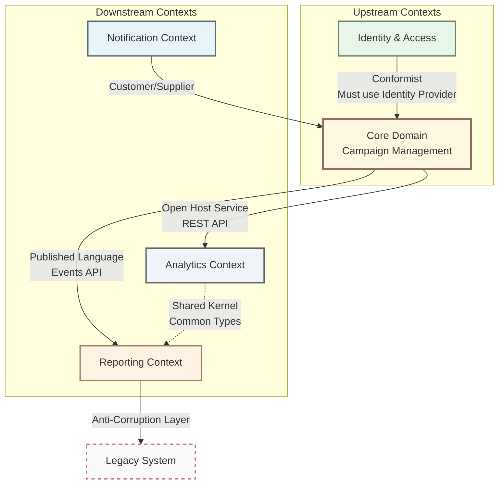

# Chapter 4: Integration Patterns

When building systems with multiple bounded contexts, you need patterns for managing their relationships and integration. This chapter covers strategies for connecting different parts of your domain.

## 4.1 Context Map

A **Context Map** is a visual representation showing how Bounded Contexts relate to each other. It documents integration patterns, dependencies, and power dynamics between contexts.

**Purpose:**
- Understand organizational boundaries and team ownership
- Identify integration points and dependencies
- Make explicit the nature of relationships (partnership, conformist, etc.)
- Plan migration and modernization strategies



### 4.1.1 Context Relationship Types

Context Maps document specific relationship patterns between Bounded Contexts. Each pattern defines power dynamics, integration style, and responsibilities.

---

#### Partnership

**Definition:** Two contexts in a cooperative relationship where teams collaborate closely on integration.

**Characteristics:**
- Mutual dependency (both need each other)
- Joint planning and synchronized releases
- Shared responsibility for integration
- High trust between teams

**When to use:**
- Core subdomains that must stay aligned
- Feature development requires coordination
- Teams willing to collaborate closely

**Example:**
```
Order Context ←→ Inventory Context

Order placement requires real-time inventory checks.
Both teams coordinate releases to ensure compatibility.
Changes are planned together.
```

**Trade-offs:**
- ✅ Strong alignment between contexts
- ✅ Efficient integration
- ❌ High coordination overhead
- ❌ Slower independent evolution

---

#### Customer/Supplier

**Definition:** Upstream context (supplier) provides service to downstream context (customer). Customer needs are prioritized but supplier controls the interface.

**Characteristics:**
- Clear upstream/downstream relationship
- Negotiated requirements and priorities
- Customer influences but doesn't dictate
- Formal change management process

**When to use:**
- Clear provider/consumer relationship
- Customer needs input into upstream roadmap
- Stable, well-defined interfaces
- Mature organizational processes

**Example:**
```
Payment Service (Supplier) → Order Service (Customer)

Order Service needs payment processing.
Payment team prioritizes Order's requirements.
Changes are negotiated and scheduled.
```

**Trade-offs:**
- ✅ Customer needs considered
- ✅ Formal governance
- ❌ Bureaucracy can slow changes
- ❌ Requires communication processes

---

#### Conformist

**Definition:** Downstream context conforms completely to upstream's model without negotiation power.

**Characteristics:**
- Upstream dictates the model
- Downstream has no influence
- One-way dependency
- Downstream accepts upstream changes

**When to use:**
- Integrating with external SaaS providers
- Legacy systems you cannot change
- Standard protocols (OAuth, SAML)
- No negotiation leverage

**Example:**
```
Your App (Conformist) → External Identity Provider (Upstream)

Your application must use the provider's user model.
The provider's changes don't consider your needs.
You adapt to their API changes.
```

**Trade-offs:**
- ✅ Simple integration (no translation)
- ✅ Low coordination overhead
- ❌ Domain model compromised by external model
- ❌ Vulnerable to upstream changes

**Mitigation:** Consider Anti-Corruption Layer if external model is complex or unstable.

---

#### Anti-Corruption Layer (ACL)

**Definition:** Translation layer protecting downstream domain from upstream's model.

**Characteristics:**
- Explicit translation between models
- Isolates domain from external changes
- Preserves clean domain model
- Acts as defensive boundary

**When to use:**
- Legacy system integration
- Third-party API with complex/poor model
- Unstable external interfaces
- Protecting core domain from external complexity

**Example:**
```
Your Domain ← [ACL] ← Legacy CRM

ACL translates:
- LegacyCustomer (15 fields, snake_case) → Customer (clean model)
- Complex legacy rules → Domain rules
- Shields domain from legacy changes
```

**Trade-offs:**
- ✅ Clean domain model preserved
- ✅ Resilient to external changes
- ❌ Translation complexity
- ❌ Maintenance overhead

**Implementation:** See section 4.3 for detailed ACL pattern.

---

#### Open Host Service

**Definition:** Upstream provides a well-documented, stable API designed for multiple downstream consumers.

**Characteristics:**
- Generic API (not tailored to one consumer)
- Versioned and stable
- Comprehensive documentation
- Multiple consumers

**When to use:**
- Many downstream contexts need same data
- API can be generalized
- Worth investment in documentation
- Core service consumed widely

**Example:**
```
Product Catalog API (Open Host) → Multiple Contexts

REST API with:
- /products/{id}
- /products/search
- /categories

Used by: Web, Mobile, Reporting, Recommendations
```

**Trade-offs:**
- ✅ Single API serves many consumers
- ✅ Clear contracts
- ❌ Requires documentation investment
- ❌ Changes impact multiple consumers

---

#### Published Language

**Definition:** Shared, well-defined language (often domain events or data formats) used for integration.

**Characteristics:**
- Standardized format (JSON, Avro, Protobuf)
- Versioned schemas
- Event-driven integration
- Loose coupling

**When to use:**
- Event-driven architecture
- Multiple consumers need same events
- Asynchronous integration
- Decoupled contexts

**Example:**
```
Order Context publishes events:
- OrderPlaced { orderId, customerId, items, total }
- OrderShipped { orderId, trackingNumber }

Consumed by:
- Inventory (decrease stock)
- Notification (send emails)
- Analytics (track metrics)
```

**Trade-offs:**
- ✅ Loose coupling
- ✅ Scalable (pub/sub)
- ❌ Eventual consistency
- ❌ Schema evolution complexity

---

### 4.1.2 Choosing Integration Patterns

**Decision Matrix:**

| Your Situation | Recommended Pattern | Reason |
|----------------|-------------------|--------|
| External SaaS providers | **Conformist** or **ACL** | No control over API. Use ACL if model is complex. |
| Legacy system you can't change | **ACL** | Protect domain from legacy complexity |
| Core contexts needing tight alignment | **Partnership** | Worth coordination cost for business value |
| Many consumers need same data | **Open Host Service** | Efficient for multiple consumers |
| Event-driven architecture | **Published Language** | Natural fit for events |
| Clear provider/consumer with negotiation | **Customer/Supplier** | Balanced power dynamics |

**Example Decision Process:**

```
Scenario: Integrating with external payment provider

Questions:
1. Can you influence the provider's API? → NO
2. Is the provider's model complex? → YES (multiple payment concepts)
3. Will it change often? → YES (provider evolves frequently)

Decision: Conformist + ACL
- Conformist: Accept we must use the provider's API
- ACL: Translate provider's complex model to clean Payment domain model

Result:
Payment Domain ← [ACL] ← Payment Provider API
- Domain uses: Payment, PaymentMethod, PaymentStatus
- ACL translates: Provider's complex types → Domain model
```

---

### 4.1.3 Context Map Evolution

Context Maps are not static. Relationships evolve as systems mature:

**Early Stage (Startup/MVP):**
```
Often: Shared Kernel everywhere
Why: Small team, fast changes needed
Risk: High coupling
```

**Growth Stage:**
```
Transition: Shared Kernel → Partnership → Customer/Supplier
Why: Teams growing, need independence
Action: Define bounded contexts, split shared code
```

**Mature Stage:**
```
Goal: Published Language + ACL for boundaries
Why: Multiple teams, independent deployment
Pattern: Event-driven with clear contracts
```

**Example Evolution:**

```
Phase 1: Monolith with Shared Kernel
├── Order ←→ Inventory (Shared Kernel)
└── Order ←→ Payment (Shared Kernel)

Phase 2: Split contexts, add boundaries
├── Order → Inventory (Customer/Supplier)
└── Order → Payment (Open Host Service)

Phase 3: Event-driven
├── Order publishes events (Published Language)
├── Inventory subscribes (consumes events)
└── Payment subscribes (consumes events)
```

**Key Insight:** Start with coupling (Shared Kernel), evolve to decoupling (Published Language) as team size and system complexity grow.

---

### Integration Patterns Summary

| Pattern | Coupling | Control | Complexity | Use When |
|---------|----------|---------|------------|----------|
| **Partnership** | High | Shared | Low | Core domains, high trust |
| **Customer/Supplier** | Medium | Negotiated | Medium | Clear provider/consumer |
| **Conformist** | High | None | Low | External APIs, no leverage |
| **ACL** | Low | Full | High | Legacy, complex external APIs |
| **Open Host Service** | Low | Provider | Medium | Multiple consumers |
| **Published Language** | Low | Publisher | Medium | Event-driven, async |
| **Shared Kernel** | Very High | Shared | Low | Same team, stable interface |

## 4.2 Shared Kernel

### What is a Shared Kernel?

A **Shared Kernel** is a small, carefully curated set of domain concepts shared between two or more bounded contexts.

**Analogy:** Like a standard library that multiple applications depend on—useful but creates coupling.

**Key Principle:** Keep it **minimal**. Shared Kernel creates coupling between contexts, so only share what is truly identical and stable.

---

### What Belongs in Shared Kernel

#### ✅ Include: Truly Shared Domain Primitives

**1. Base Value Objects (Generic, Universally Applicable)**

Value Objects used across **all** bounded contexts with **identical meaning**:

```typescript
// ✅ Email - Same meaning everywhere
export class Email {
  constructor(private readonly value: string) {
    if (!this.isValid(value)) {
      throw new InvalidEmailError(value);
    }
  }

  private isValid(email: string): boolean {
    return /^[^\s@]+@[^\s@]+\.[^\s@]+$/.test(email);
  }

  get value(): string {
    return this.value;
  }
}

// ✅ Money - Same representation everywhere
export class Money {
  constructor(
    private readonly amount: number,
    private readonly currency: Currency
  ) {}

  add(other: Money): Money {
    if (this.currency !== other.currency) {
      throw new CurrencyMismatchError();
    }
    return new Money(this.amount + other.amount, this.currency);
  }
}

// ✅ Address - Same structure everywhere
export class Address {
  constructor(
    readonly street: string,
    readonly city: string,
    readonly zipCode: string,
    readonly country: string
  ) {}
}
```

**Why these belong:** Every context uses email, money, address identically. No divergence.

---

**2. Domain Primitives (Shared Identifiers)**

```typescript
// ✅ Type-safe IDs used across contexts
export class UserId {
  constructor(private readonly value: string) {}
  get value(): string { return this.value; }
}

export class OrderId {
  constructor(private readonly value: string) {}
  get value(): string { return this.value; }
}
```

**Why:** Contexts reference each other by ID. Shared types prevent errors.

---

**3. Common Domain Events (Cross-Context Integration)**

```typescript
// ✅ Events published by one context, consumed by others
export interface DomainEvent {
  readonly eventName: string;
  readonly occurredAt: Date;
  readonly aggregateId: string;
}

export class UserCreatedEvent implements DomainEvent {
  readonly eventName = 'user.created';
  constructor(
    readonly aggregateId: string,
    readonly occurredAt: Date,
    readonly email: string
  ) {}
}
```

**Why:** Events are integration contracts—must be shared.

---

**4. Result/Either Types (Common Patterns)**

```typescript
// ✅ Standard error handling across contexts
export class Result<T> {
  private constructor(
    private readonly _value?: T,
    private readonly _error?: Error
  ) {}

  static ok<T>(value: T): Result<T> {
    return new Result(value);
  }

  static fail<T>(error: Error): Result<T> {
    return new Result(undefined, error);
  }

  isSuccess(): boolean {
    return this._error === undefined;
  }
}
```

**Why:** Common utility used everywhere, promotes consistency.

---

**5. Base Exceptions (Domain-Level Errors)**

```typescript
// ✅ Base exception all contexts extend
export abstract class DomainException extends Error {
  constructor(message: string) {
    super(message);
    this.name = this.constructor.name;
  }
}

export class ValidationException extends DomainException {}
export class NotFoundException extends DomainException {}
```

**Why:** Consistent error handling across contexts.

---

#### ❌ Exclude: Context-Specific Concepts

**1. Entities (Never Share)**

```typescript
// ❌ BAD - User means different things in different contexts
export class User {
  // Auth Context: User = login credentials
  // Profile Context: User = personal information
  // Billing Context: User = payment information
}
```

**Why wrong:** "User" has different meanings. Each context needs its own model.

**Right approach:** Each context has its own User entity, references by UserId.

---

**2. Business Logic (Context-Specific Rules)**

```typescript
// ❌ BAD - Discount rules are context-specific
export class DiscountCalculator {
  calculateDiscount(order: Order): Money {
    // Sales context rules ≠ Loyalty context rules
  }
}
```

**Why wrong:** Discount logic differs by context. Sharing creates inappropriate coupling.

---

**3. Aggregates (Too Domain-Specific)**

```typescript
// ❌ BAD - Order aggregate specific to Ordering context
export class Order {
  // Ordering context needs full order
  // Billing context only needs order total
  // Fulfillment context only needs shipping info
}
```

**Why wrong:** Each context needs different parts. Don't share aggregates.

---

### Example: E-Commerce Shared Kernel

```
shared-kernel/
├── value-objects/
│   ├── Email.ts          ✅ Used identically everywhere
│   ├── Money.ts          ✅ Used identically everywhere
│   └── Address.ts        ✅ Used identically everywhere
├── types/
│   ├── Result.ts         ✅ Common utility
│   ├── DomainEvent.ts    ✅ Integration contract
│   └── UserId.ts         ✅ Cross-context reference
└── exceptions/
    └── DomainException.ts ✅ Base error handling

Used by:
- Catalog Context (Money for prices)
- Order Context (Money, Address, Email)
- Customer Context (Email, Address)
- Billing Context (Money, UserId reference)
```

**Total:** ~5-10 types. If more, you're sharing too much.

---

### Trade-offs

#### Benefits

✅ **Avoid duplication** - Write Email once, use everywhere
✅ **Consistency** - All contexts use same Money implementation
✅ **Type safety** - Shared IDs prevent reference errors
✅ **Faster development** - Reuse common types

#### Costs

⚠️ **Coupling** - All contexts depend on shared kernel
⚠️ **Coordination** - Changes require all teams to agree
⚠️ **Versioning complexity** - Breaking changes affect everyone
⚠️ **Deployment coupling** - Update requires all contexts to deploy

---

### Governance: Managing Shared Kernel

**Critical:** Shared Kernel must be **stable** and **carefully managed**.

#### Rules

1. **Require approval from all consuming teams** before changes
2. **Version semantically** (major.minor.patch)
3. **Never break compatibility** without major version bump
4. **Keep it minimal** (5-10 types max)
5. **Document extensively** (it's a contract between contexts)
6. **Test thoroughly** (breaking changes hurt multiple teams)

#### Change Process

```
Proposed Change: Add "phoneNumber" to Address
  ↓
1. Team A proposes change
  ↓
2. Teams B, C, D review
  ↓
3. All teams agree? → Proceed
  ↓
4. Update shared kernel
  ↓
5. All teams update and deploy
```

**If any team disagrees:** Don't add to shared kernel. Duplicate instead.

---

### Decision: Shared Kernel vs Duplication?

Use this table:

| Question | Shared Kernel | Duplicate |
|----------|--------------|-----------|
| Is the concept **identical** across contexts? | ✅ Yes | ❌ No |
| Will it **never diverge** between contexts? | ✅ Yes | ❌ No |
| Is coordination cost < duplication cost? | ✅ Yes | ❌ No |
| Is this a **domain primitive** (Email, Money)? | ✅ Yes | ❌ Maybe |
| Is this **business logic**? | ❌ No | ✅ Yes |
| Is this an **entity** or **aggregate**? | ❌ No | ✅ Yes |

**When in doubt, duplicate.** Coupling is worse than duplication.

---

### Example: When to Duplicate Instead of Share

#### Scenario: "Address" in Different Contexts

**Order Context:**
```typescript
// Needs: Street, City, Zip, Country
// Validation: All fields required
class ShippingAddress {
  constructor(
    readonly street: string,
    readonly city: string,
    readonly zipCode: string,
    readonly country: string
  ) {
    // Strict validation
  }
}
```

**User Profile Context:**
```typescript
// Needs: Street, City, Zip, Country, Label (Home/Work)
// Validation: Some fields optional
class ProfileAddress {
  constructor(
    readonly street: string,
    readonly city?: string,
    readonly zipCode?: string,
    readonly country: string,
    readonly label: string
  ) {
    // Loose validation
  }
}
```

**Decision:** ❌ Don't share Address—**duplicate** it in each context.

**Why:** Different validation rules, different fields, different purposes. They will diverge.

---

### Anti-Pattern: Shared Kernel Becomes a "God Library"

**Bad:**
```
shared-kernel/
├── auth/
│   ├── User.ts            ❌ Too specific
│   └── Session.ts         ❌ Too specific
├── catalog/
│   ├── Product.ts         ❌ Aggregate, don't share
│   └── Category.ts        ❌ Entity, don't share
├── orders/
│   ├── Order.ts           ❌ Aggregate, don't share
│   └── OrderItem.ts       ❌ Entity, don't share
└── ... (entire domain!)
```

**Result:** Everything coupled to everything. No boundaries.

---

**Good:**
```
shared-kernel/
├── value-objects/
│   ├── Email.ts           ✅ Universal
│   ├── Money.ts           ✅ Universal
│   └── Address.ts         ✅ Universal
├── types/
│   ├── Result.ts          ✅ Utility
│   └── DomainEvent.ts     ✅ Integration
└── exceptions/
    └── DomainException.ts ✅ Base class
```

**Result:** Minimal coupling, clear boundaries.

---

### When to Avoid Shared Kernel Entirely

Sometimes, **don't use Shared Kernel at all**:

❌ **Avoid when:**
- Teams work at different speeds (one team blocked by another)
- Concepts will diverge (different validation, different rules)
- Contexts are maintained by different organizations
- High churn (frequent changes)

✅ **Alternative:** Duplicate and diverge. Costs of duplication < costs of coupling.

---

**For implementation details:**
📚 For Shared Kernel implementation examples, consult technology-specific implementation cookbooks.

## 4.3 Anti-Corruption Layer

Translation layer protecting domain from external models.

### Purpose

* Isolate your domain from external system changes
* Translate external models to your domain language
* Prevent external complexity from leaking into your domain

### Example

```typescript
export class LegacyUserACL implements ForRetrievingCustomers {
  async findCustomerById(id: CustomerId): Promise<Customer | null> {
    const legacyUser = await this.legacyAPI.getUserRecord(id.value);

    // TRANSLATE legacy → clean domain model
    return this.toDomain(legacyUser);
  }

  private toDomain(legacyUser: LegacyUserDTO): Customer {
    return new Customer(
      new CustomerId(legacyUser.user_id),
      new Email(legacyUser.email_address),
      new CustomerName(legacyUser.first_name, legacyUser.last_name)
    );
  }
}
```

### When to Use

* Integrating with legacy systems
* Working with third-party APIs
* Protecting domain from unstable external interfaces
* Different modeling philosophies between contexts

## Integration Pattern Selection

| Pattern                   | Use When                                   | Benefits           | Costs                  |
| ------------------------- | ------------------------------------------ | ------------------ | ---------------------- |
| **Shared Kernel**         | High trust, shared team, stable interfaces | Low duplication    | High coupling          |
| **Published Language**    | Multiple consumers, stable contract        | Clear boundaries   | Documentation overhead |
| **Anti-Corruption Layer** | Legacy integration, unstable external API  | Domain protection  | Translation complexity |
| **Conformist**            | No negotiation power, standard protocol    | Simple integration | Domain compromise      |
| **Customer/Supplier**     | Negotiated relationship, aligned teams     | Balanced power     | Requires communication |

***

**Navigation:**

* [← Previous: Tactical Patterns](03-tactical-patterns.md)
* [Next: Common Pitfalls →](05-common-pitfalls.md)
* [Table of Contents](../../#table-of-contents)
