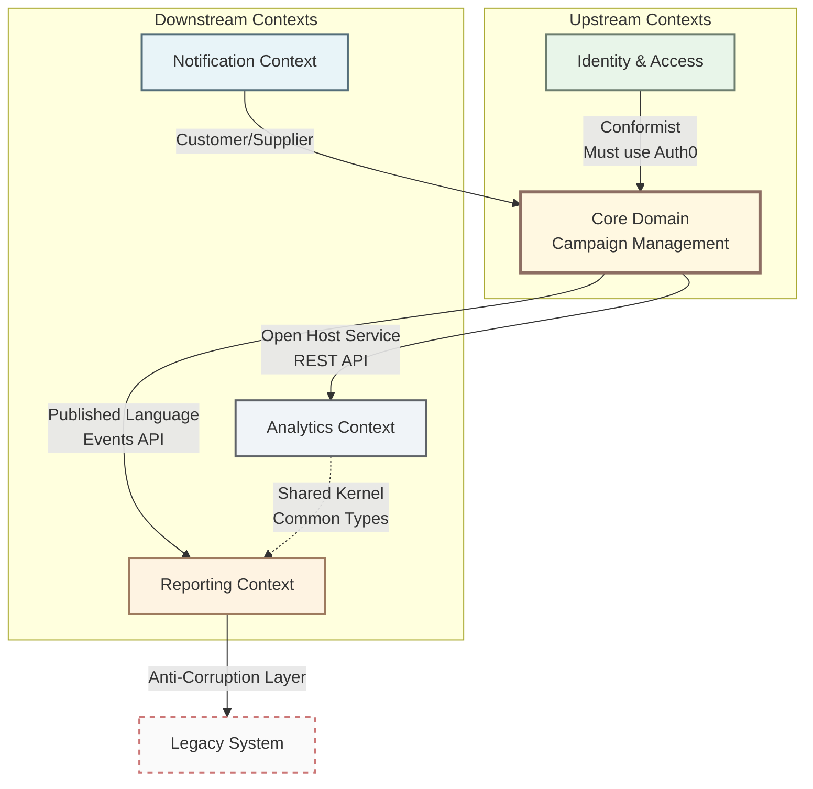

# Chapter 4: Integration Patterns

When building systems with multiple bounded contexts, you need patterns for managing their relationships and integration. This chapter covers strategies for connecting different parts of your domain.

## 4.1 Context Map

Visual representation of relationships between Bounded Contexts.



### Integration Patterns

- **Shared Kernel**: Common code between contexts (use sparingly)
- **Published Language**: Well-defined API/events for integration
- **Open Host Service**: Generic API for any consumer
- **Anti-Corruption Layer**: Translation protecting domain from external models
- **Conformist**: Downstream conforms to upstream's model
- **Customer/Supplier**: Negotiated relationship

## 4.2 Shared Kernel

Code shared between Bounded Contexts (use sparingly).

### What belongs in Shared Kernel

✅ **Appropriate:**
- Generic Value Objects (Email, Money)
- Base types (DomainEvent, Result<T>)
- Common interfaces

❌ **Not appropriate:**
- Business logic
- Complete entities
- Domain-specific rules

### Example

```typescript
// ✅ Good for Shared Kernel
export class Email {
  constructor(private readonly value: string) {
    if (!this.isValid(value)) {
      throw new InvalidEmailError(value);
    }
  }

  private isValid(email: string): boolean {
    return /^[^\s@]+@[^\s@]+\.[^\s@]+$/.test(email);
  }
}

// ❌ Bad for Shared Kernel - too domain-specific
export class OrderValidationService {
  validateOrder(order: Order): ValidationResult {
    // Business rules specific to one context
  }
}
```

## 4.3 Anti-Corruption Layer

Translation layer protecting domain from external models.

### Purpose

- Isolate your domain from external system changes
- Translate external models to your domain language
- Prevent external complexity from leaking into your domain

### Example

```typescript
export class LegacyUserACL implements ForRetrievingCustomers {
  async findCustomerById(id: CustomerId): Promise<Customer | null> {
    const legacyUser = await this.legacyAPI.getUserRecord(id.value);

    // TRANSLATE legacy → clean domain model
    return this.toDomain(legacyUser);
  }

  private toDomain(legacyUser: LegacyUserDTO): Customer {
    return new Customer(
      new CustomerId(legacyUser.user_id),
      new Email(legacyUser.email_address),
      new CustomerName(legacyUser.first_name, legacyUser.last_name)
    );
  }
}
```

### When to Use

- Integrating with legacy systems
- Working with third-party APIs
- Protecting domain from unstable external interfaces
- Different modeling philosophies between contexts

## Integration Pattern Selection

| Pattern | Use When | Benefits | Costs |
|---------|----------|----------|-------|
| **Shared Kernel** | High trust, shared team, stable interfaces | Low duplication | High coupling |
| **Published Language** | Multiple consumers, stable contract | Clear boundaries | Documentation overhead |
| **Anti-Corruption Layer** | Legacy integration, unstable external API | Domain protection | Translation complexity |
| **Conformist** | No negotiation power, standard protocol | Simple integration | Domain compromise |
| **Customer/Supplier** | Negotiated relationship, aligned teams | Balanced power | Requires communication |

---

**Navigation:**
- [← Previous: Tactical Patterns](03-tactical-patterns.md)
- [Next: Common Pitfalls →](05-common-pitfalls.md)
- [Table of Contents](README.md#table-of-contents)
