```mermaid
sequenceDiagram
    participant UC as Use Case
    participant AGG as Order
    participant DB as Database
    participant WORKER as Outbox Worker
    participant EB as Event Bus
    participant HANDLERS as Event Handlers

    Note over UC,DB: Transaction 1: Store State + Events Atomically
    UC->>AGG: order.place()
    AGG->>AGG: record(OrderPlaced)

    UC->>DB: BEGIN TRANSACTION
    UC->>DB: UPDATE orders SET status = 'PLACED'
    UC->>DB: INSERT INTO outbox_events (event_id, event_type, payload, published = false)
    UC->>DB: COMMIT ✅
    Note over DB: State + Events saved atomically

    Note over WORKER,EB: Asynchronous Publishing (Separate Process)
    loop Every 5 seconds
        WORKER->>DB: SELECT * FROM outbox_events WHERE published = false LIMIT 100
        DB-->>WORKER: [OrderPlaced event]

        WORKER->>EB: publish(OrderPlaced)
        EB->>HANDLERS: Dispatch to handlers
        HANDLERS-->>EB: ✅ Processed
        EB-->>WORKER: ✅ Published

        WORKER->>DB: UPDATE outbox_events SET published = true, published_at = NOW()
        Note over WORKER: Event marked as published
    end
```

```mermaid
sequenceDiagram
    participant EB as Event Bus
    participant HANDLER as Event Handler
    participant INBOX as Inbox Table
    participant DB as Database

    Note over EB,HANDLER: First Delivery (eventId: abc123)
    EB->>HANDLER: OrderPlaced (eventId: abc123)

    HANDLER->>INBOX: Check: SELECT * FROM inbox WHERE event_id = 'abc123'
    INBOX-->>HANDLER: Not found (first time)

    HANDLER->>DB: BEGIN TRANSACTION
    HANDLER->>INBOX: INSERT INTO inbox (event_id: abc123, status: processing)
    HANDLER->>HANDLER: Process event
    Note over HANDLER: Decrease inventory by 2 units
    HANDLER->>DB: UPDATE inventory SET stock = stock - 2
    HANDLER->>INBOX: UPDATE inbox SET status = processed
    HANDLER->>DB: COMMIT ✅
    Note over HANDLER: Event processed successfully

    Note over EB,HANDLER: Later: Duplicate Arrives (same eventId)
    EB->>HANDLER: OrderPlaced (eventId: abc123) ← Same event!

    HANDLER->>INBOX: Check: SELECT * FROM inbox WHERE event_id = 'abc123'
    INBOX-->>HANDLER: Found (status: processed)

    HANDLER->>HANDLER: SKIP (already processed) ✅
    Note over HANDLER: No action taken, idempotency guaranteed

    HANDLER-->>EB: ACK (even though skipped)
```

# Chapter 6: Advanced Patterns

Advanced patterns for distributed systems, event-driven architecture, and complex workflows. These patterns solve problems that emerge in production systems with multiple bounded contexts and high reliability requirements.

**Prerequisites:**
- Chapter 3: Tactical Patterns (Aggregates, Domain Events, Application Services)
- Understanding of eventual consistency
- Familiarity with transactions and persistence

**When you need these patterns:**
- Building distributed systems
- Multiple bounded contexts
- Event-driven architecture
- High reliability requirements
- Cross-context coordination

***

## 6.1 Event-Driven Patterns

### 6.1.1 Event Recording and Publishing Flow

One of the most common mistakes in DDD is misunderstanding **who** records events and **when** they're published.

#### The Pattern

**Aggregates record events. Use Cases publish them.**

**Why This Matters:**

1. **Aggregates own their state changes** → They know WHEN events should occur
2. **Use Cases control persistence** → Events only published IF transaction succeeds
3. **No phantom events** → If save fails, events never get published

---

#### The Flow

```mermaid
sequenceDiagram
    participant UC as Use Case
    participant AGG as Aggregate
    participant REPO as Repository
    participant DB as Database
    participant EB as Event Bus

    UC->>AGG: order.place()
    Note over AGG: Domain logic executes
    AGG->>AGG: Validate invariants
    AGG->>AGG: Change state (status = PLACED)
    AGG->>AGG: record(OrderPlaced) ← Store internally
    AGG-->>UC: Returns (with events recorded)

    UC->>REPO: save(order)
    REPO->>DB: INSERT/UPDATE
    DB-->>REPO: ✅ Success
    REPO-->>UC: ✅ Persisted

    UC->>AGG: pullEvents()
    AGG-->>UC: [OrderPlaced event]

    UC->>EB: publish([OrderPlaced])
    Note over EB: Handlers execute
    EB-->>UC: ✅ Published

    UC-->>UC: Done
```



---

#### Implementation Pattern

**Step 1: Aggregate records events**

```
class Order {
  private events: DomainEvent[] = []

  place(): void {
    // Validate business rules
    if (this.items.length === 0) {
      throw new EmptyOrderError()
    }

    if (this.status !== OrderStatus.DRAFT) {
      throw new OrderAlreadyPlacedError()
    }

    // Change state
    this.status = OrderStatus.PLACED

    // Record event (NOT publish!)
    this.record(new OrderPlaced(
      this.id,
      this.customerId,
      this.total,
      this.items.map(i => i.toData())
    ))
  }

  protected record(event: DomainEvent): void {
    this.events.push(event)
  }

  pullEvents(): DomainEvent[] {
    const events = [...this.events]
    this.events = [] // Clear after pull
    return events
  }
}
```

**Step 2: Use Case publishes events AFTER persistence**

```
class PlaceOrderUseCase {
  execute(command: PlaceOrderCommand): OrderPlaced {
    // 1. Load aggregate
    order = orderRepository.findById(command.orderId)

    // 2. Execute domain logic (records event internally)
    order.place()

    // 3. Persist changes
    orderRepository.save(order) // ← Transaction commits here

    // 4. Pull events AFTER successful save
    events = order.pullEvents()

    // 5. Publish events (only if save succeeded)
    eventBus.publish(events)

    // 6. Return result
    return { orderId: order.id, status: "placed" }
  }
}
```

---

#### Why This Works

| Concern | How Pattern Addresses It |
|---------|-------------------------|
| **Who decides when events occur?** | Aggregate (domain logic) |
| **Who controls if events are published?** | Use Case (after transaction) |
| **What if save fails?** | Events never published (consistency guaranteed) |
| **What if publishing fails?** | Use Outbox Pattern (see next section) |

---

#### Common Mistakes

**❌ Mistake 1: Publishing from aggregate**

```
class Order {
  constructor(private eventBus: EventBus) {} // ❌ Infrastructure in domain!

  place(): void {
    this.status = OrderStatus.PLACED

    // ❌ Publishing directly from aggregate
    this.eventBus.publish(new OrderPlaced(this.id))
  }
}
```

**Problems:**
- Aggregate depends on infrastructure
- Events published even if save fails
- Can't test aggregate without event bus
- Violates separation of concerns

---

**❌ Mistake 2: Use Case creates events**

```
class PlaceOrderUseCase {
  execute(command: PlaceOrderCommand): void {
    order = orderRepository.findById(command.orderId)

    // ❌ Use case creates event (should be aggregate)
    order.setStatus(OrderStatus.PLACED)

    orderRepository.save(order)

    // ❌ Use case decides when event occurs
    eventBus.publish(new OrderPlaced(order.id))
  }
}
```

**Problems:**
- Domain logic (when event occurs) in Application layer
- Aggregate can't record its own state changes
- Harder to maintain (logic scattered)

---

### 6.1.2 Outbox Pattern (Transactional Guarantee)

#### The Problem

Event publishing can fail, leading to inconsistent state.

**Failure Scenarios:**

1. **Event bus unavailable**
   ```
   order.place()
   orderRepository.save(order) // ✅ Saved
   eventBus.publish(OrderPlaced) // ❌ Event bus down!
   // Result: Order placed in DB, but no inventory update, no email
   ```

2. **Transaction rollback after publish**
   ```
   order.place()
   eventBus.publish(OrderPlaced) // ✅ Published
   orderRepository.save(order) // ❌ Database error!
   // Result: Event published but order not saved (phantom event!)
   ```

3. **Partial publish failure**
   ```
   order.place()
   orderRepository.save(order) // ✅ Saved
   eventBus.publish([OrderPlaced, OrderPaymentRequested]) // ❌ Only first published
   // Result: Inconsistent event stream
   ```

---

#### The Solution: Transactional Outbox

**Store events in same database transaction as aggregate state. Publish asynchronously later.**

**Key Idea:** Events and state saved atomically in one transaction. A background worker publishes events from the outbox table.

---

#### Flow Diagram



---

#### Implementation Pattern

**Database Schema:**

```
CREATE TABLE outbox_events (
  id SERIAL PRIMARY KEY,
  event_id UUID NOT NULL UNIQUE,
  event_type VARCHAR(255) NOT NULL,
  aggregate_id UUID NOT NULL,
  payload JSONB NOT NULL,
  published BOOLEAN NOT NULL DEFAULT false,
  published_at TIMESTAMP,
  created_at TIMESTAMP NOT NULL DEFAULT NOW(),
  retry_count INT NOT NULL DEFAULT 0
);

CREATE INDEX idx_outbox_unpublished ON outbox_events (published, created_at)
  WHERE published = false;
```

**Use Case (saves to outbox):**

```
class PlaceOrderUseCase {
  execute(command: PlaceOrderCommand): OrderId {
    transaction.begin()

    try {
      // 1. Domain logic
      order = orderRepository.findById(command.orderId)
      order.place()

      // 2. Save aggregate
      orderRepository.save(order)

      // 3. Save events to outbox (same transaction!)
      events = order.pullEvents()
      for (event of events) {
        outboxRepository.save({
          eventId: event.id,
          eventType: event.constructor.name,
          aggregateId: order.id,
          payload: JSON.serialize(event),
          published: false
        })
      }

      // 4. Commit (atomic: state + events)
      transaction.commit()

      return order.id

    } catch (error) {
      transaction.rollback()
      throw error
    }
  }
}
```

**Outbox Worker (publishes events):**

```
class OutboxEventPublisher {
  async processOutbox(): Promise<void> {
    // Runs every 5 seconds
    while (true) {
      // 1. Fetch unpublished events
      events = await outboxRepository.findUnpublished(limit: 100)

      for (event of events) {
        try {
          // 2. Publish to event bus
          await eventBus.publish(event.deserialize())

          // 3. Mark as published
          await outboxRepository.markPublished(event.id)

        } catch (error) {
          // 4. Retry logic (exponential backoff)
          await outboxRepository.incrementRetryCount(event.id)

          if (event.retryCount > MAX_RETRIES) {
            await outboxRepository.moveToDeadLetter(event.id, error)
          }
        }
      }

      await sleep(5000) // 5 second interval
    }
  }
}
```

---

#### Benefits

| Benefit | How Outbox Achieves It |
|---------|------------------------|
| **Atomicity** | Events stored in same transaction as state |
| **Guaranteed delivery** | Events persisted, won't be lost |
| **Resilient** | Retries if event bus fails |
| **No phantom events** | Events saved only if transaction commits |
| **At-least-once delivery** | Worker retries until successful |

---

#### Trade-offs

| Aspect | Outbox Pattern | In-Memory Event Bus |
|--------|---------------|---------------------|
| **Consistency** | Guaranteed (atomic) | Risk of loss |
| **Latency** | Slight delay (eventual) | Immediate |
| **Complexity** | Higher (worker, outbox table) | Lower (simple) |
| **Reliability** | High (persisted) | Low (in-memory) |
| **Use in Production** | ✅ Recommended | ❌ Risky |
| **Use in MVP** | Maybe | ✅ Simple start |

---

### 6.1.3 Inbox Pattern (Idempotency)

#### The Problem

**Events can be delivered multiple times.**

**Why Duplicates Occur:**
- Network retries (timeout, retry)
- Publisher retries (failure recovery)
- Event bus "at-least-once" semantics (Kafka, RabbitMQ default)
- Outbox worker re-publishing after crash

**Example:**
```
OrderPlaced event delivered 3 times
→ Handler decreases inventory 3 times
→ Stock: 100 → 97 (should be 99)
→ Incorrect inventory!
```

---

#### The Solution: Idempotent Event Processing

**Track processed events in database. Skip duplicates.**

**Key Idea:** Before processing event, check if already processed. If yes, skip. If no, process and record.

---

#### Flow Diagram



---

#### Implementation Pattern

**Database Schema:**

```
CREATE TABLE inbox_events (
  event_id UUID PRIMARY KEY,
  event_type VARCHAR(255) NOT NULL,
  handler_name VARCHAR(255) NOT NULL,
  status VARCHAR(50) NOT NULL, -- processing, processed, failed
  payload JSONB,
  processed_at TIMESTAMP,
  created_at TIMESTAMP NOT NULL DEFAULT NOW(),
  error_message TEXT
);

CREATE UNIQUE INDEX idx_inbox_event_handler
  ON inbox_events (event_id, handler_name);
```

**Event Handler (with inbox):**

```
class DecreaseInventoryHandler {
  async handle(event: OrderPlaced): Promise<void> {
    const handlerName = "DecreaseInventoryHandler"

    // 1. Check if already processed
    const existing = await inboxRepository.findByEventAndHandler(
      event.id,
      handlerName
    )

    if (existing && existing.status === "processed") {
      // ✅ Already processed, skip
      console.log(`Event ${event.id} already processed, skipping`)
      return
    }

    // 2. Record event as processing
    await inboxRepository.save({
      eventId: event.id,
      eventType: "OrderPlaced",
      handlerName: handlerName,
      status: "processing",
      payload: event
    })

    try {
      // 3. Process event (business logic)
      for (item of event.items) {
        inventory = await inventoryRepository.findByProduct(item.productId)
        inventory.decreaseStock(item.quantity)
        await inventoryRepository.save(inventory)
      }

      // 4. Mark as processed
      await inboxRepository.markProcessed(event.id, handlerName)

    } catch (error) {
      // 5. Mark as failed
      await inboxRepository.markFailed(event.id, handlerName, error.message)
      throw error // Rethrow for retry
    }
  }
}
```

---

#### Alternative: Upsert Pattern

Simpler approach for certain operations:

```
class UpdateUserStatisticsHandler {
  async handle(event: OrderPlaced): Promise<void> {
    // ✅ Idempotent by nature (upsert)
    await statisticsRepository.upsert({
      userId: event.customerId,
      lastOrderId: event.orderId,
      lastOrderDate: event.occurredAt,
      totalOrders: raw("total_orders + 1")
    })

    // No inbox needed if operation is naturally idempotent
  }
}
```

---

#### Benefits

| Benefit | How Inbox Achieves It |
|---------|----------------------|
| **Exactly-once processing** | Deduplication via event ID |
| **Safe retries** | Can retry without side effects |
| **Failure recovery** | Handles network/system failures gracefully |
| **Audit trail** | Records all processed events |
| **Per-handler tracking** | Different handlers can process independently |

---

### 6.1.4 When to Use Each Pattern

#### Decision Matrix

| Scenario | Pattern Combination | Reason |
|----------|-------------------|--------|
| **MVP / Single bounded context / Low volume** | In-memory EventBus | Simple, sufficient for prototypes |
| **Production / Need reliability** | Outbox | Guaranteed delivery |
| **Handlers must be idempotent** | Inbox | Prevents duplicate processing |
| **Production + Idempotency** | Outbox + Inbox | Full guarantees (recommended) |
| **High volume (10k+ events/sec)** | Outbox + Worker pool + Message Broker | Scalable publishing |
| **Cross-BC with message broker** | Outbox + Inbox + Kafka/RabbitMQ | Distributed systems |

---

#### Decision Tree

```
Do events need guaranteed delivery?
├─ NO → In-memory EventBus (MVP only)
└─ YES → Outbox Pattern
            ├─ Do handlers need idempotency?
            │  ├─ YES → Outbox + Inbox ✅ (Production recommended)
            │  └─ NO → Outbox only
            │
            └─ Are events cross-bounded-context?
               ├─ YES → Outbox + Message Broker (Kafka/RabbitMQ) + Inbox
               └─ NO → Outbox + Inbox (same database)
```

---

#### Complexity Levels

| Level | Pattern | Use When | Complexity |
|-------|---------|----------|------------|
| **1. Simple** | In-memory EventBus | MVP, prototype, learning | Low |
| **2. Reliable** | Outbox | Production, single BC | Medium |
| **3. Idempotent** | Inbox (with in-memory) | Handlers need deduplication | Medium |
| **4. Production** | Outbox + Inbox | Production, critical business logic | High |
| **5. Distributed** | Outbox + Kafka + Inbox | Multi-BC, microservices | Very High |

---

**Event Patterns Summary:**

| Pattern | Guarantees | When to Use | Complexity |
|---------|-----------|-------------|------------|
| **Event Recording Flow** | Events match state | Always | Low (foundational) |
| **Outbox** | Delivery guaranteed | Production systems | Medium |
| **Inbox** | Exactly-once processing | Idempotency required | Medium |
| **Outbox + Inbox** | Both guarantees | Production + critical ops | High |

***

## 6.2 Distributed Coordination

### 6.2.1 Saga Pattern (Orchestration)

#### The Problem

**Distributed operations span multiple bounded contexts and can fail partially.**

**Example: Place Order (Multi-Context)**

```
1. CreateOrder (Order BC) ✅ Success
2. ChargePayment (Payment BC) ✅ Success
3. ReserveInventory (Inventory BC) ❌ FAILURE (out of stock)

Problem:
- Order created in database
- Payment charged
- But no inventory!

Need to undo steps #1 and #2 (compensate)
```

---

**Traditional Solution: Distributed Transaction (2PC)**

```
coordinator.begin2PC()
├─ prepare(Order BC)
├─ prepare(Payment BC)
├─ prepare(Inventory BC) ← FAILS
└─ rollback ALL

Problems with 2PC:
❌ Locks resources across systems
❌ Coordinator is single point of failure
❌ Poor availability (blocks if any service down)
❌ Doesn't scale
❌ Tight coupling
```

---

**Saga Solution:**

- Sequence of **local transactions**
- Each step has **compensating action**
- If step fails → run compensations in **reverse order**

**Key Insight:** Accept eventual consistency instead of distributed ACID transactions.

---

#### Saga Flow with Compensations

```mermaid
sequenceDiagram
    participant SAGA as Saga Orchestrator
    participant ORDER as Order BC
    participant PAYMENT as Payment BC
    participant INV as Inventory BC

    Note over SAGA: Step 1: Create Order
    SAGA->>ORDER: CreateOrder(customerId, items)
    ORDER->>ORDER: Validate & create
    ORDER-->>SAGA: ✅ Order created (orderId: 123)
    Note over SAGA: Push compensation: CancelOrder(123)

    Note over SAGA: Step 2: Charge Payment
    SAGA->>PAYMENT: ChargePayment(orderId: 123, amount: $100)
    PAYMENT->>PAYMENT: Charge card
    PAYMENT-->>SAGA: ✅ Payment charged (txId: abc)
    Note over SAGA: Push compensation: RefundPayment(abc)

    Note over SAGA: Step 3: Reserve Inventory
    SAGA->>INV: ReserveInventory(orderId: 123, items)
    INV->>INV: Check stock
    INV-->>SAGA: ❌ Out of stock!

    Note over SAGA,INV: FAILURE → Run Compensations (LIFO)
    rect rgb(255, 240, 240)
        Note over SAGA: Compensation 1: Refund Payment
        SAGA->>PAYMENT: RefundPayment(txId: abc)
        PAYMENT->>PAYMENT: Process refund
        PAYMENT-->>SAGA: ✅ Refunded

        Note over SAGA: Compensation 2: Cancel Order
        SAGA->>ORDER: CancelOrder(orderId: 123)
        ORDER->>ORDER: Mark as cancelled
        ORDER-->>SAGA: ✅ Cancelled
    end

    Note over SAGA: Saga FAILED (all compensated)
    SAGA-->>SAGA: Return failure result
```



---

#### Implementation Pattern

**Saga Orchestrator:**

```
interface SagaStep {
  execute(): Promise<StepResult>
  compensate(): Promise<void>
}

class CreateOrderSaga {
  private compensations: Array<() => Promise<void>> = []
  private executedSteps: string[] = []

  async execute(command: CreateOrderCommand): Promise<SagaResult> {
    try {
      // Step 1: Create order
      console.log("Step 1: Creating order...")
      const order = await orderService.createOrder({
        customerId: command.customerId,
        items: command.items
      })
      this.compensations.push(() => orderService.cancelOrder(order.id))
      this.executedSteps.push("CreateOrder")

      // Step 2: Charge payment
      console.log("Step 2: Charging payment...")
      const payment = await paymentService.chargePayment({
        orderId: order.id,
        amount: order.total,
        customerId: command.customerId
      })
      this.compensations.push(() => paymentService.refundPayment(payment.id))
      this.executedSteps.push("ChargePayment")

      // Step 3: Reserve inventory
      console.log("Step 3: Reserving inventory...")
      const reservation = await inventoryService.reserveInventory({
        orderId: order.id,
        items: order.items
      })
      this.compensations.push(() => inventoryService.releaseReservation(reservation.id))
      this.executedSteps.push("ReserveInventory")

      // Step 4: Send confirmation
      console.log("Step 4: Sending confirmation...")
      await notificationService.sendOrderConfirmation({
        customerId: command.customerId,
        orderId: order.id
      })
      // No compensation for email (idempotent, no side effects to undo)
      this.executedSteps.push("SendConfirmation")

      // All steps succeeded
      return {
        success: true,
        orderId: order.id,
        executedSteps: this.executedSteps
      }

    } catch (error) {
      // Failure → run compensations in reverse order (LIFO)
      console.error(`Saga failed at step ${this.executedSteps.length + 1}: ${error.message}`)
      await this.runCompensations()

      return {
        success: false,
        error: error.message,
        executedSteps: this.executedSteps,
        compensated: true
      }
    }
  }

  private async runCompensations(): Promise<void> {
    console.log("Running compensations...")

    // LIFO: Last successful step compensated first
    while (this.compensations.length > 0) {
      const compensate = this.compensations.pop()!
      const stepName = this.executedSteps.pop()!

      try {
        console.log(`Compensating: ${stepName}`)
        await compensate()
        console.log(`✅ Compensated: ${stepName}`)

      } catch (error) {
        // Log compensation failure, but continue
        console.error(`❌ Compensation failed for ${stepName}: ${error.message}`)
        // In production: send alert, log to monitoring
      }
    }
  }
}
```

---

#### Compensating Transactions Table

| Step | Action | Compensation (if failure) | Notes |
|------|--------|---------------------------|-------|
| 1 | CreateOrder | CancelOrder | Sets order status to CANCELLED |
| 2 | ChargePayment | RefundPayment | Issues refund to customer |
| 3 | ReserveInventory | ReleaseReservation | Returns stock to available |
| 4 | SendConfirmationEmail | (No compensation) | Email is idempotent, no undo needed |

---

### 6.2.2 Compensating Transactions

#### Key Principles

**1. LIFO Order (Stack)**

Compensations run in reverse order of execution:
```
Execution order:    1 → 2 → 3 → 4 (fail)
Compensation order: 3 → 2 → 1
```

**Why:** Mirrors natural rollback. Last successful step undone first.

---

**2. Idempotent Compensations**

Compensations must be safe to run multiple times:

```
// ✅ Idempotent compensation
async function refundPayment(paymentId: PaymentId): Promise<void> {
  payment = await paymentRepository.findById(paymentId)

  if (payment.status === "REFUNDED") {
    // Already refunded, skip
    return
  }

  await paymentGateway.refund(payment.transactionId)
  payment.markAsRefunded()
  await paymentRepository.save(payment)
}
```

**Why idempotent:** If compensation fails and retries, won't cause double refund.

---

**3. Best-Effort Compensation**

Compensations may not fully restore original state:

```
Step: ChargePayment($100)
Compensation: RefundPayment($100)

Reality:
- Payment processor charges 3% fee → Customer charged $103
- Refund has 2% processing fee → Customer receives $98
- Net loss for customer: $5 (unavoidable)

Solution:
- Accept imperfect compensation
- Log discrepancy
- Consider business policy (absorb fee, partial credit, etc.)
```

---

**4. Compensation Failures**

What if compensation itself fails?

**Strategy:**
1. Retry with exponential backoff (3-5 attempts)
2. If still fails → move to manual intervention queue
3. Alert operations team
4. Log full saga state for debugging

```
async function runCompensationWithRetry(
  compensate: () => Promise<void>,
  stepName: string
): Promise<void> {
  const maxRetries = 5
  let attempt = 0

  while (attempt < maxRetries) {
    try {
      await compensate()
      return // Success

    } catch (error) {
      attempt++
      console.error(`Compensation attempt ${attempt} failed for ${stepName}`)

      if (attempt >= maxRetries) {
        // Final failure → alert
        await alertOps({
          type: "SAGA_COMPENSATION_FAILED",
          stepName,
          error: error.message,
          requiresManualIntervention: true
        })
        throw error
      }

      // Exponential backoff: 1s, 2s, 4s, 8s, 16s
      await sleep(1000 * Math.pow(2, attempt - 1))
    }
  }
}
```

---

#### Example: Non-Perfect Compensation

**Scenario: Hotel booking saga**

```
Steps:
1. Reserve room
2. Charge credit card
3. Send confirmation email

Failure at Step 3 (email service down)

Compensations:
2. Refund card ← May incur processing fee
1. Cancel room ← Room was blocked for 30 minutes, potential revenue loss
```

**Business decision:**
- Accept small fee cost
- Track compensation costs in metrics
- If costs too high → reconsider saga design or business process

---

### 6.2.3 Eventual Consistency Trade-offs

#### Saga vs Distributed Transaction Comparison

| Aspect | Saga Pattern | 2PC (Distributed Transaction) |
|--------|--------------|------------------------------|
| **Consistency** | Eventual | Immediate (ACID) |
| **Availability** | High (no locks) | Low (locks held during 2PC) |
| **Scalability** | Scales well | Poor (coordinator bottleneck) |
| **Complexity** | High (compensations required) | Lower (automatic rollback) |
| **Failure handling** | Compensate (best-effort) | Rollback (automatic) |
| **Coupling** | Loose (async messages) | Tight (sync 2PC protocol) |
| **Performance** | Fast (no blocking) | Slow (waits for all participants) |
| **Use when** | Cross-BC, microservices, distributed | Single database, monolith |

---

#### When to Use Saga

**✅ Use Saga when:**

1. **Cross-bounded-context operations**
   - Different teams own different services
   - Services deployed independently
   - Example: Order BC → Payment BC → Shipping BC

2. **Microservices architecture**
   - Distributed system with separate databases
   - No shared transaction coordinator
   - Each service has autonomy

3. **Long-running processes**
   - Workflow spans hours or days
   - Cannot hold locks for extended time
   - Example: Order fulfillment, approval workflows

4. **High availability required**
   - Cannot afford blocking operations
   - Services must remain available even if others down
   - Example: E-commerce checkout, banking operations

5. **Accept eventual consistency**
   - Business can tolerate brief inconsistency (seconds to minutes)
   - Final consistency is what matters
   - Example: Social media posts, analytics updates

---

#### When NOT to Use Saga

**❌ Don't use Saga when:**

1. **Operations within same aggregate**
   - Use regular transactions
   - Example: Adding items to order (same aggregate)

2. **Require immediate consistency**
   - Money transfers where balance must be exact
   - Stock trading (real-time accuracy needed)
   - Consider 2PC or rethink design

3. **Simple CRUD operations**
   - Over-engineering
   - Use simple application service
   - Example: Update user profile

4. **Single database / monolith**
   - Regular database transactions sufficient
   - Saga adds unnecessary complexity

---

#### Eventual Consistency Example

**Order Placement Saga:**

```
T0: User clicks "Place Order"
    ↓
T1: Order created (status: PENDING)
    ↓ [Eventual consistency gap: 2-5 seconds]
T2: Payment charged
    ↓
T3: Inventory reserved
    ↓
T4: Order marked CONFIRMED
    ↓
T5: User sees "Order confirmed"

During T1-T4:
- User might see "Processing..."
- Other systems might see order in PENDING state
- Eventually (T4) all systems see CONFIRMED state
```

**Business impact:**
- User waits 2-5 seconds for confirmation (acceptable)
- System remains highly available
- No locks blocking other operations
- Scalable to high volume

---

**Advanced Patterns Summary:**

| Pattern | Problem | Solution | When to Use |
|---------|---------|----------|-------------|
| **Event Recording Flow** | Who records/publishes events? | Aggregate records, Use Case publishes | Always (foundational) |
| **Outbox** | Event publishing can fail | Store events in DB transaction | Production systems |
| **Inbox** | Events delivered multiple times | Deduplication table | Idempotency required |
| **Saga** | Distributed transactions don't scale | Compensating transactions | Cross-BC coordination |

---

**When You Need These Patterns:**

| System Maturity | Recommended Patterns |
|-----------------|---------------------|
| **MVP / Prototype** | Event Recording Flow + In-memory EventBus |
| **Production (Single BC)** | Event Recording Flow + Outbox + Inbox |
| **Production (Multi-BC)** | Event Recording Flow + Outbox + Inbox + Saga |
| **High-Scale Distributed** | Event Recording Flow + Outbox + Message Broker + Inbox + Saga |

## 6.3 Event Sourcing

**Event Sourcing** is a persistence pattern where you store changes to application state as a sequence of events, rather than storing only the current state.

### 6.3.1 What is Event Sourcing?

**Traditional State-Based Persistence:**
```
Database stores current state only:

User Table:
| id | name | email | status |
|----|------|-------|--------|
| 1  | John | john@example.com | ACTIVE |

Problem: How did we get here? History is lost.
```

**Event Sourcing:**
```
Event Store (append-only log):

1. UserRegistered(id: 1, name: "John", email: "john@example.com")
2. EmailChanged(id: 1, newEmail: "john.new@example.com")
3. UserActivated(id: 1)

Current State = Replay events 1 → 2 → 3
History = Complete audit trail preserved
```

**Core Principle:** Events are the source of truth. Current state is derived by replaying events.

### 6.3.2 Core Concepts

#### Event Store as Append-Only Log

**Characteristics:**
- **Immutable:** Events never change or delete
- **Append-only:** New events added to the end
- **Ordered:** Events have sequence numbers
- **Persistent:** Durable storage (database, file system)

**Example Event Store Schema:**
```
Events Table:
| aggregate_id | sequence | event_type | event_data | timestamp |
|--------------|----------|------------|------------|-----------|
| order-123    | 1        | OrderCreated | {...}    | 2025-01-15 10:00 |
| order-123    | 2        | ItemAdded  | {...}      | 2025-01-15 10:02 |
| order-123    | 3        | OrderPlaced | {...}     | 2025-01-15 10:05 |
```

#### State Reconstruction from Events

**Process:**
1. Load all events for an aggregate from Event Store
2. Apply events in sequence order
3. Rebuild current state in memory

**Example:**
```
class Order {
  private id: OrderId
  private status: OrderStatus
  private items: OrderItem[] = []

  // Load from Event Store
  static reconstitute(events: DomainEvent[]): Order {
    const order = new Order()
    events.forEach(event => order.apply(event))
    return order
  }

  // Apply event to rebuild state
  private apply(event: DomainEvent): void {
    if (event instanceof OrderCreated) {
      this.id = event.orderId
      this.status = OrderStatus.DRAFT
    }
    else if (event instanceof ItemAdded) {
      this.items.push(event.item)
    }
    else if (event instanceof OrderPlaced) {
      this.status = OrderStatus.PLACED
    }
  }
}

// Usage:
const events = eventStore.getEvents('order-123')
const order = Order.reconstitute(events)
// order now has current state
```

#### Event Versioning and Upcasting

**Problem:** Event schemas evolve over time.

**Example:**
```
// Version 1 (old events in store)
interface UserRegisteredV1 {
  version: 1
  userId: string
  email: string
}

// Version 2 (new events)
interface UserRegisteredV2 {
  version: 2
  userId: string
  email: string
  marketingConsent: boolean // New field
}

// Upcaster: Converts old events to new format when loading
class UserRegisteredUpcaster {
  upcast(event: UserRegisteredV1): UserRegisteredV2 {
    return {
      version: 2,
      userId: event.userId,
      email: event.email,
      marketingConsent: false // Default for old events
    }
  }
}
```

**Strategies:**
1. **Upcasting:** Convert old events to new format when loading
2. **Weak Schema:** Handle multiple versions in apply() method
3. **Event Migration:** Batch convert old events (risky!)

#### Snapshots for Performance

**Problem:** Replaying 10,000+ events is slow.

**Solution:** Periodically save state snapshots.

**Process:**
```
1. Event 1-1000: Applied
2. Snapshot at event 1000 (save current state)
3. Event 1001-2000: Applied
4. Snapshot at event 2000

Loading order at event 2000:
- Load snapshot at 2000 ✅ Fast
- No need to replay 2000 events ✅
```

**Example Schema:**
```
Snapshots Table:
| aggregate_id | sequence | state_data | timestamp |
|--------------|----------|------------|-----------|
| order-123    | 1000     | {...}      | 2025-01-15 |
| order-123    | 2000     | {...}      | 2025-01-20 |

Loading Process:
1. Load latest snapshot (sequence 2000)
2. Load events after snapshot (sequence > 2000)
3. Apply only new events to snapshot state
```

**Snapshot Strategy:**
- Save snapshot every N events (e.g., 100)
- Save snapshot periodically (e.g., daily)
- On-demand snapshots for hot aggregates

### 6.3.3 When to Use Event Sourcing

**Use Event Sourcing when:**

#### 1. Complete Audit Trail Required

**Scenario:** Regulatory compliance (finance, healthcare)

**Why Event Sourcing:**
- Every state change is recorded
- Who, what, when is preserved
- Cannot be tampered with (immutable)

**Example:**
```
Financial Transaction History:
- AccountOpened (2025-01-01)
- DepositMade ($1000, 2025-01-05)
- WithdrawalMade ($200, 2025-01-10)
- InterestApplied ($5, 2025-01-15)

Auditor can see complete history.
```

#### 2. Temporal Queries Needed

**Scenario:** "What was the state at any point in time?"

**Why Event Sourcing:**
- Replay events up to specific timestamp
- Reconstruct historical state

**Example:**
```
Query: "What was Order #123 status on Jan 10?"
1. Load events for Order #123
2. Replay events until timestamp = 2025-01-10
3. Return state at that point
```

#### 3. Event Replay for Debugging/Testing

**Scenario:** Production bug, need to reproduce

**Why Event Sourcing:**
- Replay production events in test environment
- Reproduce exact state that caused bug

#### 4. Multiple Read Models from Same Events

**Scenario:** Different views of same data

**Why Event Sourcing:**
- One Event Store (write model)
- Multiple projections (read models)
- Add new projections without migrating data

**Example:**
```
Events: OrderPlaced, OrderShipped, OrderDelivered

Projections:
1. OrderSummary (for customers)
2. SalesAnalytics (for BI)
3. ShippingQueue (for warehouse)

Each projection built by replaying same events.
```

**Don't use Event Sourcing when:**

#### 1. Simple CRUD Applications

**Problem:** Event Sourcing adds complexity.

**Solution:** Traditional state-based persistence is simpler.

**Example:** Blog posts, user profiles (no audit trail needed)

#### 2. Team Unfamiliar with Pattern

**Problem:** Steep learning curve.

**Solution:** Start with simpler patterns, adopt ES later if needed.

#### 3. No Audit Requirements

**Problem:** ES overhead without benefit.

**Solution:** If current state is enough, don't use ES.

#### 4. Performance-Critical Reads (without CQRS)

**Problem:** Replaying events is slower than querying current state.

**Solution:** Combine ES with CQRS (see 6.4) or use snapshots aggressively.

### 6.3.4 Trade-offs

| Benefit | Challenge |
|---------|-----------|
| **Complete audit trail** | **Learning curve:** New mental model |
| **Temporal queries** (state at any time) | **Event schema evolution** (versioning complexity) |
| **Event replay** (debugging, testing) | **No deletes** (GDPR right to be forgotten requires workarounds) |
| **Multiple projections** from same events | **Eventually consistent reads** (unless using CQRS) |
| **Domain events as first-class citizens** | **Performance:** Replaying many events without snapshots |
| **Append-only** (no update anomalies) | **Storage growth** (events never deleted) |

### 6.3.5 Event Sourcing vs Traditional Persistence

| Aspect | Traditional (State-Based) | Event Sourcing |
|--------|---------------------------|----------------|
| **Storage** | Current state only | All events (append-only log) |
| **History** | Lost (unless audit table) | Complete (events are history) |
| **Queries** | Fast (direct SQL) | Rebuild state (replay events or projections) |
| **Updates** | UPDATE/DELETE | Append new events (immutable) |
| **Audit Trail** | Separate audit table | Built-in (events are audit) |
| **Temporal Queries** | Difficult/impossible | Native (replay to timestamp) |
| **Complexity** | Low | Medium-High |
| **GDPR Deletes** | Easy (DELETE) | Hard (events immutable, need anonymization) |

**Decision Tree:**

```
Do you need complete audit trail?
├─ YES → Consider Event Sourcing
│         │
│         Do you need temporal queries (state at any time)?
│         ├─ YES → Strong candidate for Event Sourcing
│         └─ NO → Event Sourcing or Audit Table
│
└─ NO → Do you need event replay (debugging, multiple projections)?
          ├─ YES → Consider Event Sourcing
          └─ NO → Traditional persistence
```

### 6.3.6 Common Mistakes

#### Mistake 1: Storing Current State AND Events (Hybrid)

**Problem:** Maintaining consistency between state table and event store.

**Symptom:**
```
Orders Table (current state):
| id | status | total |

Events Table (history):
| aggregate_id | event_type | event_data |

Problem: State and events can diverge!
- Transaction fails after updating state but before writing event
- Now they're out of sync
```

**Solution:** Choose one source of truth:
- **Event Sourcing:** Events are truth, state is derived
- **Traditional:** State is truth, events are optional audit

**Don't mix unless you have sophisticated 2-phase commit.**

#### Mistake 2: Not Versioning Events

**Problem:** Event schema changes break old events.

**Symptom:**
```
Old Event: { userId: "123", email: "john@example.com" }
New Code: Expects { userId: "123", email: "john@example.com", name: "John" }

Replay fails: name field missing!
```

**Solution:** Always version events:
```
interface UserRegistered {
  version: number  // ✅ Include version
  userId: string
  email: string
  name?: string    // Optional for backwards compatibility
}
```

#### Mistake 3: Events Too Large (Including Too Much Data)

**Problem:** Events contain entire aggregate state.

**Symptom:**
```
// ❌ Bad: Huge event
interface OrderPlaced {
  order: {
    id: "123",
    items: [...100 items...],
    customer: {...full customer object...},
    shippingAddress: {...},
    billingAddress: {...},
    // Megabytes of data!
  }
}
```

**Solution:** Events should contain only changes:
```
// ✅ Good: Small event
interface OrderPlaced {
  orderId: "123",
  customerId: "456",
  placedAt: "2025-01-15T10:00:00Z"
  // Reference IDs, not full objects
}
```

#### Mistake 4: No Snapshots (Performance Issue)

**Problem:** Replaying 10,000 events every time is slow.

**Symptom:**
```
Loading order takes 5 seconds (replaying 10,000 events)
```

**Solution:** Implement snapshots:
```
if (events.length > 100) {
  snapshot = loadLatestSnapshot(aggregateId)
  newEvents = loadEventsSince(aggregateId, snapshot.sequence)
  state = applyEvents(snapshot.state, newEvents)
}
```

#### Mistake 5: Not Handling GDPR Deletes

**Problem:** Events are immutable, but GDPR requires "right to be forgotten."

**Solution:** Event anonymization:
```
// Original Event:
UserRegistered { userId: "123", email: "john@example.com", name: "John Doe" }

// After GDPR delete request:
UserRegistered { userId: "123", email: "[REDACTED]", name: "[REDACTED]" }

// State can still be rebuilt, but PII is gone
```

### 6.3.7 Event Sourcing with DDD Aggregates

**Integration Pattern:**

```
class Order {
  private id: OrderId
  private uncommittedEvents: DomainEvent[] = []

  place(): void {
    // Validate
    if (this.items.length === 0) throw new Error("Empty order")

    // Change state
    this.status = OrderStatus.PLACED

    // Record event (ES-specific)
    this.recordEvent(new OrderPlaced(this.id, this.total))
  }

  private recordEvent(event: DomainEvent): void {
    // Apply event to self (for consistency)
    this.apply(event)
    // Store for persistence
    this.uncommittedEvents.push(event)
  }

  // ES-specific: Reconstruct from events
  static reconstitute(events: DomainEvent[]): Order {
    const order = new Order()
    events.forEach(e => order.apply(e))
    return order
  }

  private apply(event: DomainEvent): void {
    if (event instanceof OrderPlaced) {
      this.status = OrderStatus.PLACED
    }
    // ... other events
  }

  getUncommittedEvents(): DomainEvent[] {
    return this.uncommittedEvents
  }
}

// Repository with ES:
class OrderRepository {
  save(order: Order): void {
    const events = order.getUncommittedEvents()
    eventStore.append(order.id, events)
  }

  findById(id: OrderId): Order {
    const events = eventStore.getEvents(id)
    return Order.reconstitute(events)
  }
}
```

### 6.3.8 Further Reading

For implementation details, see framework-specific cookbooks:
- Event Store databases (EventStoreDB, Marten, etc.)
- Projection strategies
- Snapshotting implementations
- GDPR compliance patterns

**Recommended Resources:**
- Vaughn Vernon (2013): "Implementing Domain-Driven Design" - Chapter on Event Sourcing
- Martin Fowler: "Event Sourcing" article
- Greg Young: "Event Sourcing" talks and papers

---

## 6.4 CQRS (Command Query Responsibility Segregation)

**CQRS** is an architectural pattern that separates read operations (queries) from write operations (commands) using different models.

### 6.4.1 What is CQRS?

**Traditional Architecture:**
```
Single Model for Reads and Writes:

Order Entity
├── id, status, items, total (data)
├── place(), cancel(), addItem() (commands)
└── Used for both:
    - Writing: order.place()
    - Reading: SELECT * FROM orders
```

**CQRS:**
```
Separate Models:

Write Model (Commands):
├── Order Aggregate (DDD)
├── Business logic + validation
└── Optimized for writes

Read Model (Queries):
├── OrderSummary DTO
├── Denormalized, pre-joined
└── Optimized for reads
```

**Core Principle:** Use different models for reading data and writing data when their requirements differ significantly.

**Important:** CQRS is NOT the same as Event Sourcing, but they often work well together.

### 6.4.2 CQRS Patterns (Progressive Complexity)

#### Pattern 1: Simple CQRS (Same Database, Different Models)

**Characteristics:**
- One database
- Different models for commands vs queries
- Synchronous consistency

**Example:**
```
Write Model:
class Order {  // Aggregate
  place() { /* business logic */ }
  cancel() { /* business logic */ }
}

Read Model:
interface OrderSummaryDTO {
  orderId: string
  customerName: string
  status: string
  itemCount: number
  total: number
}

Same Database:
- orders table (write model)
- order_summaries view (read model, pre-joined)
```

**When to use:** Moderate complexity, different read/write patterns, team comfortable with CQRS

#### Pattern 2: CQRS with Separate Databases

**Characteristics:**
- Write database (normalized)
- Read database (denormalized)
- Event-driven synchronization
- Eventually consistent

**Example:**
```
Write Database (Relational):
- orders table (normalized)
- order_items table
- customers table

Read Database (Document Store):
- order_summaries collection (denormalized)
  {
    orderId: "123",
    customerName: "John Doe",
    items: [...],  // Embedded
    total: 150
  }

Synchronization:
OrderPlaced event → Update Read DB
```

**When to use:** Different scaling needs (read-heavy vs write-heavy), different teams

#### Pattern 3: CQRS with Event Sourcing

**Characteristics:**
- Event Store for writes
- Projections for reads (multiple possible)
- Event-driven by design

**Example:**
```
Write Side (Event Sourcing):
- Event Store: OrderPlaced, OrderShipped, etc.
- Aggregates reconstituted from events

Read Side (Projections):
Projection 1: OrderSummary (for customers)
Projection 2: SalesAnalytics (for BI team)
Projection 3: ShippingQueue (for warehouse)

Each projection built by subscribing to events.
```

**When to use:** Need multiple read models, full audit trail, event replay

### 6.4.3 When to Use CQRS

**Use CQRS when:**

#### 1. Read/Write Workloads Very Different

**Scenario:** 95% reads, 5% writes (or vice versa)

**Why CQRS:**
- Scale read and write sides independently
- Optimize each for its workload

**Example:**
```
E-Commerce Product Catalog:
- Writes: Product updates (few per day)
- Reads: Product searches (millions per day)

Solution: CQRS
- Write: Relational database (normalized, ACID)
- Read: Search engine (fast search, denormalized)
```

#### 2. Complex Queries vs Simple Writes

**Scenario:** Simple writes but complex reporting queries

**Why CQRS:**
- Write model stays clean (aggregates)
- Read model pre-computed (fast queries)

**Example:**
```
Writes: Place order (simple aggregate)
Reads: Sales dashboard with:
  - Revenue by region by product
  - Top customers
  - Inventory forecasting

Solution: CQRS with read DB optimized for analytics
```

#### 3. Different Scaling Requirements

**Scenario:** Need to scale reads differently from writes

**Why CQRS:**
- Read replicas for queries
- Write master for commands
- Independent scaling

#### 4. Multiple Read Models for Same Data

**Scenario:** Different views of same data

**Why CQRS (+ Event Sourcing):**
- One write model
- Multiple read models (projections)

**Example:**
```
Write: Order aggregate

Read Models:
1. CustomerOrders (for customer portal)
2. WarehousePicking (for fulfillment)
3. SalesReports (for analytics)
```

**Don't use CQRS when:**

#### 1. Simple CRUD

**Problem:** CQRS adds complexity for no benefit.

**Solution:** Traditional layered architecture is simpler.

#### 2. Read/Write Patterns Similar

**Problem:** No benefit if reads and writes have same requirements.

**Solution:** Single model is simpler.

#### 3. Team Unfamiliar with Pattern

**Problem:** Eventual consistency is hard to reason about.

**Solution:** Start simple, add CQRS later if needed.

#### 4. No Performance/Scalability Issues

**Problem:** Premature optimization.

**Solution:** Wait until you have actual scaling needs.

### 6.4.4 Trade-offs

| Benefit | Challenge |
|---------|-----------|
| **Independent scaling** (read vs write) | **Eventual consistency** (reads lag writes) |
| **Optimized models** (each side optimized) | **Complexity:** Two models to maintain |
| **Read performance** (denormalized, pre-computed) | **Synchronization:** Keep read model updated |
| **Multiple read models** possible | **Debugging:** More moving parts |
| **Flexibility:** Different databases for each side | **Monitoring:** Must track sync lag |

### 6.4.5 CQRS with Eventual Consistency

**Challenge:** Reads are eventually consistent with writes.

**Example Problem:**
```
User clicks "Place Order"
  → Command: order.place()
  → Event: OrderPlaced
  → Write DB updated
  → Event published
  → Read DB updated (100ms later)
  → User query: "Show my orders"
  → Read DB still stale! Order not visible!

User sees: "Order not found" 😞
```

**Solutions:**

#### Solution 1: Return Command Result

```
POST /orders/place
  → Command executes
  → Returns: { orderId: "123", status: "PLACED" }
  → UI shows this immediately (doesn't query read DB)
```

#### Solution 2: Show "Processing" State

```
POST /orders/place
  → Returns: { orderId: "123", status: "PROCESSING" }
  → UI polls: GET /orders/123
  → Eventually: { orderId: "123", status: "PLACED" }
```

#### Solution 3: Command-Side Query (Hybrid)

```
POST /orders/place
  → Command executes
  → Immediately query write DB (not read DB)
  → Returns current state
  → Background: Sync to read DB
```

### 6.4.6 Common Mistakes

#### Mistake 1: CQRS Everywhere (Over-Engineering)

**Problem:** Applying CQRS to every bounded context.

**Symptom:**
```
UserProfile: CQRS
Settings: CQRS
Notifications: CQRS
... (all simple CRUD)

Result: 10x complexity for no benefit
```

**Solution:** Use CQRS only where beneficial (complex queries, different scaling)

#### Mistake 2: Not Handling Eventual Consistency

**Problem:** Users see stale data, complain.

**Solution:** See 6.4.5 solutions above

#### Mistake 3: Complex Projections

**Problem:** Projection logic becomes as complex as domain logic.

**Symptom:**
```
SalesReportProjection:
- 500 lines of code
- Business rules duplicated
- Bugs in projection vs aggregate
```

**Solution:** Keep projections simple (SELECT and transform). Complex logic stays in write model.

#### Mistake 4: Not Monitoring Sync Lag

**Problem:** Read DB falls behind, no one notices.

**Solution:** Monitor lag:
```
Metrics:
- write_db_timestamp: 2025-01-15 10:00:05
- read_db_timestamp: 2025-01-15 10:00:03
- lag: 2 seconds ✅ OK

If lag > 10 seconds: Alert!
```

### 6.4.7 CQRS Decision Matrix

| Your Situation | Pattern | Complexity | Benefit |
|----------------|---------|------------|---------|
| Simple CRUD, similar read/write | No CQRS | Low | None (don't use) |
| Different read/write patterns, same DB | Simple CQRS (same DB) | Low-Medium | Moderate (clean separation) |
| Different scaling needs | CQRS + Separate DBs | Medium | High (independent scaling) |
| Need audit trail + multiple views | CQRS + Event Sourcing | High | Very High (full history + flexibility) |

### 6.4.8 CQRS with DDD

**Integration Pattern:**

```
Write Side (Commands):

// Application Service (Use Case)
class PlaceOrderUseCase {
  execute(command: PlaceOrderCommand): void {
    // Load aggregate
    order = orderRepository.findById(command.orderId)

    // Execute domain logic
    order.place()

    // Save
    orderRepository.save(order)

    // Publish events for read side
    eventBus.publish(order.getEvents())
  }
}

Read Side (Queries):

// Query Handler (no business logic)
class GetOrderSummaryQuery {
  execute(orderId: string): OrderSummaryDTO {
    // Query read database directly
    return readDatabase.query(
      "SELECT * FROM order_summaries WHERE id = ?",
      orderId
    )
  }
}

Synchronization:

// Projection (subscribes to events)
class OrderSummaryProjection {
  handle(event: OrderPlaced): void {
    readDatabase.insert("order_summaries", {
      id: event.orderId,
      customerName: event.customerName,
      status: "PLACED",
      total: event.total
    })
  }

  handle(event: OrderShipped): void {
    readDatabase.update("order_summaries", {
      id: event.orderId,
      status: "SHIPPED"
    })
  }
}
```

### 6.4.9 Further Reading

For implementation details, see framework-specific cookbooks:
- Projection strategies (catch-up subscriptions, checkpoints)
- Read model synchronization
- Handling failures and retries
- Monitoring and observability

**Recommended Resources:**
- Greg Young: "CQRS Documents"
- Martin Fowler: "CQRS" article
- Udi Dahan: CQRS talks

---

**Summary: Event Sourcing vs CQRS**

| Aspect | Event Sourcing | CQRS |
|--------|----------------|------|
| **What** | Persistence pattern (store events) | Architectural pattern (separate read/write) |
| **Purpose** | Audit trail, temporal queries | Optimize reads vs writes |
| **Can be used independently?** | ✅ Yes (ES without CQRS) | ✅ Yes (CQRS without ES) |
| **Often combined?** | ✅ Yes (ES is write side, projections are read side) | ✅ Yes |
| **Complexity** | Medium-High | Medium |
| **When to use** | Need history, audit, event replay | Different read/write patterns, scaling |

***

**Navigation:**

* [← Previous: Common Pitfalls](05-common-pitfalls.md)
* [Next: Appendix A →](appendix-a-strategic-classification.md)
* [Table of Contents](README.md#table-of-contents)
