# Chapter 3: Tactical Patterns

Tactical patterns are the building blocks for implementing your domain model. While strategic design helps you organize at a high level, tactical patterns give you concrete tools for coding business logic.

## 3.1 Entity

Object with **identity** that persists over time.

```typescript
class User {
  constructor(private readonly id: UserId) {} // Identity

  updateEmail(email: Email): void {
    // State changes, identity remains
  }
}
```

**Characteristics:**

* Has unique identity (UserId, OrderId, etc.)
* Identity remains constant throughout lifecycle
* State can change over time
* Two entities with same data but different IDs are different objects

## 3.2 Value Object

**Immutable** object defined by attributes, no identity.

```typescript
class Money {
  constructor(
    private readonly amount: number,
    private readonly currency: Currency
  ) {}
  // Immutable, compared by value
}
```

**Characteristics:**

* No unique identity
* Defined entirely by its attributes
* Immutable (create new instance for changes)
* Two value objects with same attributes are interchangeable

## 3.3 Aggregate

Cluster of entities + VOs with **root entity** enforcing consistency.

```mermaid
graph TB
    subgraph AGG["🔷 Order Aggregate"]
        ROOT[Order<br/>Aggregate Root<br/>orderId, status, total]

        subgraph ENTITIES["Entities"]
            ITEM1[OrderItem<br/>itemId, quantity]
            ITEM2[OrderItem<br/>itemId, quantity]
        end

        subgraph VOS["Value Objects"]
            ADDR[ShippingAddress<br/>street, city, zip]
            MONEY[Money<br/>amount, currency]
            EMAIL[CustomerEmail<br/>value]
        end

        ROOT -->|owns| ITEM1
        ROOT -->|owns| ITEM2
        ROOT -->|has| ADDR
        ROOT -->|has| MONEY
        ROOT -->|has| EMAIL
    end

    EXT[External Access] -->|Only through Root| ROOT
    EXT -.->|Never directly| ITEM1

    style AGG fill:#e8f4f8,stroke:#546e7a,stroke-width:3px
    style ROOT fill:#fff8e1,stroke:#8d6e63,stroke-width:2px
    style ENTITIES fill:#fef3e2,stroke:#9e7b5f,stroke-width:1px
    style VOS fill:#f0f4f8,stroke:#5f6368,stroke-width:1px
```



### Aggregate Rules

* External entities can only reference the Aggregate Root
* Root enforces all invariants
* Transaction boundaries = Aggregate boundaries

```typescript
class Order { // Aggregate Root
  private items: OrderItem[] = [];

  addItem(item: OrderItem): void {
    if (this.items.length >= MAX_ITEMS) {
      throw new MaxItemsExceededError();
    }
    this.items.push(item);
  }
}
```

## 3.4 Domain Events

Facts about state changes in the domain.

```typescript
class OrderPlacedEvent extends DomainEvent {
  constructor(
    public readonly orderId: OrderId,
    public readonly customerId: CustomerId
  ) {
    super();
  }
}
```

**Characteristics:**

* Immutable
* Named in past tense (OrderPlaced, UserRegistered)
* Contain data about what happened
* Used for decoupling and integration

## 3.5 Repository

Interface for retrieving and persisting aggregates.

```typescript
export interface OrderRepository {
  findById(id: OrderId): Promise<Order | null>;
  save(order: Order): Promise<void>;
}
```

**Characteristics:**

* Collection-like interface
* Hides persistence details from domain
* Works with aggregate roots only
* Defined in domain, implemented in infrastructure

## 3.6 Domain Services

Stateless operations that don't belong to a single entity.

**Use when:**

* Logic spans multiple aggregates
* Complex calculations
* External system coordination

```typescript
export interface TransferMoneyService {
  transfer(
    from: Account,
    to: Account,
    amount: Money
  ): Promise<void>;
}
```

**When to Use Domain Services vs Entity Methods:**

* Entity method: behavior naturally belongs to that entity
* Domain Service: behavior involves multiple aggregates or doesn't fit any single entity

***

**Navigation:**

* [← Previous: Strategic Design](02-strategic-design.md)
* [Next: Integration Patterns →](04-integration-patterns.md)
* [Table of Contents](../../#table-of-contents)
